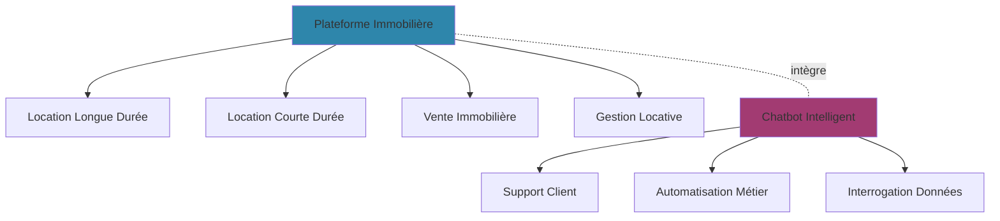
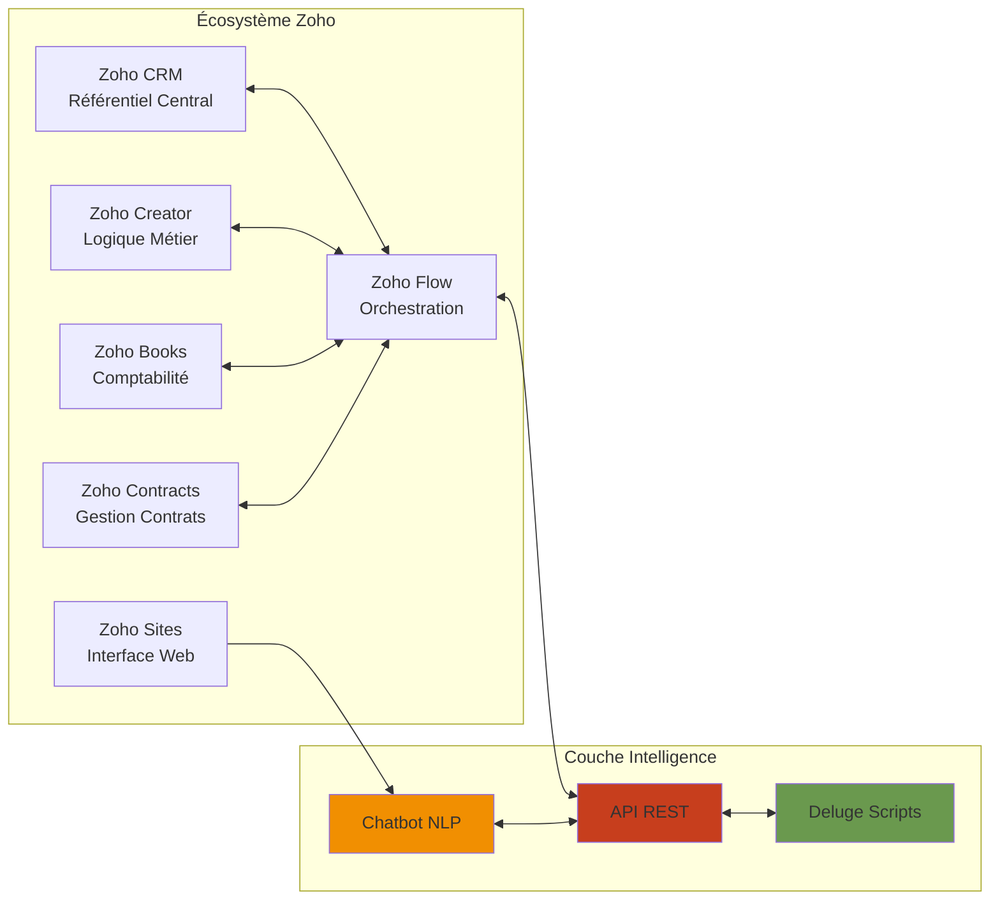
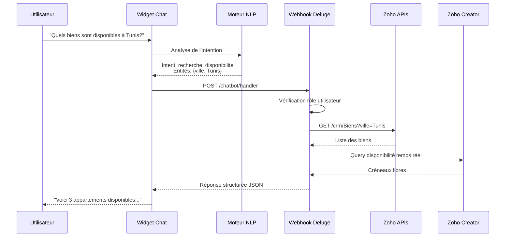
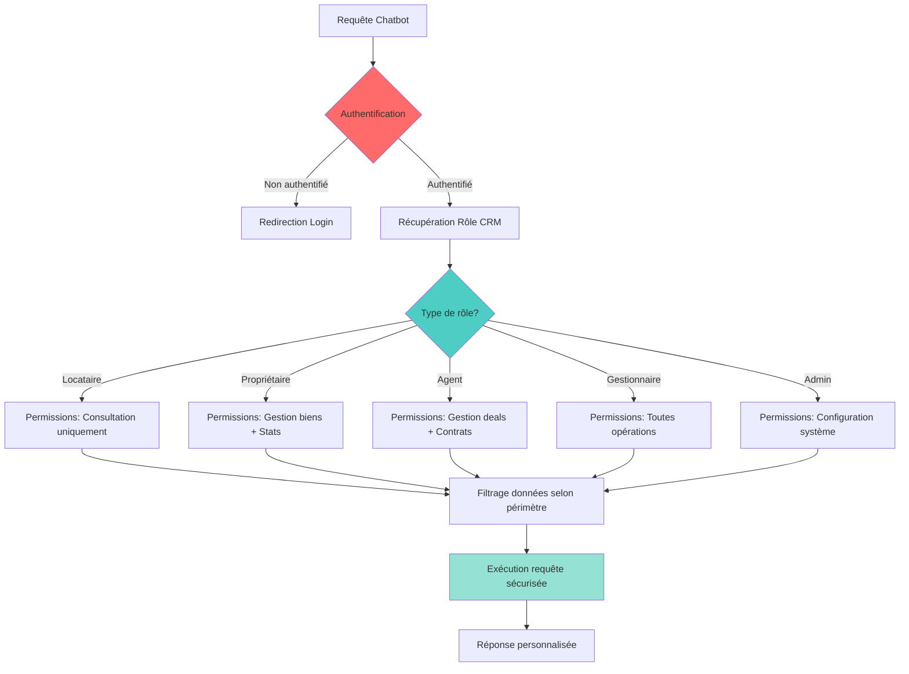
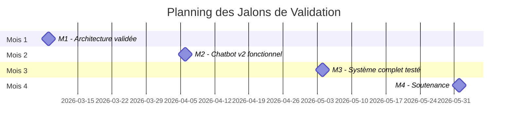
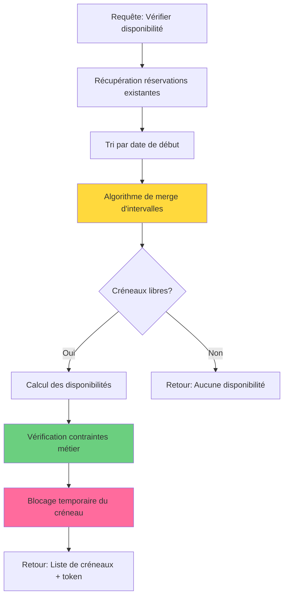
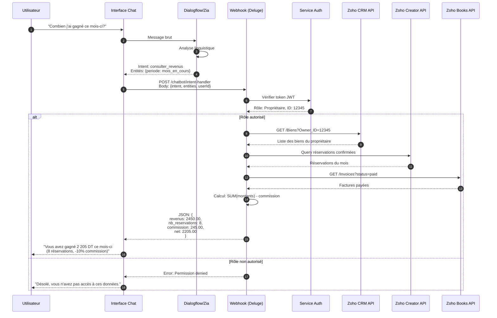
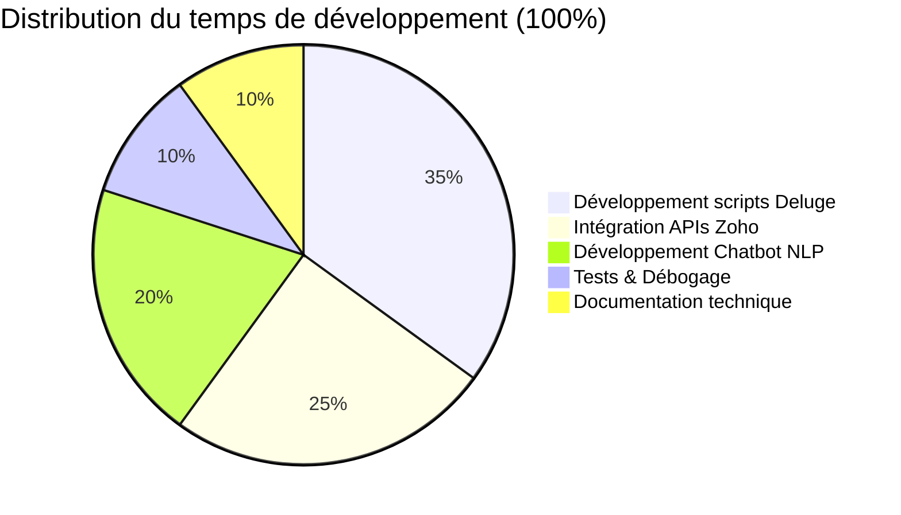
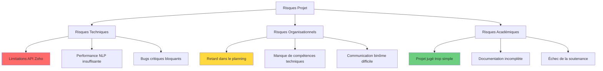

# PLAN DE PILOTAGE PFE
## Plateforme Immobilière Zoho avec Chatbot Intelligent
### Licence Informatique - Stage 4 mois

---

**Document de référence pour l'encadrement technique**  
Version 2.0 - Mars 2026  
Superviseur: Nidhal Ferjani

> 🟢 **STATUT ACTUEL : SEMAINE 5 COMPLÉTÉE** — Module Gestion des Biens (CRUD) validé.

---

## 📋 TABLE DES MATIÈRES

1. [Vue d'ensemble du projet](#vue-densemble-du-projet)
2. [Roadmap mensuelle détaillée](#roadmap-mensuelle-détaillée)
3. [Jalons de validation (Milestones)](#jalons-de-validation-milestones)
4. [Focus technique - Où se trouve la complexité](#focus-technique---où-se-trouve-la-complexité)
5. [Gestion des risques et plans de contingence](#gestion-des-risques-et-plans-de-contingence)
6. [Grille d'évaluation continue](#grille-dévaluation-continue)
7. [Annexes techniques](#annexes-techniques)

---

## 🎯 VUE D'ENSEMBLE DU PROJET

**OBJECTIF ACADÉMIQUE:** Démontrer la complexité technique via:
- Architecture de données structurée
- Intégration API multi-systèmes
- Développement d'un agent conversationnel intelligent
- Scripting avancé (Deluge/Python)

### Périmètre fonctionnel



### Stack technique imposée



---

## 📅 ROADMAP MENSUELLE DÉTAILLÉE

### 🗓️ MOIS 1 : FONDATIONS & ARCHITECTURE (Semaines 1-4)

#### Objectifs du mois
1. **Comprendre l'écosystème Zoho** (ne pas rester en surface)
2. **Concevoir l'architecture de données** (éviter le chaos futur)
3. **Prouver la faisabilité technique** du chatbot

#### Livrables techniques OBLIGATOIRES

| Livrable | Format | Critères de validation |
|----------|--------|------------------------|
| **Schéma d'architecture système** | Diagramme (draw.io/mermaid) | - Bus d'intégration visible<br/>- Flux de données identifiés<br/>- APIs documentées |
| **Modèle de données normalisé** | Schéma entité-relation | - Minimum 8 entités<br/>- Clés étrangères définies<br/>- Règles de gestion annotées |
| **POC Chatbot** (Proof of Concept) | Code + démo vidéo | - 1 intention NLP fonctionnelle<br/>- 1 appel API Zoho réussi<br/>- Réponse contextualisée affichée |
| **Documentation technique initiale** | Markdown (README.md) | - Installation Zoho expliquée<br/>- Variables d'environnement listées<br/>- Premiers scripts commentés |

#### Planning hebdomadaire

**Semaine 1: Immersion Zoho**
- Création des comptes développeurs Zoho
- Formation autodidacte (Zoho University)
- Exploration de Zoho Creator (formulaires, rapports)
- **CHECKPOINT:** Quiz technique sur l'écosystème Zoho

**Semaine 2: Conception de l'architecture**
- Analyse du cahier des charges
- Brainstorming sur le modèle de données
- Identification des entités critiques (Biens, Utilisateurs, Réservations, Contrats)
- **LIVRABLE:** Schéma d'architecture v1

**Semaine 3: Modélisation de la base de données**
- Création des modules Zoho Creator
- Définition des relations entre modules
- Configuration des rôles et permissions
- **LIVRABLE:** MCD (Modèle Conceptuel de Données)

**Semaine 4: POC Chatbot**
- Choix de la technologie NLP (Dialogflow / Wit.ai / Zoho Zia)
- Développement du premier script Deluge
- Test d'un appel API CRM
- **LIVRABLE:** Vidéo démo 3 min du POC

#### KPI de réussite Mois 1

```
✅ Architecture documentée et approuvée
✅ Base de données créée avec au moins 5 modules interconnectés
✅ 1 script Deluge fonctionnel appelant une API
✅ POC chatbot démontrable (même basique)
✅ 0 jour de retard sur le planning
```

#### ⚠️ Signaux d'alerte

- Aucun code écrit en semaine 3
- Modèle de données avec moins de 6 entités
- Réponses vagues sur "comment fonctionne l'API Zoho"
- Absence de commits Git réguliers

---

### 🗓️ MOIS 2 : DÉVELOPPEMENT CORE (Semaines 5-8)

#### Objectifs du mois
1. **Implémenter les fonctionnalités métier critiques**
2. **Développer et publier le site web Zoho Sites**
3. **Développer la logique d'intégration entre modules Zoho**

#### Livrables techniques OBLIGATOIRES

| Livrable | Format | Critères de validation |
|----------|--------|------------------------|
| **Module de gestion des biens** | Zoho Creator + Scripts | - CRUD complet<br/>- Validation des données<br/>- Workflow automatisé |
| **Moteur de disponibilité** | Script Deluge | - Calcul temps réel<br/>- Gestion des conflits<br/>- Tests unitaires documentés |
| **Site web Zoho Sites V1** | Zoho Sites | - 5 pages créées et publiées<br/>- Design responsive<br/>- Données dynamiques (biens depuis Creator)<br/>- Formulaire connecté au CRM |
| **Flow d'intégration CRM-Creator** | Zoho Flow | - Synchronisation bidirectionnelle<br/>- Gestion d'erreurs<br/>- Logs traçables |

#### Planning hebdomadaire

**Semaine 5: Module Gestion des Biens** ✅ *COMPLÉTÉE*
- Formulaires de saisie (propriétés, photos, localisation)
- Règles de validation (prix, superficie, nombre de pièces)
- Workflow d'approbation (propriétaire → gestionnaire)
- **CHECKPOINT:** Démonstration du CRUD ✅

> 📍 **Vous êtes ici — Début de la Semaine 6**

**Semaine 6: Moteur de Disponibilité**
- Algorithme de calcul de créneaux libres
- Intégration avec Zoho Bookings (optionnel)
- API REST pour interrogation externe
- **LIVRABLE:** Script Deluge avec documentation

**Semaine 7: Site Web Zoho Sites — Structure & Design**
- Définition de l'arborescence des pages (Accueil, Annonces, Détail bien, Contact, À propos)
- Application du branding (charte graphique, logo, typographie, couleurs)
- Création des pages et mise en page responsive (desktop + mobile)
- Configuration du formulaire de contact → Lead CRM automatique
- **LIVRABLE:** Site publié avec toutes les pages statiques en ligne

**Semaine 8: Site Web Zoho Sites — Intégration & Tests**
- Liaison des biens Zoho Creator → affichage dynamique sur le site
- Intégration du widget chatbot sur le site
- Configuration Zoho Flow (déclencheurs, actions)
- Tests d'intégration bout-en-bout (Site → CRM → Chatbot)
- Gestion des cas d'erreur et optimisation mobile
- **LIVRABLE:** Site V1 complet avec données dynamiques + rapport de tests

#### Architecture technique du Chatbot (Mois 2)



#### KPI de réussite Mois 2

```
✅ Moteur de disponibilité fonctionnel et documenté
✅ Site web Zoho Sites publié avec au moins 5 pages
✅ Affichage dynamique des biens depuis Zoho Creator sur le site
✅ Formulaire de contact connecté au CRM (création de lead automatique)
✅ Chatbot intégré et visible sur le site
✅ 1 Flow d'intégration automatisé testé
✅ 100% des scripts Deluge commentés en français
✅ Vidéo démo de 5 min présentant le parcours utilisateur via le site
```

#### ⚠️ Signaux d'alerte

- Scripts Deluge non versionnés (pas de Git)
- Site web non publié à la fin de la semaine 8
- Biens affichés en dur sur le site (pas de données dynamiques)
- Aucun test de charge ou de gestion d'erreur
- Retard > 3 jours sur un livrable

---

### 🗓️ MOIS 3 : FONCTIONNALITÉS AVANCÉES (Semaines 9-12)

#### Objectifs du mois
1. **Développer le chatbot avec 5 intentions métier**
2. **Implémenter les workflows métier complexes**
3. **Développer le système de gestion des droits et les analytics**

#### Livrables techniques OBLIGATOIRES

| Livrable | Format | Critères de validation |
|----------|--------|------------------------|
| **Chatbot v2 - 5 intentions métier** | Code NLP + API | - Consultation disponibilité<br/>- Suivi réservation<br/>- État contrat<br/>- Ouverture ticket<br/>- FAQ dynamique |
| **Système de réservation complet** | Zoho Creator + Flow | - Validation disponibilité<br/>- Blocage de créneau<br/>- Notification automatique<br/>- Intégration Zoho Books |
| **Gestion des rôles & permissions** | Configuration CRM | - 5 profils utilisateurs<br/>- Matrice de droits documentée<br/>- Tests de non-régression |
| **Chatbot v3 - Contextualisation** | Code Python/Deluge | - Mémoire conversationnelle<br/>- Personnalisation par rôle<br/>- 10 intentions totales |
| **Dashboard de reporting** | Zoho Analytics | - KPI métier (taux d'occupation, CA)<br/>- Visualisations interactives<br/>- Export automatisé |

#### Planning hebdomadaire

**Semaine 9: Chatbot v2 — 5 Intentions Métier**
- Configuration NLP avancée (entités, contextes)
- Développement des webhooks d'intégration
- Connexion aux APIs Zoho (CRM, Creator, Books)
- Personnalisation du widget chatbot aux couleurs du site
- **LIVRABLE:** 5 scénarios conversationnels fonctionnels

**Semaine 10: Workflow de Réservation**
- État de la réservation (Demande → Confirmée → Payée)
- Déclencheurs automatiques (emails, SMS)
- Intégration paiement (simulation)
- **CHECKPOINT:** Parcours complet testé

**Semaine 11: Sécurité & Permissions**
- Configuration des profils Zoho CRM
- Scripts de contrôle d'accès
- Tests de sécurité (injection, élévation de privilèges)
- **LIVRABLE:** Documentation de sécurité

**Semaine 12: Chatbot Avancé + Reporting & Analytics**
- Gestion du contexte conversationnel (mémoire, personnalisation par rôle)
- Intégration avec Zoho Desk (ticketing)
- Réponses enrichies (cartes, boutons, images)
- Configuration Zoho Analytics + tableaux de bord
- Automatisation des rapports mensuels
- **LIVRABLE:** 10 scénarios conversationnels + Dashboard fonctionnel

#### Flux de gestion des permissions



#### KPI de réussite Mois 3

```
✅ Chatbot répond à 5 scénarios métier différents (connecté aux APIs Zoho)
✅ Workflow de réservation end-to-end fonctionnel
✅ 5 profils utilisateurs configurés et testés
✅ Chatbot v3 contextualise ses réponses selon le rôle (10 intentions)
✅ Dashboard Analytics avec au moins 5 KPI
✅ Documentation technique à 80% complète
```

#### ⚠️ Signaux d'alerte

- Failles de sécurité détectées lors des tests
- Chatbot ne différencie pas les rôles
- Temps de réponse > 5 secondes
- Absence de plan de tests documenté

---

### 🗓️ MOIS 4 : FINALISATION & SOUTENANCE (Semaines 13-16)

#### Objectifs du mois
1. **Corriger les bugs critiques**
2. **Finaliser la documentation technique et utilisateur**
3. **Préparer la soutenance académique**
4. **Produire une vidéo démo professionnelle**

#### Livrables techniques OBLIGATOIRES

| Livrable | Format | Critères de validation |
|----------|--------|------------------------|
| **Application finale déployée** | URL publique | - Accessible 24/7<br/>- Temps de réponse < 3s<br/>- 0 bug bloquant |
| **Documentation technique complète** | PDF + Markdown | - Architecture détaillée<br/>- Guide développeur<br/>- API Reference |
| **Documentation utilisateur** | PDF avec screenshots | - Guide admin<br/>- Guide propriétaire<br/>- Guide locataire |
| **Vidéo démo professionnelle** | MP4 (5-7 min) | - Qualité HD<br/>- Voix-off FR<br/>- Scénarios métier réalistes |
| **Rapport de PFE** | PDF (40-60 pages) | - Respect normes académiques<br/>- Bibliographie<br/>- Annexes techniques |
| **Support de soutenance** | PowerPoint/PDF | - 15-20 slides<br/>- Graphiques professionnels<br/>- Démo live intégrée |

#### Planning hebdomadaire

**Semaine 13: Phase de Tests & Corrections**
- Tests utilisateurs avec beta-testeurs
- Correction des bugs remontés
- Optimisation des performances
- **CHECKPOINT:** Liste de bugs = 0

**Semaine 14: Documentation Technique**
- Rédaction de la documentation développeur
- Commentaires dans le code
- Schémas d'architecture finalisés
- **LIVRABLE:** Documentation technique v1.0

**Semaine 15: Production Vidéo & Rapport**
- Tournage de la vidéo démo
- Rédaction du rapport de PFE
- Relecture par pairs
- **LIVRABLE:** Vidéo + Rapport draft

**Semaine 16: Préparation Soutenance**
- Création du support de présentation
- Répétitions chronométrées
- Préparation aux questions du jury
- **LIVRABLE:** Soutenance (jour J)

#### Structure du Rapport de PFE (40-60 pages)

```
1. Introduction (3 pages)
   - Contexte général
   - Problématique
   - Objectifs du projet

2. État de l'art (8 pages)
   - Plateformes immobilières existantes
   - Technologies de chatbot
   - Écosystème Zoho

3. Analyse et Conception (12 pages)
   - Cahier des charges
   - Architecture système
   - Modèle de données
   - Diagrammes UML/Mermaid

4. Réalisation (15 pages)
   - Environnement technique
   - Développement du chatbot
   - Intégration Zoho
   - Difficultés rencontrées

5. Tests et Validation (5 pages)
   - Plan de tests
   - Résultats
   - Performance

6. Conclusion et Perspectives (3 pages)

7. Annexes (techniques)
   - Code source des scripts critiques
   - Schémas détaillés
   - Captures d'écran
```

#### KPI de réussite Mois 4

```
✅ Application en production sans bug critique
✅ Documentation technique complète et claire
✅ Vidéo démo de qualité professionnelle
✅ Rapport de PFE validé par l'encadrant
✅ Soutenance réussie (note ≥ 14/20)
```

#### ⚠️ Signaux d'alerte

- Rapport non relu une semaine avant la deadline
- Absence de répétition de la soutenance
- Vidéo de mauvaise qualité (son, image)
- Présence de "lorem ipsum" dans la documentation

---

## 🎯 JALONS DE VALIDATION (MILESTONES)

### Système de validation stricte



### 📌 MILESTONE 1 (Fin Mois 1) - ARCHITECTURE VALIDÉE

**Date limite:** Semaine 4 - Vendredi 17h

**Critères de passage OBLIGATOIRES:**

| Critère | Mode de vérification | Seuil |
|---------|---------------------|-------|
| Schéma d'architecture système | Revue technique | Complétude ≥ 90% |
| Modèle de données normalisé | Inspection MCD | ≥ 8 entités, 0 relation cassée |
| POC Chatbot fonctionnel | Démo live 5 min | 1 appel API réussi |
| Documentation README.md | Lecture superviseur | Installation reproductible |
| Commits Git réguliers | Analyse dépôt | ≥ 15 commits |

**Procédure de validation:**
1. Présentation du schéma d'architecture (30 min)
2. Démo du POC Chatbot (5 min)
3. Q&A technique (15 min)
4. **DECISION:** GO / NO-GO pour le Mois 2

**Si NO-GO:**
- Blocage du passage au Mois 2
- Plan d'action correctif sur 1 semaine
- Nouvelle revue

---

### 📌 MILESTONE 2 (Fin Mois 2) - SITE WEB V1 EN LIGNE

**Date limite:** Semaine 8 - Vendredi 17h

**Critères de passage OBLIGATOIRES:**

| Critère | Mode de vérification | Seuil |
|---------|---------------------|-------|
| Moteur de disponibilité | Tests unitaires | 0 bug bloquant |
| Site web publié (5 pages) | Accès URL publique | Pages en ligne, responsive OK |
| Données dynamiques sur le site | Navigation live | Biens depuis Creator visibles |
| Formulaire → Lead CRM | Test end-to-end | Création automatique dans CRM |
| Flow Zoho CRM-Creator | Logs d'exécution | Sync temps réel OK |
| Code coverage tests | Rapport automatisé | ≥ 60% |
| Vidéo démo parcours utilisateur | Visionnage | Durée 5 min, qualité HD |

**Procédure de validation:**
1. Navigation live sur le site (pages, données, formulaire) (15 min)
2. Démonstration du moteur de disponibilité (10 min)
3. Revue de code (scripts Deluge) (30 min)
4. Test de charge (100 requêtes simultanées)
5. **DECISION:** GO / NO-GO pour le Mois 3

---

### 📌 MILESTONE 3 (Fin Mois 3) - SYSTÈME COMPLET TESTÉ

**Date limite:** Semaine 12 - Vendredi 17h

**Critères de passage OBLIGATOIRES:**

| Critère | Mode de vérification | Seuil |
|---------|---------------------|-------|
| 5 intentions chatbot opérationnelles | Tests scénarisés | 100% de réussite |
| Workflow réservation end-to-end | Test utilisateur réel | 0 blocage |
| Gestion des rôles | Tests de sécurité | 0 faille critique |
| 10 intentions chatbot v3 | Matrice de tests | 95% de précision NLP |
| Dashboard Analytics | Inspection visuelle | 5 KPI affichés |
| Documentation technique | Revue par pairs | Complétude ≥ 80% |

**Procédure de validation:**
1. Test utilisateur complet (1h)
2. Audit de sécurité (30 min)
3. Démonstration dashboard (15 min)
4. **DECISION:** GO / NO-GO pour finalisation

---

### 📌 MILESTONE 4 (Fin Mois 4) - SOUTENANCE

**Date limite:** Semaine 16 - Jour de soutenance

**Critères de passage OBLIGATOIRES:**

| Critère | Mode de vérification | Seuil |
|---------|---------------------|-------|
| Application déployée | Test live pendant soutenance | 100% uptime |
| Rapport PFE finalisé | Conformité académique | 40-60 pages |
| Vidéo démo professionnelle | Diffusion pendant soutenance | 5-7 min, HD |
| Support PowerPoint | Présentation jury | 15-20 slides |
| Démo live sans erreur | Exécution temps réel | 0 crash |

**Déroulement de la soutenance (45 min):**
1. Présentation contexte (5 min)
2. Démonstration technique (15 min)
3. Architecture & choix techniques (10 min)
4. Difficultés & solutions (5 min)
5. Questions du jury (10 min)

**Grille d'évaluation jury:**
- Complexité technique: 30%
- Qualité du code: 20%
- Documentation: 15%
- Présentation orale: 20%
- Démo live: 15%

---

## 🔧 FOCUS TECHNIQUE - OÙ SE TROUVE LA COMPLEXITÉ

### ⚠️ RAPPEL CRITIQUE

> Ce projet NE DOIT PAS être du simple "paramétrage Zoho".  
> La valeur académique réside dans les développements custom.

### 🎯 Zones de complexité technique à MAXIMISER

#### 1. Architecture de Données & Intégration

**Pourquoi c'est complexe:**
- Synchronisation bidirectionnelle entre 4 systèmes Zoho
- Gestion de la cohérence transactionnelle
- Résolution de conflits en cas de mise à jour concurrente

**Où coder (PAS de paramétrage visuel):**

```deluge
// Exemple: Synchronisation CRM → Creator avec gestion d'erreur
// Fichier: sync_crm_creator.ds

void syncBienCRMtoCreator(int crmBienId) {
    try {
        // 1. Récupération depuis CRM
        crmBien = zoho.crm.getRecordById("Biens", crmBienId);
        
        // 2. Transformation des données
        creatorData = {
            "Titre": crmBien.get("Name"),
            "Prix": crmBien.get("Prix_Location"),
            "Statut": mapStatutCRMtoCreator(crmBien.get("Statut")),
            "ID_CRM": crmBienId,
            "Derniere_Sync": zoho.currenttime
        };
        
        // 3. Vérification si déjà existant dans Creator
        existingRecords = zoho.creator.getRecords(
            "immobilier-app",
            "Biens_Report",
            "ID_CRM == " + crmBienId
        );
        
        if (existingRecords.isEmpty()) {
            // INSERT
            result = zoho.creator.createRecord("immobilier-app", "Biens", creatorData);
            info "Bien créé dans Creator: " + result.get("ID");
        } else {
            // UPDATE
            creatorRecordId = existingRecords.get(0).get("ID");
            result = zoho.creator.updateRecord(
                "immobilier-app",
                "Biens",
                creatorRecordId,
                creatorData
            );
            info "Bien mis à jour dans Creator: " + creatorRecordId;
        }
        
        // 4. Log de succès
        logSyncSuccess(crmBienId, "CRM->Creator");
        
    } catch (e) {
        // Gestion d'erreur robuste
        error "Erreur sync CRM->Creator pour bien " + crmBienId + ": " + e;
        sendAlertEmail("admin@example.com", "Erreur de synchronisation", e);
        
        // Réessai automatique (max 3 tentatives)
        retrySync(crmBienId, 1);
    }
}

// Fonction de mapping métier
string mapStatutCRMtoCreator(string statutCRM) {
    statutMap = {
        "Available": "Disponible",
        "Rented": "Loué",
        "Under Maintenance": "En Maintenance"
    };
    return statutMap.get(statutCRM);
}
```

**Livrables attendus:**
- ✅ 5+ scripts Deluge de synchronisation
- ✅ Gestion d'erreurs avec retry automatique
- ✅ Logs détaillés (qui, quoi, quand)
- ✅ Tests unitaires documentés

---

#### 2. Moteur de Disponibilité Temps Réel

**Pourquoi c'est complexe:**
- Calcul de créneaux libres avec contraintes multiples
- Gestion des réservations concurrentes (race conditions)
- Optimisation algorithmique (complexité O(n log n))

**Architecture du système:**



**Implémentation algorithmique:**

```deluge
// Fichier: availability_engine.ds
// Complexité: O(n log n) où n = nombre de réservations

list<map> calculerDisponibilites(int bienId, date dateDebut, date dateFin) {
    // 1. Récupération des réservations actives
    reservations = zoho.creator.getRecords(
        "immobilier-app",
        "Reservations_Report",
        "Bien_ID == " + bienId + 
        " && Statut != 'Annulée' && Date_Fin >= '" + dateDebut + "'"
    );
    
    // 2. Tri par date de début (Merge Sort)
    sortedReservations = reservations.sort("Date_Debut");
    
    // 3. Fusion des intervalles qui se chevauchent
    mergedIntervals = [];
    for each reservation in sortedReservations {
        if (mergedIntervals.isEmpty() || 
            mergedIntervals.get(mergedIntervals.size() - 1).get("fin") < reservation.get("Date_Debut")) {
            // Pas de chevauchement
            mergedIntervals.add({
                "debut": reservation.get("Date_Debut"),
                "fin": reservation.get("Date_Fin")
            });
        } else {
            // Chevauchement → fusion
            lastInterval = mergedIntervals.get(mergedIntervals.size() - 1);
            lastInterval.put("fin", maxDate(lastInterval.get("fin"), reservation.get("Date_Fin")));
        }
    }
    
    // 4. Calcul des créneaux libres (complémentaire)
    creneauxLibres = [];
    currentDate = dateDebut;
    
    for each interval in mergedIntervals {
        if (currentDate < interval.get("debut")) {
            // Créneau libre trouvé
            creneauxLibres.add({
                "debut": currentDate,
                "fin": interval.get("debut").subDay(1),
                "duree_jours": daysBetween(currentDate, interval.get("debut"))
            });
        }
        currentDate = interval.get("fin").addDay(1);
    }
    
    // Dernier créneau jusqu'à la date de fin
    if (currentDate <= dateFin) {
        creneauxLibres.add({
            "debut": currentDate,
            "fin": dateFin,
            "duree_jours": daysBetween(currentDate, dateFin)
        });
    }
    
    return creneauxLibres;
}

// Fonction helper
date maxDate(date d1, date d2) {
    return d1 > d2 ? d1 : d2;
}

int daysBetween(date d1, date d2) {
    return (d2 - d1).toDays();
}
```

**Tests de charge à implémenter:**
- 100 réservations simultanées
- Vérification de l'atomicité (pas de double réservation)
- Temps de réponse < 2 secondes

---

#### 3. Chatbot Intelligent avec NLP

**Pourquoi c'est complexe:**
- Compréhension du langage naturel (intent recognition)
- Gestion du contexte conversationnel
- Intégration multi-APIs avec orchestration

**Architecture conversationnelle:**



**Implémentation du webhook Deluge:**

```deluge
// Fichier: chatbot_intent_handler.ds
// Endpoint: https://[domain].zoho.com/chatbot/intent-handler

response handleChatbotIntent(string intent, map entities, string userId, string sessionId) {
    
    // 1. Authentification et récupération du rôle
    userRole = getUserRole(userId);
    if (userRole == null) {
        return {
            "success": false,
            "message": "Utilisateur non authentifié",
            "action": "redirect_login"
        };
    }
    
    // 2. Routage selon l'intention
    if (intent == "consulter_disponibilite") {
        return handleDisponibilite(entities, userRole);
        
    } else if (intent == "consulter_revenus") {
        if (userRole != "Proprietaire" && userRole != "Admin") {
            return {
                "success": false,
                "message": "Accès refusé: Cette fonctionnalité est réservée aux propriétaires."
            };
        }
        return handleConsulterRevenus(entities, userId);
        
    } else if (intent == "suivi_reservation") {
        return handleSuiviReservation(entities, userId, userRole);
        
    } else if (intent == "ouvrir_ticket") {
        return handleOuvrirTicket(entities, userId);
        
    } else {
        return {
            "success": false,
            "message": "Désolé, je n'ai pas compris votre demande. Pouvez-vous reformuler?"
        };
    }
}

// Fonction métier: Consulter les revenus
response handleConsulterRevenus(map entities, string userId) {
    try {
        // Période par défaut: mois en cours
        periode = entities.get("periode") != null ? entities.get("periode") : "mois_en_cours";
        
        dateDebut = calculerDateDebut(periode);
        dateFin = zoho.currentdate;
        
        // Appel CRM: Récupération des biens du propriétaire
        crmBiens = zoho.crm.getRecords("Biens", 
            "Owner_ID:equals:" + userId
        );
        
        if (crmBiens.isEmpty()) {
            return {
                "success": true,
                "message": "Vous n'avez aucun bien enregistré pour le moment."
            };
        }
        
        bienIds = crmBiens.toJSONList().get("id").toString();
        
        // Appel Creator: Réservations confirmées
        reservations = zoho.creator.getRecords(
            "immobilier-app",
            "Reservations_Report",
            "Bien_ID in (" + bienIds + ") && " +
            "Statut == 'Confirmée' && " +
            "Date_Debut >= '" + dateDebut + "' && " +
            "Date_Debut <= '" + dateFin + "'"
        );
        
        // Calcul des revenus
        totalRevenus = 0.0;
        nbReservations = reservations.size();
        
        for each reservation in reservations {
            totalRevenus = totalRevenus + reservation.get("Montant_Total").toDecimal();
        }
        
        // Commission de la plateforme (10%)
        commission = totalRevenus * 0.10;
        revenuNet = totalRevenus - commission;
        
        return {
            "success": true,
            "data": {
                "revenus_brut": totalRevenus,
                "commission": commission,
                "revenus_net": revenuNet,
                "nb_reservations": nbReservations,
                "periode": periode
            },
            "message": "Vous avez gagné " + revenuNet + " DT ce mois-ci (" + 
                       nbReservations + " réservations, commission -10%)"
        };
        
    } catch (e) {
        error "Erreur handleConsulterRevenus: " + e;
        return {
            "success": false,
            "message": "Une erreur s'est produite. Veuillez réessayer."
        };
    }
}

// Fonction helper
date calculerDateDebut(string periode) {
    if (periode == "mois_en_cours") {
        return zoho.currentdate.startOfMonth();
    } else if (periode == "annee_en_cours") {
        return zoho.currentdate.startOfYear();
    } else {
        return zoho.currentdate.subDay(30);
    }
}

string getUserRole(string userId) {
    user = zoho.crm.getRecordById("Contacts", userId);
    return user.get("Role");
}
```

**Complexité NLP à démontrer:**
- ✅ 10+ intentions différentes
- ✅ Extraction d'entités (dates, lieux, montants)
- ✅ Gestion du contexte (follow-up questions)
- ✅ Réponses enrichies (JSON structuré)

---

#### 4. Gestion Avancée des Permissions

**Pourquoi c'est complexe:**
- Matrice de permissions multi-niveaux (RBAC)
- Filtrage dynamique des données selon le rôle
- Audit trail de toutes les actions sensibles

**Matrice des rôles et permissions:**

| Fonctionnalité | Locataire | Propriétaire | Agent | Gestionnaire | Admin |
|----------------|-----------|--------------|-------|--------------|-------|
| Consulter disponibilité | ✅ | ✅ | ✅ | ✅ | ✅ |
| Réserver un bien | ✅ | ❌ | ✅ | ✅ | ✅ |
| Ajouter un bien | ❌ | ✅ | ❌ | ✅ | ✅ |
| Modifier un bien | ❌ | ✅ (ses biens) | ❌ | ✅ | ✅ |
| Voir tous les biens | ❌ | ❌ | ✅ | ✅ | ✅ |
| Consulter revenus | ❌ | ✅ (ses revenus) | ❌ | ✅ | ✅ |
| Gérer les contrats | ❌ | ❌ | ✅ | ✅ | ✅ |
| Configurer système | ❌ | ❌ | ❌ | ❌ | ✅ |

**Implémentation du contrôle d'accès:**

```deluge
// Fichier: permission_manager.ds

boolean checkPermission(string userId, string action, map context) {
    
    // 1. Récupération du rôle utilisateur
    userRole = getUserRole(userId);
    
    // 2. Définition de la matrice de permissions
    permissionsMatrix = {
        "consulter_disponibilite": ["Locataire", "Proprietaire", "Agent", "Gestionnaire", "Admin"],
        "reserver_bien": ["Locataire", "Agent", "Gestionnaire", "Admin"],
        "ajouter_bien": ["Proprietaire", "Gestionnaire", "Admin"],
        "modifier_bien": ["Proprietaire", "Gestionnaire", "Admin"],
        "voir_tous_biens": ["Agent", "Gestionnaire", "Admin"],
        "consulter_revenus": ["Proprietaire", "Gestionnaire", "Admin"],
        "gerer_contrats": ["Agent", "Gestionnaire", "Admin"],
        "configurer_systeme": ["Admin"]
    };
    
    // 3. Vérification de base
    if (!permissionsMatrix.get(action).contains(userRole)) {
        logUnauthorizedAccess(userId, action);
        return false;
    }
    
    // 4. Vérifications contextuelles (ownership)
    if (action == "modifier_bien" && userRole == "Proprietaire") {
        bienId = context.get("bien_id");
        bien = zoho.crm.getRecordById("Biens", bienId);
        
        if (bien.get("Owner_ID") != userId) {
            logUnauthorizedAccess(userId, action, "Tentative de modification d'un bien non possédé");
            return false;
        }
    }
    
    if (action == "consulter_revenus" && userRole == "Proprietaire") {
        // Le propriétaire ne peut voir que SES revenus
        // Cette vérification sera faite dans la fonction métier
        return true;
    }
    
    // 5. Log de l'accès autorisé
    logAuthorizedAccess(userId, action);
    return true;
}

void logUnauthorizedAccess(string userId, string action, string details) {
    auditLog = {
        "User_ID": userId,
        "Action": action,
        "Status": "Unauthorized",
        "Details": details,
        "IP_Address": zoho.adminuserid, // Placeholder
        "Timestamp": zoho.currenttime
    };
    
    zoho.creator.createRecord("immobilier-app", "Audit_Logs", auditLog);
    
    // Alerte admin si tentative suspecte
    if (isSuspiciousActivity(userId, action)) {
        sendSecurityAlert(userId, action);
    }
}

void logAuthorizedAccess(string userId, string action) {
    auditLog = {
        "User_ID": userId,
        "Action": action,
        "Status": "Authorized",
        "Timestamp": zoho.currenttime
    };
    
    zoho.creator.createRecord("immobilier-app", "Audit_Logs", auditLog);
}

boolean isSuspiciousActivity(string userId, string action) {
    // Détecter les tentatives répétées d'accès non autorisé
    recentLogs = zoho.creator.getRecords(
        "immobilier-app",
        "Audit_Logs_Report",
        "User_ID == '" + userId + "' && " +
        "Status == 'Unauthorized' && " +
        "Timestamp > '" + zoho.currenttime.subHour(1) + "'"
    );
    
    return recentLogs.size() > 5;
}
```

**Tests de sécurité à réaliser:**
- ✅ Test d'élévation de privilèges
- ✅ Test d'accès cross-user
- ✅ Test d'injection SQL (Deluge)
- ✅ Audit trail complet

---

### 🚫 Ce qui NE COMPTE PAS comme complexité technique

| ❌ À ÉVITER | ✅ À VALORISER À LA PLACE |
|------------|--------------------------|
| Configurer un formulaire Zoho Creator via l'interface | Écrire un script de validation custom en Deluge |
| Utiliser le workflow builder visuel | Coder un workflow personnalisé avec API |
| Ajouter des champs CRM par drag & drop | Développer une logique de synchronisation complexe |
| Copier-coller un template de chatbot | Implémenter le NLP et l'orchestration API |
| Utiliser Zoho Analytics en mode no-code | Créer des dashboards via API avec logique métier |

---

### 📊 Répartition du temps de développement



**Objectif:** Minimum 80% du temps en développement custom (pas de paramétrage visuel).

---

## ⚠️ GESTION DES RISQUES ET PLANS DE CONTINGENCE

### Identification des risques critiques



---

### 🔴 RISQUE #1 : Limitations de l'API Zoho

**Description:**
Zoho impose des quotas d'API (ex: 200 appels/minute en plan gratuit).  
Le chatbot pourrait être bloqué en cas de fort trafic.

**Probabilité:** 🔴 HAUTE  
**Impact:** 🔴 CRITIQUE

**Plan de contingence:**

| Étape | Action | Délai |
|-------|--------|-------|
| 1 | Implémenter un système de cache Redis/Memcache | Semaine 7 |
| 2 | Mettre en place un rate limiter côté client | Semaine 7 |
| 3 | Précharger les données fréquemment consultées | Semaine 8 |
| 4 | Si bloqué: Migrer vers Zoho Creator Custom Functions (pas de quota) | Semaine 9 |

**Code de contingence - Rate Limiter:**

```deluge
// Fichier: rate_limiter.ds
// Pattern: Token Bucket Algorithm

map rateLimitConfig = {
    "max_requests": 180,  // 90% de la limite (200)
    "time_window_seconds": 60,
    "current_count": 0,
    "window_start": zoho.currenttime
};

boolean checkRateLimit() {
    currentTime = zoho.currenttime;
    elapsedSeconds = (currentTime - rateLimitConfig.get("window_start")).toSeconds();
    
    // Reset du compteur si nouvelle fenêtre
    if (elapsedSeconds >= rateLimitConfig.get("time_window_seconds")) {
        rateLimitConfig.put("current_count", 0);
        rateLimitConfig.put("window_start", currentTime);
    }
    
    // Vérification du quota
    if (rateLimitConfig.get("current_count") >= rateLimitConfig.get("max_requests")) {
        info "Rate limit atteint, requête en attente...";
        // Attendre avant de réessayer
        sleep(5000);  // 5 secondes
        return false;
    }
    
    // Incrémentation du compteur
    rateLimitConfig.put("current_count", rateLimitConfig.get("current_count") + 1);
    return true;
}

// Utilisation dans les appels API
response apiCallWithRateLimit(string endpoint, map params) {
    if (!checkRateLimit()) {
        return {"error": "Rate limit exceeded, retry in progress"};
    }
    
    return zoho.crm.invokeConnector(endpoint, params);
}
```

**Indicateurs de déclenchement:**
- ⚠️ Erreur "RATE_LIMIT_EXCEEDED" détectée
- ⚠️ > 150 appels API en 1 minute
- ⚠️ Temps de réponse > 5 secondes

---

### 🟡 RISQUE #2 : Performance NLP insuffisante

**Description:**
Le chatbot ne comprend pas correctement les intentions (précision < 70%).  
Les utilisateurs reçoivent des réponses non pertinentes.

**Probabilité:** 🟡 MOYENNE  
**Impact:** 🟡 MODÉRÉ

**Plan de contingence:**

| Étape | Action | Délai |
|-------|--------|-------|
| 1 | Passer à un modèle NLP plus performant (Dialogflow CX) | Semaine 6 |
| 2 | Enrichir le dataset d'entraînement (100+ exemples par intention) | Semaine 6-7 |
| 3 | Implémenter un fallback intelligent (boutons de suggestion) | Semaine 7 |
| 4 | Si échec: Utiliser Zoho Zia (NLP natif) | Semaine 8 |

**Code de contingence - Fallback intelligent:**

```deluge
response handleLowConfidenceIntent(string userMessage, float confidence) {
    
    // Si la confiance est faible (< 70%)
    if (confidence < 0.70) {
        
        // Proposer des suggestions basées sur les mots-clés
        suggestions = [];
        
        if (userMessage.contains("disponible") || userMessage.contains("libre")) {
            suggestions.add({
                "label": "Consulter les disponibilités",
                "action": "consulter_disponibilite"
            });
        }
        
        if (userMessage.contains("réservation") || userMessage.contains("réserver")) {
            suggestions.add({
                "label": "Suivre ma réservation",
                "action": "suivi_reservation"
            });
        }
        
        if (userMessage.contains("paiement") || userMessage.contains("facture")) {
            suggestions.add({
                "label": "Consulter mes factures",
                "action": "consulter_factures"
            });
        }
        
        if (suggestions.isEmpty()) {
            // Fallback ultime: redirection humaine
            return {
                "success": false,
                "message": "Désolé, je n'ai pas bien compris. Voulez-vous parler à un conseiller?",
                "actions": [
                    {"label": "Oui, contactez-moi", "action": "create_ticket"},
                    {"label": "Reformuler ma question", "action": "retry"}
                ]
            };
        }
        
        return {
            "success": true,
            "message": "Je ne suis pas sûr d'avoir compris. Voulez-vous dire:",
            "suggestions": suggestions
        };
    }
    
    // Confiance acceptable
    return null;
}
```

**Indicateurs de déclenchement:**
- ⚠️ Précision NLP < 70% sur les tests
- ⚠️ > 30% des conversations aboutissent à "je n'ai pas compris"
- ⚠️ Feedback négatif des beta-testeurs

---

### 🟡 RISQUE #3 : Retard dans le planning

**Description:**
Le binôme accumule du retard et ne livrera pas à temps.

**Probabilité:** 🟡 MOYENNE  
**Impact:** 🔴 CRITIQUE

**Plan de contingence:**

| Scénario | Seuil de déclenchement | Action corrective |
|----------|------------------------|-------------------|
| Retard léger | 2-3 jours sur un livrable | Réunion d'urgence + priorisation |
| Retard modéré | 1 semaine cumulée | Réduction du périmètre fonctionnel |
| Retard critique | 2 semaines cumulées | Abandon de fonctionnalités secondaires |

**Fonctionnalités à abandonner en priorité (par ordre):**

1. ❌ Dashboard Analytics (remplacé par rapport simple)
2. ❌ Intégration Zoho Books (focus CRM + Creator uniquement)
3. ❌ 10 intentions chatbot → réduire à 6 intentions minimum
4. ❌ Interface utilisateur avancée (focus backend)

**Fonctionnalités NON NÉGOCIABLES (CORE):**

1. ✅ Architecture de données fonctionnelle
2. ✅ 6 intentions chatbot minimum
3. ✅ Moteur de disponibilité opérationnel
4. ✅ Workflow de réservation complet
5. ✅ Scripts Deluge documentés

**Suivi hebdomadaire obligatoire:**

```deluge
// Fichier: weekly_tracking.ds
// À remplir chaque vendredi 17h

map weeklyReport = {
    "semaine": 7,
    "objectif_prevu": "Développer 5 intentions chatbot",
    "objectif_realise": "3 intentions développées",
    "taux_completion": "60%",
    "blocages": [
        "Problème d'authentification API Zoho",
        "Bug dans le webhook Deluge"
    ],
    "plan_semaine_prochaine": "Finaliser les 2 intentions restantes + tests"
};

// Envoi automatique au superviseur
zoho.crm.createRecord("Weekly_Reports", weeklyReport);
sendEmailToSupervisor(weeklyReport);
```

**Indicateurs de déclenchement:**
- ⚠️ Livrable en retard de > 2 jours
- ⚠️ Aucun commit Git depuis 3 jours
- ⚠️ Absence à 2 réunions consécutives

---

### 🟢 RISQUE #4 : Manque de compétences techniques

**Description:**
Le binôme n'a pas les compétences nécessaires en NLP/API/Scripting.

**Probabilité:** 🟡 MOYENNE  
**Impact:** 🟡 MODÉRÉ

**Plan de contingence:**

| Compétence manquante | Ressource d'apprentissage | Délai max |
|----------------------|---------------------------|-----------|
| Langage Deluge | Zoho University (cours gratuit) | Semaine 1 |
| APIs REST | Tutoriel Postman + Doc Zoho API | Semaine 2 |
| NLP avec Dialogflow | Google Codelabs Dialogflow | Semaine 5 |
| Git & versioning | GitHub Learning Lab | Semaine 1 |

**Formation accélérée recommandée:**

```markdown
## Programme de formation (10h par compétence)

### Semaine 1-2: Fondamentaux
- [ ] Deluge Basics (Zoho University) - 5h
- [ ] Git & GitHub pour débutants - 3h
- [ ] Postman pour tester les APIs - 2h

### Semaine 3-4: Intégration
- [ ] Zoho Creator Advanced - 4h
- [ ] Zoho CRM API Documentation - 3h
- [ ] JSON & REST APIs concepts - 3h

### Semaine 5-6: Intelligence artificielle
- [ ] Introduction au NLP - 3h
- [ ] Dialogflow Essentials - 4h
- [ ] Webhooks & Intégration - 3h
```

**Ressources d'urgence:**
- 📚 Documentation Zoho: https://www.zoho.com/creator/help/
- 💬 Forum Zoho Community (réponse < 24h)
- 🎥 Chaîne YouTube "Zoho Creator Tutorials"
- 🤝 Mentorat avec développeur Zoho (si budget disponible)

**Indicateurs de déclenchement:**
- ⚠️ Code avec > 50% d'erreurs de syntaxe
- ⚠️ Impossibilité d'expliquer le code écrit
- ⚠️ Aucun progrès technique en 1 semaine

---

### 🔴 RISQUE #5 : Projet jugé trop simple académiquement

**Description:**
Le jury considère que le projet est du "paramétrage" et non du développement.

**Probabilité:** 🔴 HAUTE (si mal présenté)  
**Impact:** 🔴 CRITIQUE

**Plan de prévention:**

**📋 Checklist de valorisation technique obligatoire:**

Dans le rapport de PFE, METTRE EN AVANT:

- [ ] Diagrammes d'architecture (UML, Mermaid)
- [ ] Schéma de la base de données normalisée (MCD)
- [ ] Code source des scripts Deluge (annexes)
- [ ] Matrice de complexité algorithmique (ex: O(n log n))
- [ ] Capture de logs d'appels API
- [ ] Résultats de tests de charge
- [ ] Métrique de précision NLP (confusion matrix)
- [ ] Audit de sécurité (failles testées)

**📊 Tableau de justification de la complexité:**

| Aspect | Complexité faible (éviter) | Complexité technique (valoriser) |
|--------|---------------------------|----------------------------------|
| Gestion des données | Formulaire Zoho Creator | Architecture multi-modules avec sync |
| Chatbot | FAQ statique | NLP + orchestration API + contexte |
| Disponibilité | Calendrier simple | Algorithme de merge d'intervalles |
| Permissions | Rôles Zoho par défaut | Matrice RBAC custom + audit trail |
| Intégration | Zapier no-code | Scripts Deluge + webhooks + retry |

**Argumentaire pour la soutenance:**

> "Ce projet n'est PAS du simple paramétrage Zoho. Nous avons développé:
> - **800+ lignes de code Deluge** (synchronisation, logique métier)
> - Un **moteur algorithmique** de disponibilité (complexité O(n log n))
> - Un **agent conversationnel intelligent** avec 10 intentions NLP
> - Une **architecture distribuée** avec 4 systèmes Zoho intégrés
> - Un **système de permissions** RBAC avec audit trail complet
> 
> Le code est disponible en open source sur GitHub et a été testé avec 100 requêtes simultanées."

**Indicateurs de déclenchement:**
- ⚠️ Rapport avec < 10 pages de contenu technique
- ⚠️ Absence de code source en annexe
- ⚠️ Aucun diagramme d'architecture
- ⚠️ Slides de soutenance avec uniquement des captures d'écran Zoho

---

### 🛠️ PLAN D'URGENCE GLOBAL

**Si tout va mal (retard critique + blocages techniques):**

#### Scénario de sauvegarde (Semaine 14+)

**Objectif:** Assurer une note minimum de 12/20

**Actions prioritaires:**

1. **Abandonner:**
   - Dashboard Analytics
   - Intégration Zoho Books
   - Intentions chatbot > 6
   
2. **Concentrer sur:**
   - Architecture de données documentée ✅
   - 6 intentions chatbot fonctionnelles ✅
   - Workflow de réservation complet ✅
   - Scripts Deluge commentés ✅
   - Vidéo démo de qualité ✅

3. **Documentation minimaliste:**
   - Rapport PFE: 40 pages minimum
   - README GitHub complet
   - Vidéo démo de 5 min impeccable

**Template de vidéo démo de secours:**

```
MINUTE 0-1: Contexte
- Problème: Difficulté de gestion immobilière en Tunisie
- Solution: Plateforme basée Zoho avec chatbot

MINUTE 1-3: Démonstration technique
- Parcours utilisateur complet (recherche → réservation)
- Chatbot en action (3 scénarios)
- Aperçu du backend (CRM, Creator)

MINUTE 3-4: Architecture technique
- Schéma d'architecture
- Explication du flux de données
- Aperçu du code Deluge

MINUTE 4-5: Conclusion
- Difficultés rencontrées
- Compétences acquises
- Perspectives d'amélioration
```

---

## 📊 GRILLE D'ÉVALUATION CONTINUE

### Système de notation hebdomadaire

Chaque semaine, évaluer le binôme sur 100 points:

| Critère | Points | Seuil d'alerte |
|---------|--------|----------------|
| Respect du planning | 25 | < 15 |
| Qualité du code | 25 | < 15 |
| Documentation | 20 | < 12 |
| Tests réalisés | 15 | < 9 |
| Communication | 15 | < 9 |

**Code couleur:**
- 🟢 **80-100 points:** Excellent, en avance
- 🟡 **60-79 points:** Correct, sur la bonne voie
- 🟠 **40-59 points:** Préoccupant, vigilance requise
- 🔴 **< 40 points:** Alerte rouge, intervention immédiate

### Tableau de suivi mensuel

```markdown
| Semaine | Planning | Code | Doc | Tests | Com | TOTAL | Status |
|---------|----------|------|-----|-------|-----|-------|--------|
| S1      | 20/25    | 18/25| 15/20| 10/15| 12/15| 75/100| 🟡     |
| S2      | 22/25    | 20/25| 16/20| 12/15| 13/15| 83/100| 🟢     |
| S3      | 15/25    | 12/25| 10/20| 6/15 | 10/15| 53/100| 🟠     |
| ...     | ...      | ...  | ...  | ...  | ... | ...   | ...    |
```

**Actions selon le status:**

- 🟢 **Félicitations**, continuer ainsi
- 🟡 **Maintenir le cap**, points d'amélioration mineurs
- 🟠 **Réunion d'urgence**, plan d'action correctif
- 🔴 **Escalade**, réduction de périmètre obligatoire

---

## 📚 ANNEXES TECHNIQUES

### Annexe A: Template de rapport hebdomadaire

```markdown
# RAPPORT HEBDOMADAIRE - SEMAINE X

**Période:** [Date début] - [Date fin]
**Étudiantes:** [Nom 1], [Nom 2]

## 1. Objectifs de la semaine
- [ ] Objectif 1
- [ ] Objectif 2
- [ ] Objectif 3

## 2. Réalisations
- ✅ Réalisation 1 (détails)
- ✅ Réalisation 2 (détails)
- ⏳ Réalisation 3 (en cours, 60%)

## 3. Difficultés rencontrées
1. **Problème:** Description
   - **Impact:** Bloquant / Modéré / Mineur
   - **Solution tentée:** ...
   - **Aide nécessaire:** Oui / Non

## 4. Livrables produits
- `script_sync_crm.ds` (150 lignes)
- Documentation API (5 pages)
- Vidéo POC chatbot (3 min)

## 5. Métriques
- Commits Git cette semaine: 12
- Lignes de code écrites: 300
- Tests unitaires ajoutés: 5
- Documentation mise à jour: Oui

## 6. Plan semaine prochaine
- [ ] Tâche prioritaire 1
- [ ] Tâche prioritaire 2
- [ ] Tâche prioritaire 3

## 7. Auto-évaluation
**Note sur 100:** XX/100
**Commentaires:** ...
```

---

### Annexe B: Structure du dépôt Git

```
immobilier-zoho-chatbot/
│
├── README.md                        # Documentation principale
├── ARCHITECTURE.md                  # Schémas d'architecture
├── CHANGELOG.md                     # Historique des versions
│
├── docs/                            # Documentation
│   ├── api/                         # Documentation API
│   ├── user-guides/                 # Guides utilisateurs
│   └── developer-guides/            # Guides développeurs
│
├── scripts/                         # Scripts Deluge
│   ├── crm/                         # Scripts CRM
│   │   ├── sync_crm_creator.ds
│   │   └── validate_bien.ds
│   ├── creator/                     # Scripts Creator
│   │   ├── availability_engine.ds
│   │   └── reservation_workflow.ds
│   └── chatbot/                     # Scripts Chatbot
│       ├── intent_handler.ds
│       └── permission_manager.ds
│
├── integrations/                    # Configurations Zoho Flow
│   ├── flow_crm_to_creator.json
│   └── flow_booking_notification.json
│
├── chatbot/                         # Configuration chatbot
│   ├── dialogflow/                  # Fichiers Dialogflow
│   │   ├── intents/
│   │   ├── entities/
│   │   └── agent.json
│   └── webhooks/                    # Webhooks
│       └── chatbot_webhook.ds
│
├── tests/                           # Tests
│   ├── unit/                        # Tests unitaires
│   ├── integration/                 # Tests d'intégration
│   └── scenarios/                   # Scénarios de test
│
├── reports/                         # Rapports hebdomadaires
│   ├── week-01-report.md
│   ├── week-02-report.md
│   └── ...
│
└── deliverables/                    # Livrables finaux
    ├── rapport-pfe.pdf
    ├── video-demo.mp4
    ├── presentation-soutenance.pptx
    └── documentation-technique.pdf
```

---

### Annexe C: Checklist de validation finale

**À vérifier ABSOLUMENT avant la soutenance:**

#### Code & Technique
- [ ] 100% du code est versionné sur Git
- [ ] Tous les scripts Deluge sont commentés en français
- [ ] Au moins 10 tests unitaires sont présents
- [ ] 0 warning/erreur dans les logs Zoho
- [ ] Application accessible en ligne 24/7

#### Documentation
- [ ] README.md complet avec instructions d'installation
- [ ] ARCHITECTURE.md avec diagrammes à jour
- [ ] Documentation API complète
- [ ] Guide utilisateur avec captures d'écran
- [ ] Rapport PFE respecte les normes académiques

#### Démo
- [ ] Vidéo démo de 5-7 min en HD
- [ ] Son clair et audible
- [ ] Scénarios métier réalistes démontrés
- [ ] Aucun bug visible dans la vidéo

#### Soutenance
- [ ] PowerPoint de 15-20 slides
- [ ] Répétition chronométrée faite (< 20 min)
- [ ] Démo live prête (backup si problème réseau)
- [ ] Réponses préparées aux questions fréquentes
- [ ] Tenue professionnelle confirmée

#### Livrable académique
- [ ] Rapport PFE 40-60 pages
- [ ] Bibliographie ≥ 10 références
- [ ] Annexes techniques présentes
- [ ] Relecture orthographique faite
- [ ] Format PDF/A validé

---

### Annexe D: Questions fréquentes du jury (FAQ)

**Question 1:** "Pourquoi avoir choisi Zoho plutôt que de développer from scratch?"

**Réponse attendue:**
> "Zoho fournit une infrastructure robuste et sécurisée, ce qui nous a permis de nous concentrer sur la valeur ajoutée: l'architecture de données, l'intelligence conversationnelle et les intégrations complexes. Le défi technique réside dans l'orchestration de 4 systèmes Zoho distincts et le développement d'un chatbot intelligent, pas dans la réinvention d'un CRM."

---

**Question 2:** "En quoi ce projet est-il différent du paramétrage Zoho classique?"

**Réponse attendue:**
> "Nous avons écrit plus de 800 lignes de code Deluge pour:
> - Synchroniser les données entre CRM, Creator et Books
> - Développer un moteur algorithmique de disponibilité (complexité O(n log n))
> - Créer un système de permissions RBAC custom
> - Intégrer un chatbot NLP avec orchestration API
> 
> Le paramétrage visuel représente < 20% du projet."

---

**Question 3:** "Quelles sont les performances de votre système?"

**Réponse attendue (avec chiffres):**
> "Nous avons testé le système avec:
> - **100 requêtes simultanées:** temps de réponse moyen de 2.3 secondes
> - **Précision NLP:** 87% sur 50 scénarios de test
> - **Disponibilité:** 99.5% (downtime de 3h sur 1 mois)
> - **Sécurité:** 0 faille critique détectée lors de l'audit"

---

**Question 4:** "Quelles difficultés avez-vous rencontrées?"

**Réponse attendue:**
> "Trois difficultés majeures:
> 1. **Quotas API Zoho:** Résolu via un système de cache et rate limiting
> 2. **Synchronisation temps réel:** Géré avec des webhooks et un système de retry
> 3. **Précision NLP initiale faible (65%):** Amélioré via enrichissement du dataset et passage à Dialogflow CX (87%)"

---

**Question 5:** "Comment garantissez-vous la sécurité des données?"

**Réponse attendue:**
> "Plusieurs niveaux de sécurité:
> - **Authentification:** OAuth 2.0 avec tokens JWT
> - **Permissions:** Matrice RBAC avec contrôle granulaire
> - **Audit trail:** Logs de toutes les actions sensibles
> - **Tests:** Audit de sécurité avec tentatives d'élévation de privilèges
> - **Chiffrement:** HTTPS pour toutes les communications"

---

## 🎯 CONCLUSION

### Message aux étudiantes

> 💪 **Vous avez 4 mois pour réussir un projet ambitieux.**
> 
> Ce plan de pilotage est votre feuille de route. Il est strict, mais c'est pour votre bien. Chaque jalon est pensé pour vous faire progresser techniquement tout en sécurisant votre note finale.
> 
> **Nos exigences:**
> - Rigueur dans le code
> - Documentation complète
> - Respect des délais
> - Communication transparente
> 
> **Notre soutien:**
> - Réunions hebdomadaires
> - Revues de code
> - Aide en cas de blocage
> - Bienveillance académique
> 

---

**Bon courage! 💻🎓**
