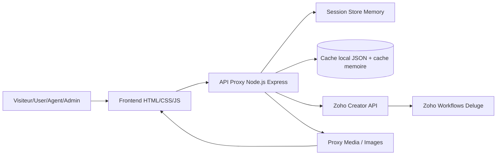
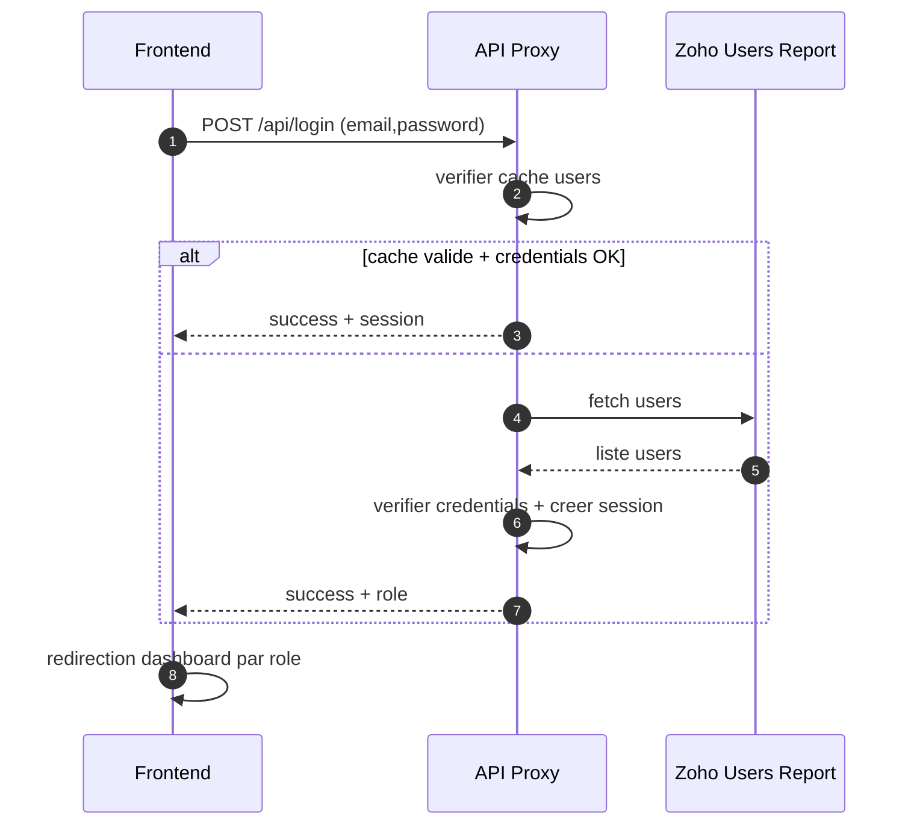
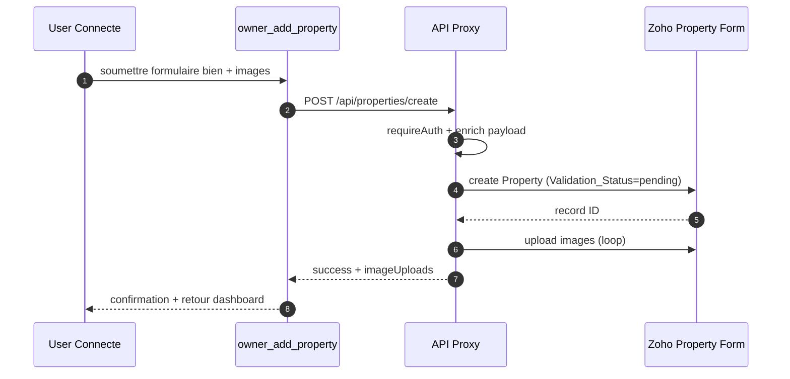
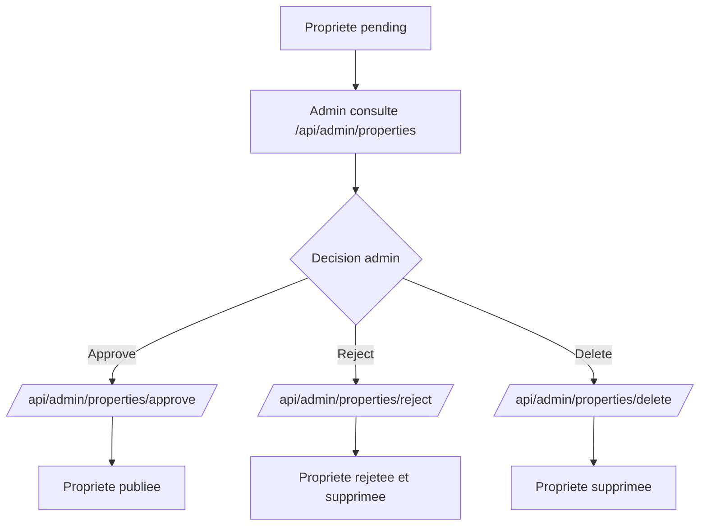
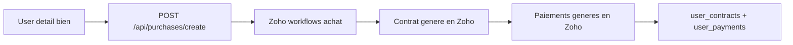

# Cahier de charge - Plateforme GI Immobilier

## 1. Contexte du projet
La plateforme GI Immobilier est une application web de gestion immobiliere connectee a Zoho Creator.

Objectif global:
- Proposer un portail web pour la consultation d'annonces immobilieres.
- Permettre l'authentification et la gestion des comptes (User, Agent, Admin).
- Digitaliser les processus de publication, reservation, achat, contrat et paiement.
- Permettre l'administration des utilisateurs et des proprietes.

Base de code analysee:
- Backend proxy Express: api-proxy.js
- Frontend public: index.html, annonces.html, detail.html
- Frontend User: user_dashboard.html, user_contracts.html, user_payments.html, owner_add_property.html
- Frontend Agent: agent_dashboard.html, agent_profile.html, agent_validation.html
- Frontend Admin: admin_dashboard.html, admin_users.html, admin_properties.html
- Auth shared helper: auth-helper.js

## 2. Perimetre fonctionnel
### 2.1 Perimetre inclus
- Consultation des annonces et detail d'un bien
- Inscription / connexion / deconnexion
- Publication d'un bien par utilisateur connecte
- Reservation d'un bien
- Demande d'achat d'un bien
- Suivi des contrats et paiements utilisateur
- Gestion du profil agent
- Gestion admin des utilisateurs
- Gestion admin des proprietes (approve/reject/delete)
- Proxy media et image pour contourner CORS Zoho

### 2.2 Perimetre exclu (etat actuel)
- Paiement en ligne integre (gateway bancaire)
- Notifications push/email natives cote application
- Workflow BPM externe (hors Zoho workflows)
- Application mobile native

## 3. Parties prenantes et acteurs
- Visiteur: consulte annonces et details
- Utilisateur (User): reserve, achete, publie un bien, suit contrats/paiements
- Agent: gere son profil et son espace agent
- Administrateur: gere users et moderation proprietes
- Systeme Zoho Creator: source de donnees et logique metier workflow
- Backend Node.js: proxy API, session, cache, mediation Zoho

## 4. Besoins fonctionnels

### 4.1 Authentification et session
- BF-01: Le systeme doit permettre la connexion via email/mot de passe.
- BF-02: Le systeme doit exposer l'etat de connexion via un endpoint de statut.
- BF-03: Le systeme doit deconnecter l'utilisateur et detruire la session serveur.
- BF-04: Le systeme doit rediriger l'utilisateur vers son dashboard selon role.
- BF-05: Le systeme doit proteger les routes metier sensibles (reservation, achat, creation bien, profil).

Routes identifiees:
- GET /api/auth-status
- POST /api/login
- POST /api/logout
- GET /api/logout
- POST /api/signup

### 4.2 Gestion des proprietes (public + owner)
- BF-06: Le systeme doit lister les proprietes approuvees uniquement pour le public.
- BF-07: Le systeme doit afficher le detail d'une propriete via son ID.
- BF-08: Le systeme doit permettre a un user connecte de creer une propriete avec statut pending.
- BF-09: Le systeme doit accepter plusieurs images et les uploader vers Zoho + cache local.
- BF-10: Le systeme doit filtrer/rechercher les annonces par type et terme de recherche.

Routes identifiees:
- GET /api/properties
- GET /api/properties/:id
- POST /api/properties/create
- GET /api/media
- GET /api/property-image/:recordId

### 4.3 Reservation et achat
- BF-11: Le systeme doit permettre la creation d'une reservation (dates debut/fin) par user connecte.
- BF-12: Le systeme doit permettre la creation d'une demande d'achat par user connecte.
- BF-13: Le systeme doit associer automatiquement buyer/seller/property selon session et donnees Zoho.
- BF-14: Le systeme doit remonter les messages d'erreur workflows Zoho (conflit date, validation, etc.).

Routes identifiees:
- POST /api/reservations/create
- POST /api/purchases/create

### 4.4 Espace utilisateur
- BF-15: Le dashboard user doit afficher profil, proprietes, achats, contrats, paiements.
- BF-16: Le systeme doit filtrer les donnees par utilisateur connecte.
- BF-17: Le systeme doit afficher les contrats utilisateur.
- BF-18: Le systeme doit afficher les paiements utilisateur.

Routes identifiees:
- GET /api/agent/profile
- GET /api/purchases/user
- GET /api/contracts/user
- GET /api/payments/user

### 4.5 Espace agent
- BF-19: L'agent doit consulter son profil depuis Zoho.
- BF-20: L'agent doit pouvoir mettre a jour son profil (nom, email, telephone, mot de passe optionnel).

Routes identifiees:
- GET /api/agent/profile
- POST /api/agent/profile/update

### 4.6 Espace administration
- BF-21: L'admin doit consulter la liste des utilisateurs.
- BF-22: L'admin doit creer un utilisateur avec role.
- BF-23: L'admin doit supprimer un utilisateur (workflow puis fallback suppression directe).
- BF-24: L'admin doit consulter le detail d'un utilisateur.
- BF-25: L'admin doit mettre a jour un utilisateur.
- BF-26: L'admin doit consulter toutes les proprietes (published/pending/rejected).
- BF-27: L'admin doit approuver une propriete.
- BF-28: L'admin doit rejeter une propriete (avec suppression).
- BF-29: L'admin doit supprimer une propriete.
- BF-30: L'admin doit vider le cache applicatif.

Routes identifiees:
- GET /api/admin/users
- POST /api/admin/users/add
- POST /api/admin/users/delete
- GET /api/admin/users/detail/:id
- POST /api/admin/users/update
- GET /api/admin/properties
- POST /api/admin/properties/approve
- POST /api/admin/properties/reject
- POST /api/admin/properties/delete
- POST /api/admin/cache/clear

## 5. Besoins non fonctionnels

### 5.1 Performance
- BNF-01: Le listing des proprietes doit supporter pagination et limitation (max_records <= 200).
- BNF-02: Le backend doit implementer un cache en memoire pour listings/detail proprietes.
- BNF-03: Le frontend doit charger les listes de facon asynchrone avec indicateurs d'etat.

### 5.2 Securite
- BNF-04: Les routes sensibles doivent etre protegees par session (requireAuth).
- BNF-05: Le mot de passe ne doit pas etre expose dans le frontend.
- BNF-06: Le serveur doit gerer session/cookie via express-session.
- BNF-07: Les droits OAuth Zoho doivent couvrir lecture/creation/update/delete selon modules.

### 5.3 Fiabilite et resilence
- BNF-08: Le backend doit supporter fallback de source Zoho (v2.1, creator, creatorapp).
- BNF-09: Le backend doit tenter un refresh token OAuth sur erreurs 401/403.
- BNF-10: Le serveur doit changer automatiquement de port en cas de conflit (EADDRINUSE).
- BNF-11: Le systeme doit gerer mode degrade via cache utilisateurs si Zoho indisponible.

### 5.4 Maintenabilite
- BNF-12: La logique metier principale doit rester dans Zoho workflows (approche Zoho-first).
- BNF-13: Le code doit centraliser les helpers auth dans auth-helper.js.
- BNF-14: Les pages role-based doivent reutiliser des patterns UI communs (dashboard template).

### 5.5 UX/UI
- BNF-15: L'application doit etre responsive desktop/mobile.
- BNF-16: Les statuts de chargement/succes/erreur doivent etre visibles (pill, alerts, empty states).
- BNF-17: Les interactions critiques (delete/approve/create) doivent retourner un feedback utilisateur clair.

## 6. Architecture logique

## 7. Schema des flux principaux

### 7.1 Flux de connexion

### 7.2 Flux de publication d'un bien

### 7.3 Flux de moderation admin

### 7.4 Flux achat -> contrats -> paiements

## 8. Regles de gestion deduites du code
- RG-01: Les proprietes visibles publiquement doivent etre approuvees.
- RG-02: Toute nouvelle propriete creee par user est en statut pending.
- RG-03: Les reservations et achats exigent utilisateur authentifie.
- RG-04: Les contrats/paiements utilisateur sont filtres par Buyer/session.
- RG-05: Les validations metier critiques (mot de passe, disponibilite, transitions) sont gerees dans Zoho workflows.
- RG-06: Les images peuvent provenir de Zoho API, URL directe, uploads locaux ou data URI.

## 9. Contraintes techniques
- Stack backend: Node.js + Express + express-session + node-fetch
- Stack frontend: HTML/CSS/JS vanilla
- Source de verite metier: Zoho Creator (forms/reports/workflows)
- Environnement requis: variables .env valides (OAuth tokens, domaines Zoho, secrets session)
- Port par defaut: 3000 (fallback automatique port+1)

## 10. Critères d'acceptation (extraits)
- CA-01: Un user non connecte ne peut pas creer reservation/achat/bien.
- CA-02: Un user connecte voit uniquement ses achats/contrats/paiements.
- CA-03: Une propriete pending n'apparait pas dans annonces publiques.
- CA-04: L'admin peut approuver/rejeter/supprimer une propriete avec feedback.
- CA-05: Les erreurs Zoho sont remontees en message exploitable cote UI.
- CA-06: Les pages principales sont responsives et conservent la lisibilite mobile.

## 11. Risques et points d'attention
- Le demarrage du proxy est actuellement en echec dans l'environnement observe (sortie terminal code 1). Une validation du fichier .env, scopes OAuth et traces runtime est necessaire avant recette finale.
- La suppression/update Zoho depend fortement des scopes OAuth exacts (DELETE/UPDATE reports).
- Les workflows Zoho et le code Node doivent rester synchronises (noms de champs, noms de forms, statuts).

## 12. Recommandations de lotissement
- Lot 1: Stabilisation technique (demarrage serveur, scopes OAuth, logs erreurs)
- Lot 2: Stabilisation fonctionnelle role User (annonces, detail, achat, reservation)
- Lot 3: Stabilisation role Admin (users/properties)
- Lot 4: Qualite non fonctionnelle (tests, performance cache, securite session, monitoring)

---
Document produit a partir du scan du code existant, version de reference pour cadrage fonctionnel et technique.