# 📐 Deluge Workflows Design — Nexus Real Estate Management Platform

> Complete technical documentation of the Nexus platform Deluge scripts, illustrated by Mermaid diagrams covering architecture, flows, sequences, activities, state transitions, and class diagrams.

---

## 1. Global System Architecture

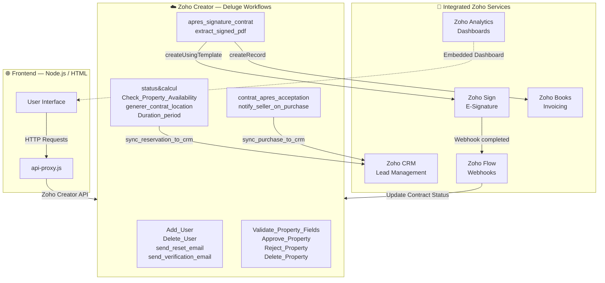

---

## 2. Class Diagram — Creator Data Model

```mermaid
classDiagram
    class User {
        +ID : String
        +ID1 : Integer
        +full_name : Object
        +Email : String
        +Phone_Number : String
        +Password : String
        +Role : Enum[User,Agent,Admin]
        +Reset_Token : String
        +Reset_Token_Expiry : String
        +Verification_Token : String
        +CRM_Contact_ID : String
    }

    class Property {
        +ID : String
        +ID1 : Integer
        +title : String
        +description : String
        +location : String
        +Price1 : Decimal
        +status : Enum
        +type_field : Enum
        +Surface1 : Integer
        +Rooms1 : Integer
        +Bathrooms1 : Integer
        +Floor : Integer
        +Year_Built : Date
        +prix_nuit : Decimal
        +loyer_mensuel : Decimal
        +caution_courte : Decimal
        +caution_longue : Decimal
        +Validation_Status : Enum
        +User : Lookup~User~
    }

    class Reservation {
        +ID : String
        +ID1 : Integer
        +Start_Date : Date
        +End_Date : Date
        +Status : Enum
        +Duration_days : Integer
        +Duration_Text : String
        +type_location : Enum
        +Montant : Decimal
        +Caution : Decimal
        +Commission_rate : Decimal
        +Commission_montant : Decimal
        +Net_Proprietaire : Decimal
        +Advance_Amount : Decimal
        +Advance_Payment_Status : Enum
        +Payment_Deadline : DateTime
        +CRM_Deal_ID : String
        +User : Lookup~User~
        +Property1 : Lookup~Property~
    }

    class Purchase {
        +ID : String
        +ID1 : Integer
        +Status : Enum
        +Request_Date : Date
        +Message : String
        +Preference_de_contact : String
        +Advance_Amount : Decimal
        +Advance_Payment_Status : Enum
        +Payment_Deadline : DateTime
        +CRM_Deal_ID : String
        +Buyer : Lookup~User~
        +Seller : Lookup~User~
        +Property : Lookup~Property~
    }

    class Contract {
        +ID : String
        +ID1 : Integer
        +type_field : Enum
        +Status : Enum
        +prix_total : Decimal
        +Creation_date : Date
        +Date_signature : Date
        +Zoho_Sign_ID : String
        +Contrat_PDF_URL : String
        +Signe_Acheteur : String
        +Signe_Vendeur : String
        +Buyer : Lookup~User~
        +Seller : Lookup~User~
        +Property : Lookup~Property~
        +Reservation : Lookup~Reservation~
        +Purchase : Lookup~Purchase~
    }

    class Payment {
        +ID : String
        +Amount : Decimal
        +Payment_Date : Date
        +Status : Enum
        +type_field : Enum
        +methode : Enum
        +Ref_transaction : String
        +Date_limite : Date
        +Commission_rate : Decimal
        +Commission_montant : Decimal
        +Net_Proprietaire : Decimal
        +Zoho_Books_Invoice_ID : String
        +Contract : Lookup~Contract~
    }

    User "1" --> "0..*" Property : owns
    User "1" --> "0..*" Reservation : makes
    User "1" --> "0..*" Purchase : submits
    Property "1" --> "0..*" Reservation : receives
    Property "1" --> "0..*" Purchase : receives
    Reservation "1" --> "0..1" Contract : generates
    Purchase "1" --> "0..1" Contract : generates
    Contract "1" --> "0..1" Payment : triggers
```

---

## 3. General Platform Flow

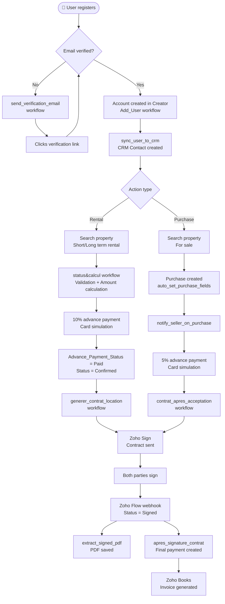

---

## 4. Sequence Diagram — `status&calcul` Workflow (Reservation)

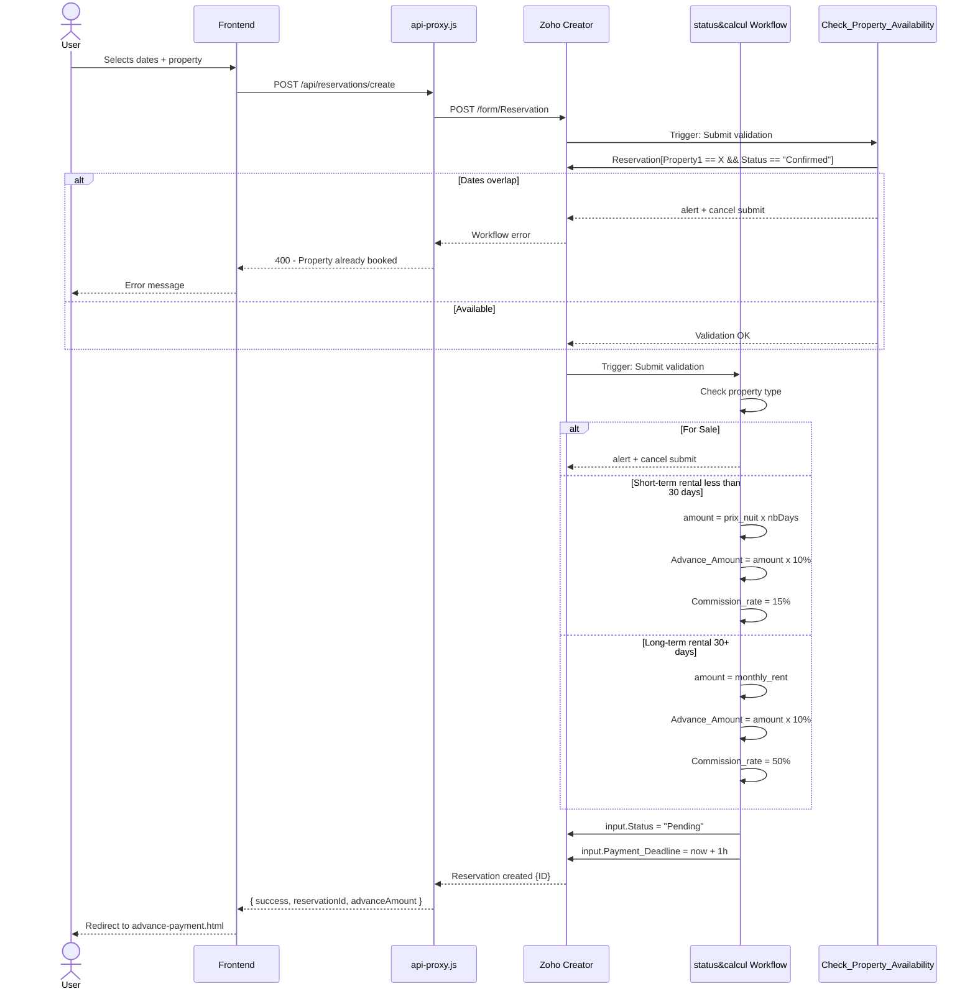

---

## 5. Sequence Diagram — Complete E-Signature Flow

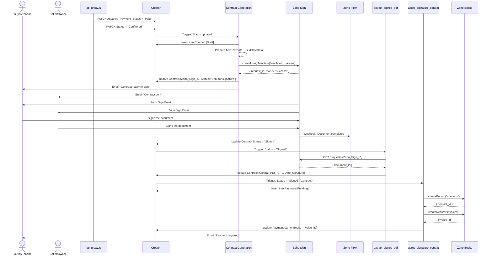

---

## 6. Sequence Diagram — Password Reset Flow

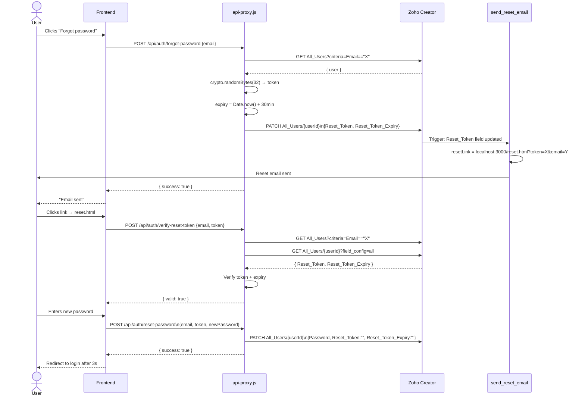

---

## 7. Activity Diagram — `Add_User` Workflow

```mermaid
flowchart TD
    START([▶ User form submitted]) --> A[Get input.Password]
    A --> B{Starts with\n$2b$ or $2a$?}
    B -->|Yes — already hashed| G
    B -->|No| C{length >= 8?}
    C -->|No| E1[alert: 8 characters minimum\ncancel submit]
    C -->|Yes| D{Contains uppercase?}
    D -->|No| E2[alert: uppercase required\ncancel submit]
    D -->|Yes| E{Contains digit?}
    E -->|No| E3[alert: digit required\ncancel submit]
    E -->|Yes| F{Contains special char\n!@#$%^&*()}
    F -->|No| E4[alert: special character required\ncancel submit]
    F -->|Yes| G[User[Email == input.Email]]
    G --> H{Email already exists?}
    H -->|Yes| E5[alert: email already in use\ncancel submit]
    H -->|No| I{Role empty?}
    I -->|Yes| J[input.Role = 'User']
    I -->|No| K
    J --> K([✅ Record creation allowed])
    E1 --> STOP([❌ End])
    E2 --> STOP
    E3 --> STOP
    E4 --> STOP
    E5 --> STOP
```

---

## 8. Activity Diagram — `generer_contrat_location` Workflow

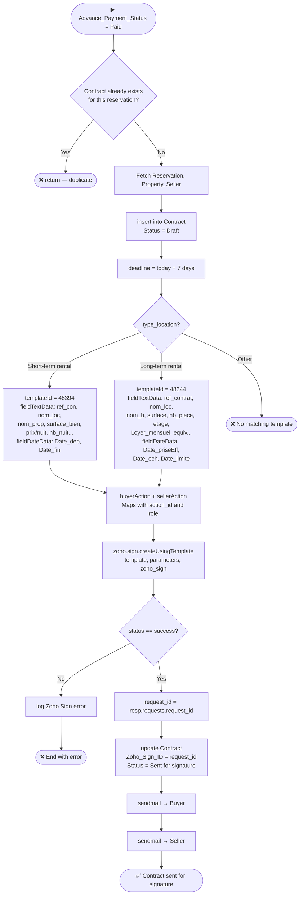

---

## 9. State Transition Diagram — Reservation

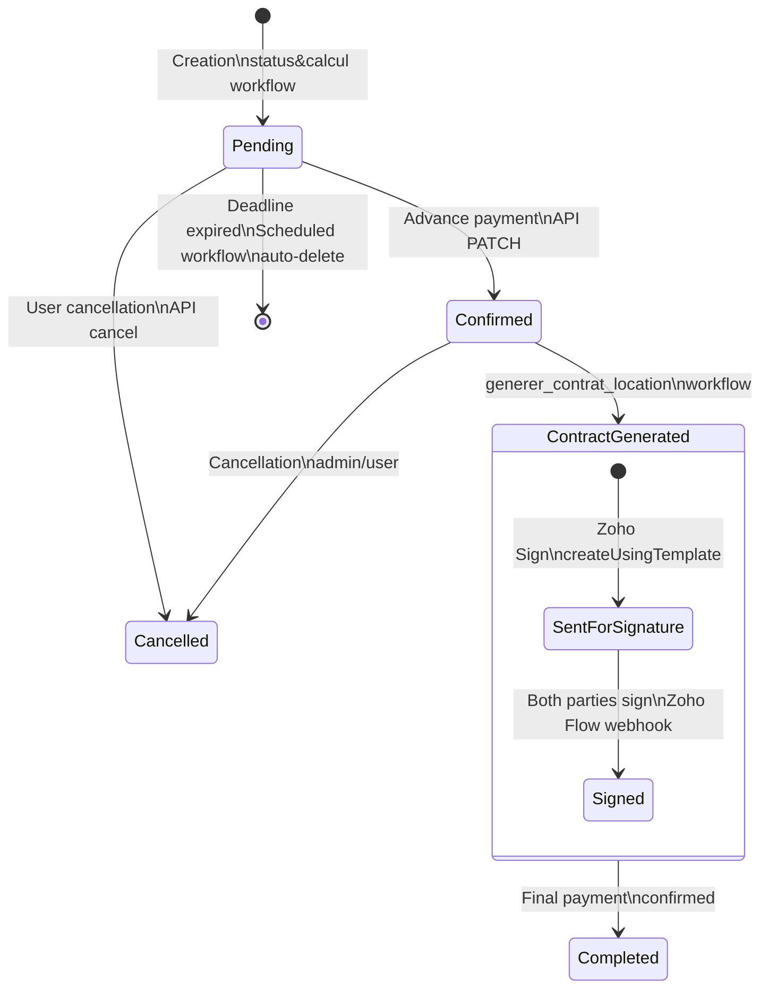

---

## 10. State Transition Diagram — Purchase Request

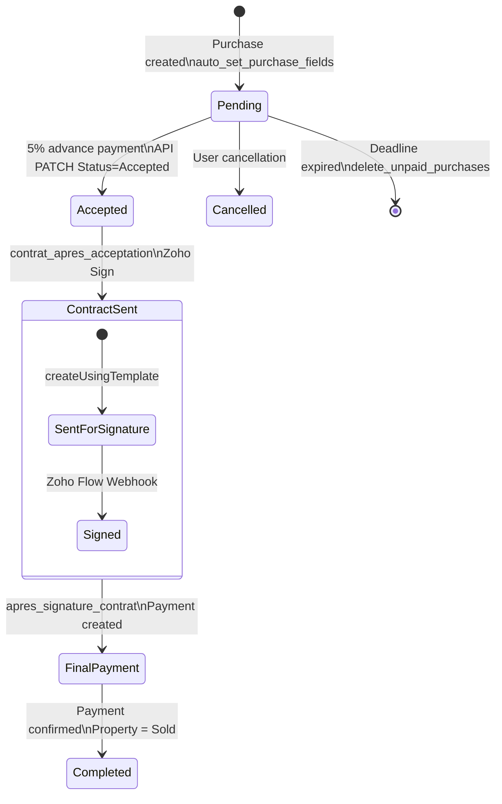

---

## 11. State Transition Diagram — Contract

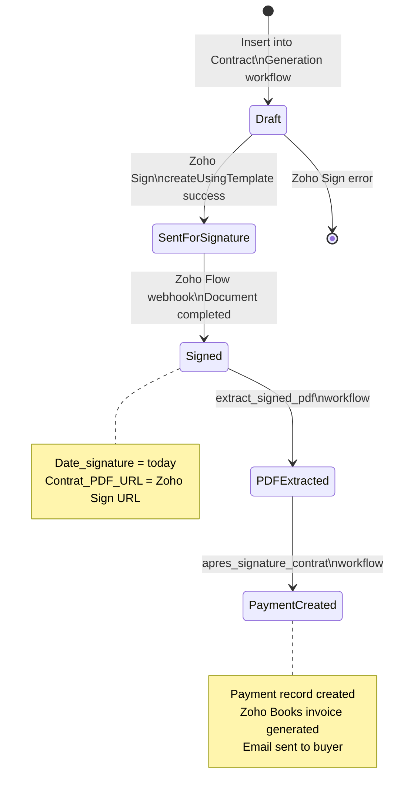

---

## 12. State Transition Diagram — Payment

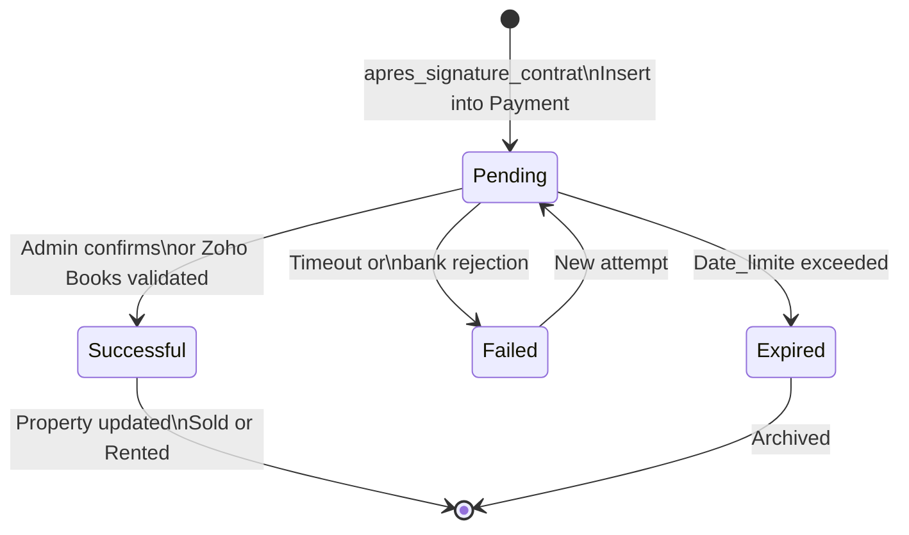

---

## 13. State Transition Diagram — Property

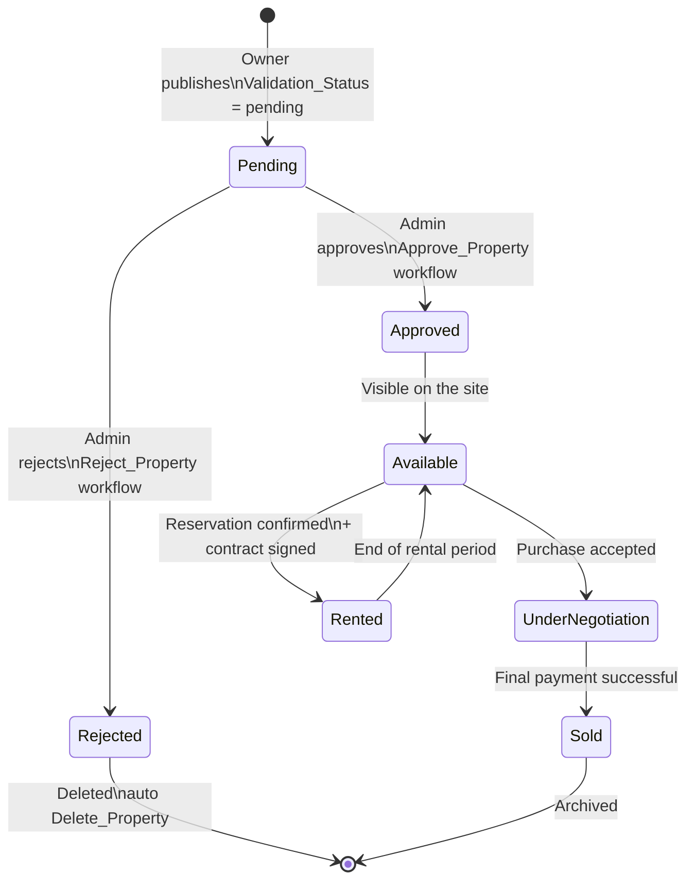

---

## 14. Sequence Diagram — CRM Synchronization

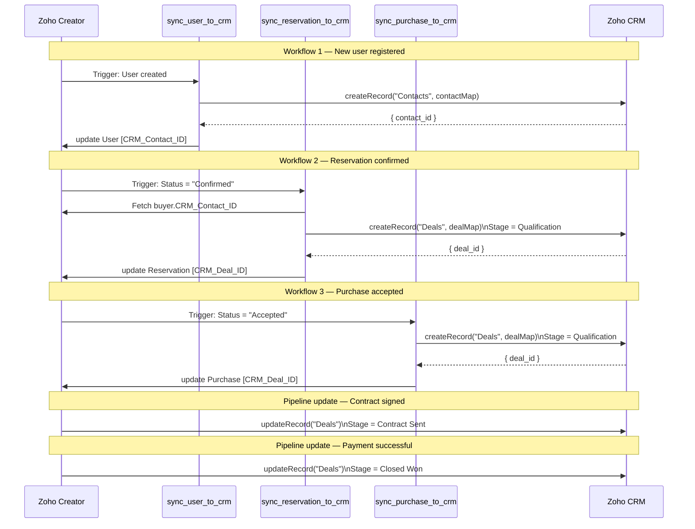

---

## 15. Flow Diagram — Automatic Deletion (Payment Deadline)

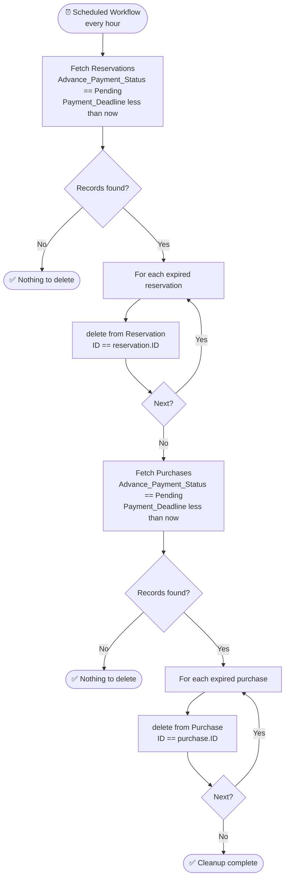

---

## 16. Activity Diagram — `apres_signature_contrat` Workflow

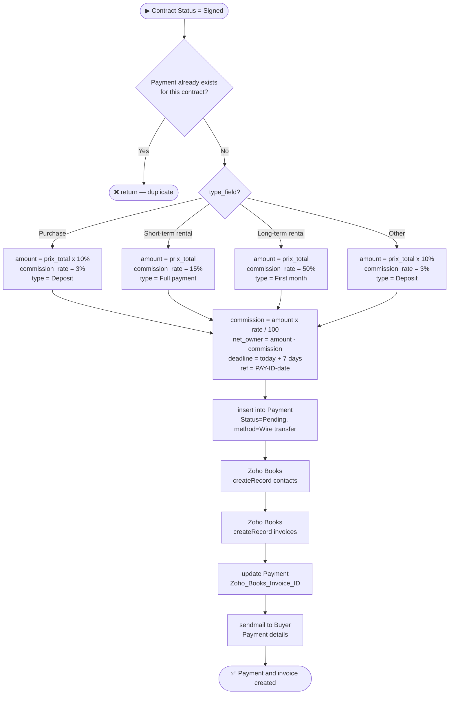

---

## 17. Synthetic View — Workflow Interactions

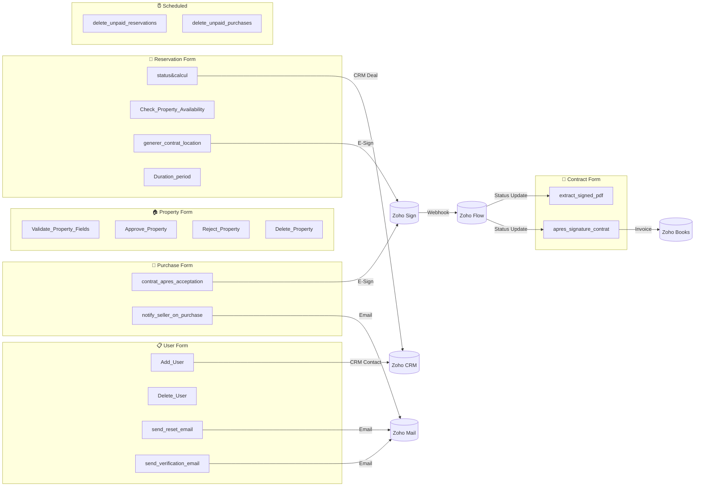

---

*Documentation generated for the Final Year Project (PFE) — Nexus Real Estate Management Platform — Bachelor of Information Technology, Specialization: Information Systems Development*
