<!-- ═══════════════════════════════════════════════════════════════════════════
     GI IMMOBILIER — REAL ESTATE MANAGEMENT PLATFORM
     Final Year Project Report (PFE)
     Bachelor of Science in Information Technology
     Specialization: Information Systems Development
     Academic Year: 2025–2026
     Host Organization: NEXFLOW
     ═══════════════════════════════════════════════════════════════════════════ -->

<div align="center">

# GI Immobilier — Intelligent Real Estate Management Platform

### Final Year Project Report (PFE)

**Bachelor of Science in Information Technology**
*Specialization: Information Systems Development*
*Academic Year: 2025–2026*

---

**Host Organization:** NEXFLOW  
**Supervisors:** [Academic Supervisor] · [Company Supervisor]  
**Authors:** Yossra · Nadia

---

*Submitted in partial fulfillment of the requirements for the degree of*
*Bachelor of Science in Information Technology*

</div>

---

---

# General Introduction

The digitalization of real estate services represents one of the most significant transformations in the modern economy. Property owners, tenants, buyers, and real estate professionals are increasingly turning to digital platforms to manage their transactions, contracts, and communications. Despite the emergence of several global platforms such as Airbnb, Booking.com, and Zillow, existing solutions often fall short in providing a unified, integrated ecosystem that handles the full lifecycle of real estate operations — from property listing and reservation to contract generation, electronic signature, payment tracking, and intelligent AI-driven assistance.

This final year project (PFE) was carried out within **NEXFLOW**, a certified Zoho partner and digital transformation consulting company based in Tunisia. The project aimed to design and implement **GI Immobilier**, a comprehensive web-based real estate management platform adapted to the Tunisian market and built upon the Zoho ecosystem.

The platform serves four distinct user categories: **tenants and buyers** who search, reserve, and purchase properties; **property owners** who list and manage their assets; **real estate agents** who validate listings and supervise transactions; and **administrators** who oversee the entire platform operation. Beyond these standard roles, the platform integrates **Nexia**, an AI-powered chatbot built on the Groq API using the LLaMA 3.1 language model, providing contextual, role-aware assistance to all user types.

The technical architecture adopts a **Zoho-First** philosophy, in which the Node.js/Express backend acts as a thin, intelligent proxy layer while all core business logic — status workflows, financial calculations, contract generation, and automated notifications — resides within **Zoho Creator Deluge** scripts and integrated Zoho services (Zoho Sign, Zoho Flow, Zoho Analytics, Zoho CRM, and Zoho Books).

This report is organized into six chapters, each corresponding to one development sprint under the Scrum agile methodology:

- **Chapter 1** introduces the host organization, analyzes the competitive landscape, and presents the proposed solution and adopted methodology.
- **Chapter 2** defines the system requirements, identifies actors, presents the product backlog, adopted technologies, and overall architecture.
- **Chapter 3** covers Sprint 1: user authentication and account management.
- **Chapter 4** covers Sprint 2: property management and search.
- **Chapter 5** covers Sprint 3: reservations, purchases, and transaction management.
- **Chapter 6** covers Sprint 4: AI chatbot integration and platform supervision.

The report concludes with a general conclusion discussing achievements, limitations, and future perspectives.

---

---

# Chapter 1: General Presentation

## Introduction

This chapter presents the general framework of the end-of-studies project. It begins with a detailed overview of the host organization — NEXFLOW — and the professional context in which the project was carried out. It then introduces the problem of real estate digitalization, analyzes existing competitive platforms, and defines the limitations that motivated the development of the proposed solution. Finally, this chapter presents the Scrum agile methodology adopted throughout the project.

---

## 1. Presentation of the Host Organization

NEXFLOW is a digital transformation consulting company specialized in the integration, customization, and optimization of Zoho solutions. As a certified Zoho partner, NEXFLOW supports organizations across all phases of their digital transformation journey — from strategic consulting and solution design to full implementation, user training, and continuous post-deployment support.

The company's core mission is to help businesses accelerate their digital evolution by leveraging the power of the Zoho ecosystem, enabling them to improve operational efficiency, streamline business processes, and enhance competitive advantage through tailored technology solutions.

### 1.1. Key Services

NEXFLOW offers a comprehensive portfolio of services covering the entire lifecycle of digital transformation projects:

| Service Area | Description |
|---|---|
| **Digital Transformation Consulting** | Strategic guidance in defining digital roadmaps and selecting appropriate Zoho modules |
| **Zoho Solutions Implementation** | End-to-end design, configuration, and deployment of Zoho applications |
| **Systems Integration & API Connectivity** | Integration of Zoho tools with third-party systems through RESTful APIs |
| **Training & User Support** | Certified trainer-led sessions to ensure effective user adoption |
| **Operational Support & Maintenance** | Ongoing post-deployment support for performance and continuous improvement |

### 1.2. Expertise

NEXFLOW relies on a multidisciplinary team of certified professionals with deep expertise in Zoho technologies and digital transformation:

- **Certified Zoho Consultants** — Advanced configuration and integration experts
- **Business Analysts** — Process specialists aligning Zoho solutions to organizational objectives
- **Zoho Creator Developers** — Custom application developers using Deluge scripting
- **API Integration Specialists** — Engineers ensuring seamless data exchange between platforms
- **Data Security Experts** — Professionals implementing compliance and confidentiality protocols

### 1.3. Company Profile

| Field | Details |
|---|---|
| Company Name | NEXFLOW |
| Sector | Digital Transformation / IT Consulting |
| Specialization | Zoho Ecosystem Integration |
| Phone | +216 29 905 835 |
| Email | contact@nexflow.tn |

---

## 2. Project Presentation

The GI Immobilier project aims to design and implement a digital real estate platform inspired by modern marketplace models, dedicated to the management of property rentals and sales in Tunisia. The platform is built on the Zoho ecosystem and integrates multiple Zoho applications to ensure centralized data management, automated business processes, secure access control, and an intelligent AI chatbot for contextual user assistance.

### 2.1. Existence Study

With the rapid expansion of digital technologies, online real estate platforms have become essential tools for managing property listings, reservations, contracts, and customer relationships. Traditional real estate workflows are often time-consuming, paper-intensive, and require manual coordination between multiple stakeholders — owners, tenants, buyers, agents, and legal entities.

At the global level, several digital platforms have emerged to address these challenges. However, most existing solutions focus on front-end user experience and lack deep integration with business management tools, automated workflow engines, or intelligent conversational assistants. This gap creates a strong opportunity to develop a unified platform combining real estate management, business automation, and artificial intelligence within a single coherent ecosystem.

In the Tunisian context specifically, there is a notable absence of integrated real estate platforms that combine property listing, transaction management, electronic contract signing, and AI assistance in a unified environment tailored to local market requirements (Tunisian Dinar, local regulatory norms, and French-language interface).

### 2.2. Competitor Platforms

**Airbnb**
Airbnb is a global online marketplace connecting property owners with travelers seeking short-term accommodation. It provides property listings, online booking, payment processing, and user reviews. However, Airbnb is primarily designed for short-term rentals and does not offer advanced internal management tools for contract lifecycle management, internal automation workflows, or business-specific AI assistance.

**Booking.com**
Booking.com is an online travel agency supporting accommodation reservations worldwide. It features strong search and filtering capabilities and wide global reach. However, the platform is fundamentally reservation-centric and provides limited tools for property owners to manage business processes, contracts, or financial tracking.

**Zillow**
Zillow is a real estate platform focused on property listings, price estimations, and market insights for long-term rentals and sales. While rich in data, Zillow does not support transactional processes such as booking flows, advance payment mechanisms, electronic contract signing, or intelligent conversational assistance.

### 2.3. Comparison Table of Existing Real Estate Platforms

*Table 1.1: Comparison of Existing Real Estate Platforms*

| Feature | Airbnb | Booking.com | Zillow | GI Immobilier (Proposed) |
|---|---|---|---|---|
| Platform Type | Short-term Marketplace | Online Booking | Listing Platform | Integrated Management Platform |
| Target Audience | Travelers, Hosts | Travelers, Property Owners | Buyers, Renters, Agents | Tenants, Owners, Agents, Admins |
| Rental Types | Short-term | Short-term | Long-term & Sales | Short-term, Long-term, Sales |
| Contract Management | ✗ | ✗ | Limited | ✓ (Zoho Sign) |
| Payment Integration | ✓ | ✓ | ✗ | ✓ (Zoho Books) |
| Workflow Automation | ✗ | Limited | ✗ | ✓ (Zoho Flow, Deluge) |
| AI Chatbot | ✗ | ✗ | ✗ | ✓ (Role-based, LLaMA 3.1) |
| Role-Based Access | Basic | Basic | Basic | Advanced (4 roles) |
| Electronic Signature | ✗ | ✗ | ✗ | ✓ (Zoho Sign) |
| Analytics Dashboard | ✗ | Basic | Basic | ✓ (Zoho Analytics) |
| Tunisian Market Adaptation | ✗ | ✗ | ✗ | ✓ (DT currency, French UI) |

---

## 3. Criticism of the Existing Platforms

Despite their widespread adoption, existing real estate platforms present several significant limitations that negatively impact the efficiency of real estate management and the overall user experience:

**Airbnb:** Primarily designed for short-term rentals and tourist accommodation, Airbnb does not provide tools for contract lifecycle management, internal workflow automation, or financial tracking for property agencies. The platform entirely lacks an intelligent AI assistant capable of answering business-specific queries or triggering operational actions based on user roles.

**Booking.com:** While providing strong booking capabilities, Booking.com is fundamentally reservation-oriented and offers property managers limited control over internal business processes. The absence of integrated contract management, payment scheduling, and business automation creates operational gaps for professional real estate entities.

**Zillow:** Focused on property listings and market data, Zillow does not support the transactional dimension of real estate — it cannot handle bookings, advance payments, electronic contract signatures, or payment schedule tracking. Furthermore, it provides no intelligent conversational features to guide users through complex real estate processes.

**Overall Assessment:** Existing platforms address isolated dimensions of the real estate domain but consistently fail to provide a unified solution combining property management, automated workflows, financial tracking, electronic signing, and role-aware intelligent assistance in a single integrated ecosystem. This is the gap that GI Immobilier is designed to fill.

---

## 4. Proposed Solution

Based on the competitive analysis and identified limitations, the proposed solution is an **integrated web-based real estate management platform** built on the Zoho ecosystem and enhanced with an AI-powered intelligent chatbot. The platform, named **GI Immobilier**, is designed to serve the Tunisian market with a French-language user interface while adhering to professional English code and documentation standards.

The proposed solution delivers the following core capabilities:

- **Centralized Real Estate Management:** All property listings, user accounts, reservations, purchase requests, contracts, and payments are centralized in Zoho Creator, ensuring data consistency, integrity, and availability.

- **Automated Business Processes:** Zoho Flow automation and Deluge scripting handle key workflows automatically — reservation validation, property availability checking, advance payment processing, contract generation via Zoho Sign, and payment scheduling through Zoho Books.

- **Full Transaction Lifecycle:** The platform supports both rental (short-term and long-term) and sales transactions, from initial listing through advance payment confirmation, electronic contract signing, and final payment recording.

- **Intelligent AI Chatbot (Nexia):** An AI assistant powered by Groq API (LLaMA 3.1 8B Instant) provides contextual, role-based assistance to all user types. Agents and administrators can trigger operational actions (approve/reject properties, manage users) directly through natural language conversation.

- **Role-Based Access and Security:** Four distinct roles — User (Tenant/Buyer), Property Owner, Real Estate Agent, and Administrator — each have tailored dashboards, permissions, and chatbot capabilities.

- **Zoho Ecosystem Integration:** The platform leverages Zoho Creator (database + workflows), Zoho Sign (e-signatures), Zoho Flow (cross-app automation), Zoho Analytics (KPI dashboards), Zoho CRM (customer relationship management), and Zoho Books (invoicing and payment tracking).

---

## 5. Adopted Methodology

### 5.1. Framework SCRUM

Scrum is an agile framework designed to help teams tackle complex adaptive problems while delivering products of maximum value creatively and efficiently. It operates on iterative cycles called **Sprints**, typically lasting two to four weeks, with each Sprint producing a potentially shippable product increment.

The Scrum framework is built around three core roles:

- **Scrum Master:** Promotes and supports Scrum practices, removes impediments, and ensures the team adheres to Scrum theory and values.
- **Product Owner (PO):** Defines and prioritizes the Product Backlog, ensuring maximum business value from each Sprint.
- **Development Team (DT):** A self-organizing, cross-functional team that transforms backlog items into functional product increments.

The process flow in our project follows the standard Scrum structure:

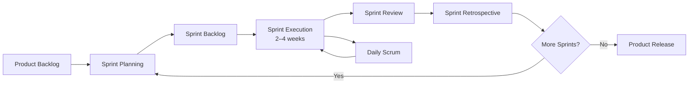

### 5.2. Justification of Choice

The Scrum methodology was selected for this project based on several key criteria:

| Criterion | Justification |
|---|---|
| **Iterative Development** | Allows delivering functional increments at the end of each Sprint, enabling early validation |
| **Flexibility** | Adapts to changing requirements discovered during development |
| **Transparency** | Sprint boards and burn-down charts provide clear progress visibility |
| **Risk Management** | Short cycles reduce the risk of major deviations from project objectives |
| **Continuous Improvement** | Retrospectives enable the team to improve processes between Sprints |

The project was organized into **four Sprints of four weeks each**, covering: (1) Authentication & Account Management, (2) Property Management & Search, (3) Reservations & Transaction Management, and (4) AI Chatbot Integration & Platform Supervision.

---

## Conclusion

This first chapter established the general context of the GI Immobilier project by presenting the host organization NEXFLOW and its expertise in Zoho ecosystem integration. Through a systematic analysis of existing real estate platforms, we identified the key gaps — particularly the absence of integrated automation, contract management, electronic signing, and AI-assisted interaction — that motivated the development of our proposed solution. The Scrum methodology was selected to guide the iterative development process, ensuring continuous delivery of functional increments and adaptability to evolving requirements. The following chapter will detail the system requirements, technical architecture, and adopted technology stack.

---

---

# Chapter 2: Project Preparation

## Introduction

This chapter is dedicated to the detailed preparation and planning of the GI Immobilier platform. It begins by identifying all system actors and their roles, followed by a comprehensive specification of functional and non-functional requirements. The global use case diagram provides a visual overview of system interactions. The chapter then presents the full Product Backlog organized across four Sprints, followed by a detailed description of all adopted technologies — hardware, development environment, frameworks, programming languages, and database management. The chapter concludes with the presentation of the adopted layered architecture and its advantages.

---

## 1. Capturing Requirements

### 1.1. Identification of Actors

The GI Immobilier platform involves five distinct actors interacting with the system at different levels of access and capability:

| Actor | Description | Access Level |
|---|---|---|
| **Administrator** | Platform manager with full access to all data, users, properties, and system configuration | Highest |
| **Real Estate Agent** | Agency employee responsible for validating property listings and supervising transactions | High |
| **Property Owner** | A registered user who lists properties for rent or sale and monitors incoming requests | Medium-High |
| **User (Tenant/Buyer)** | A registered user who searches, reserves, and purchases properties | Medium |
| **AI Chatbot (Nexia)** | Intelligent assistant providing role-aware assistance and executing authorized operational actions | Automated |

> **Note:** The Property Owner is not a separate Zoho role — owners are `User` accounts who have listed at least one property. The system dynamically identifies them based on their property portfolio.

### 1.2. Requirements Specification

#### 1.2.1. Functional Requirements

**User (Tenant / Buyer)**

*Authentication:*
- Create a new user account (two-step email verification)
- Log in securely using email and password credentials
- Reset forgotten password via email token

*Property Search and Consultation:*
- Browse all approved property listings (for rent or for sale)
- Search properties by location and price range
- Filter properties by type (rental / sale) and category
- View detailed property information including images, specifications, and pricing
- Contact property owners via WhatsApp or email

*Rental Management (Tenant Role):*
- Create reservation requests for selected properties and date ranges
- Pay advance amount (10% of rental cost) to confirm a reservation
- View current and past reservations with status tracking
- Cancel active reservations

*Purchase Management (Buyer Role):*
- Submit purchase requests for properties listed for sale
- Pay advance amount (5% of property price) to confirm purchase
- Track the status of purchase requests
- Consult generated sales contracts

*Contract and Payment Management:*
- View electronically signed rental and sales contracts
- Download contract PDFs via secure proxy
- View payment schedules and histories
- Access Zoho Books invoice links

*Chatbot Interaction:*
- Query Nexia for property information, reservation status, and purchase tracking
- Receive contextual guidance based on current role and data

*Profile Management:*
- View and update personal information (name, email, phone)
- Change account password

**Property Owner**

- Register, log in, and reset password
- Add new property listings with complete details (title, description, price, type, location, images)
- Update existing property information (pricing, description, availability)
- Delete property listings
- View all personally submitted properties and their validation status
- Monitor incoming rental reservations and purchase requests
- Access contracts and payment records related to owned properties
- Query Nexia for operational insights about their properties

**Real Estate Agent**

- Securely log in to the agent dashboard
- Review and validate (approve or reject) pending property listings
- Monitor all reservations, purchase requests, contracts, and payments platform-wide
- Trigger property validation actions directly via Nexia chatbot
- Update profile information

**Administrator**

- Securely log in with platform-wide access
- Manage all registered users: view, search, create, edit roles, and delete
- Supervise all property listings across all validation statuses
- Approve or reject pending property listings
- Delete any property or user record
- View Zoho Analytics dashboards and KPI charts
- Clear platform-wide data caches
- Use Nexia with full administrative action capabilities (approve/reject properties, delete users, show charts)
- Monitor chatbot activity via dedicated admin interface

#### 1.2.2. Non-Functional Requirements

| Category | Requirement | Implementation |
|---|---|---|
| **Performance** | Fast response times under normal load | In-memory caching (15–30 s TTL), request deduplication, compression middleware |
| **Security** | Protection of user and financial data | Helmet headers, rate limiting, session management, OAuth2 token rotation, image proxy whitelist |
| **Scalability** | Support for growing user base | Stateless-ready architecture; external store (Redis) recommended for multi-instance deployment |
| **Reliability** | Stable operation with graceful error handling | Exponential retry backoff, 3-URL Zoho fallback, unhandled rejection guards, SIGTERM handlers |
| **Usability** | Intuitive interfaces for all user types | Role-specific dashboards, French-language UI, responsive design |
| **Maintainability** | Clean, documented codebase | Separation of concerns (Node.js proxy / Zoho logic), `backend-utils.js` shared utilities |
| **Availability** | Minimal downtime | Multi-base Zoho API fallback, graceful shutdown, startup token validation |

---

## 2. Global Use Case Diagram

The following diagram provides a global overview of all system interactions between actors and the platform's core functional modules:

```mermaid
graph TB
    subgraph ACTORS["System Actors"]
        U([👤 User<br/>Tenant/Buyer])
        O([🏠 Property Owner])
        A([🔑 Agent])
        ADM([⚙️ Administrator])
        BOT([🤖 AI Chatbot<br/>Nexia])
    end

    subgraph AUTH["Authentication Module"]
        UC1[Register Account]
        UC2[Login]
        UC3[Logout]
        UC4[Reset Password]
        UC5[Manage Profile]
    end

    subgraph PROP["Property Module"]
        UC6[Browse Properties]
        UC7[View Property Detail]
        UC8[Add Property]
        UC9[Edit Property]
        UC10[Delete Property]
        UC11[Validate Property]
        UC12[Contact Owner]
    end

    subgraph TRANS["Transaction Module"]
        UC13[Create Reservation]
        UC14[Cancel Reservation]
        UC15[Submit Purchase Request]
        UC16[Pay Advance]
        UC17[View Contracts]
        UC18[Download PDF]
        UC19[Track Payments]
    end

    subgraph ADMIN_MOD["Administration Module"]
        UC20[Manage Users]
        UC21[View Analytics]
        UC22[Clear Cache]
    end

    subgraph CHAT["AI Chatbot Module"]
        UC23[Query Chatbot]
        UC24[Execute Admin Actions]
    end

    U --> UC1 & UC2 & UC3 & UC4 & UC5
    U --> UC6 & UC7 & UC12
    U --> UC13 & UC14 & UC15 & UC16 & UC17 & UC18 & UC19
    U --> UC23

    O --> UC1 & UC2 & UC5
    O --> UC8 & UC9 & UC10 & UC6 & UC7
    O --> UC13 & UC15 & UC17 & UC19
    O --> UC23

    A --> UC2 & UC5
    A --> UC11 & UC6
    A --> UC13 & UC15 & UC17 & UC19
    A --> UC23 & UC24

    ADM --> UC2
    ADM --> UC20 & UC21 & UC22
    ADM --> UC11 & UC6
    ADM --> UC23 & UC24

    BOT --> UC23
```

---

## 3. Product Backlog

The Product Backlog contains all user stories organized across four Sprints. Story points use the Fibonacci scale (1, 2, 3, 5, 8).

*Table 2.1: Complete Product Backlog*

| Sprint | # | User Story | Effort |
|---|---|---|---|
| **Sprint 1** | 1 | As a user, I want to register an account to access the platform. | 3 |
| | 2 | As a user, I want to log in securely using my credentials. | 2 |
| | 3 | As a user, I want to log out from my account securely. | 1 |
| | 4 | As a user, I want to reset my password if I forget it. | 3 |
| | 5 | As a user, I want to modify my profile information. | 3 |
| | 6 | As an administrator, I want to view the list of all registered users. | 3 |
| | 7 | As an administrator, I want to add a user account manually. | 3 |
| | 8 | As an administrator, I want to modify user roles and information. | 5 |
| | 9 | As an administrator, I want to delete a user account when necessary. | 3 |
| **Sprint 2** | 10 | As a property owner, I want to add a new property listing with full details and images. | 5 |
| | 11 | As a property owner, I want to update my property information and availability. | 5 |
| | 12 | As a property owner, I want to delete a property listing. | 3 |
| | 13 | As a property owner, I want to view all my listed properties. | 3 |
| | 14 | As a user, I want to view all approved properties for rent or sale. | 3 |
| | 15 | As a user, I want to search properties by location and price range. | 5 |
| | 16 | As a user, I want to filter properties by type (rent or sale). | 3 |
| | 17 | As a user, I want to contact the property owner via WhatsApp or email. | 8 |
| | 18 | As an agent, I want to approve or reject pending property listings. | 5 |
| | 19 | As an agent, I want to view all approved and pending properties. | 3 |
| | 20 | As an agent, I want to modify my profile information. | 5 |
| **Sprint 3** | 21 | As a tenant, I want to create a reservation request for a selected property and date range. | 5 |
| | 22 | As a tenant, I want to confirm a reservation by paying the advance amount. | 4 |
| | 23 | As a tenant, I want to view my current and past reservations. | 3 |
| | 24 | As a tenant, I want to cancel an active reservation. | 3 |
| | 25 | As a buyer, I want to submit a purchase request for a property. | 5 |
| | 26 | As a buyer, I want to confirm a purchase by paying the advance amount. | 4 |
| | 27 | As a buyer, I want to track the status of my purchase request. | 3 |
| | 28 | As a property owner, I want to view incoming reservations on my properties. | 3 |
| | 29 | As a property owner, I want to view incoming purchase requests on my properties. | 5 |
| | 30 | As an administrator, I want to generate rental contracts automatically. | 8 |
| | 31 | As an administrator, I want to view analytical charts of the platform. | 6 |
| **Sprint 4** | 32 | As a user, I want to query the AI chatbot about available properties. | 5 |
| | 33 | As a user, I want the chatbot to retrieve my reservation status. | 6 |
| | 34 | As a user, I want the chatbot to retrieve my purchase request status. | 6 |
| | 35 | As a user, I want to contact a human agent via live chat for immediate assistance. | 8 |
| | 36 | As an agent, I want to use the chatbot to validate or reject pending properties. | 6 |
| | 37 | As an administrator, I want to supervise and control chatbot behavior and scope. | 5 |

---

## 4. The Adopted Technologies

### 4.1. Hardware Environment and Tools

The development environment was set up on the following hardware configuration:

| Component | Specification |
|---|---|
| Device | MSI Thin 15 Gaming Laptop |
| Processor | Intel Core i5 (13th Generation) |
| RAM | 16 GB DDR5 |
| Storage | 512 GB NVMe SSD |
| Operating System | Windows 11 Pro (64-bit) |

### 4.2. Development Environment

The platform relies on a cloud-native development environment centered around the Zoho ecosystem:

| Tool | Role |
|---|---|
| **Zoho Creator** | Low-code platform for business application logic, forms, reports, and workflows |
| **Zoho CRM** | Customer relationship management and contact/lead synchronization |
| **Zoho Flow** | Cross-application workflow automation (Zoho Sign → Zoho Creator updates) |
| **Zoho Books** | Invoicing, payment tracking, and financial record management |
| **Zoho Sign** | Electronic signature and PDF contract generation |
| **Zoho Analytics** | Business intelligence dashboards and KPI chart embedding |
| **Zoho API Console** | OAuth 2.0 credential registration and scope management |
| **Node.js** | JavaScript runtime for the backend proxy server |
| **Visual Studio Code** | Primary code editor |
| **draw.io** | UML diagramming and system architecture modeling |
| **Git** | Version control |

### 4.3. Frameworks and Libraries

| Framework / Library | Version | Purpose |
|---|---|---|
| **Express.js** | ^5.2.1 | Web server and REST API routing |
| **express-session** | ^1.19.0 | Server-side session management |
| **node-fetch** | ^2.7.0 | HTTP client for Zoho API calls |
| **form-data** | ^4.0.5 | Multipart form data for image uploads |
| **helmet** | ^8.2.0 | HTTP security headers |
| **express-rate-limit** | ^8.5.2 | Login and password-reset rate limiting |
| **compression** | ^1.8.1 | HTTP response compression |
| **nodemailer** | ^8.0.7 | SMTP email delivery |
| **bcryptjs** | ^3.0.3 | Password hashing utilities |
| **cors** | ^2.8.6 | Cross-Origin Resource Sharing |

### 4.4. Programming Languages

| Language | Usage |
|---|---|
| **JavaScript (Node.js)** | Backend proxy server, business logic orchestration, OAuth management |
| **Deluge** | Zoho Creator workflow scripting — all core business rules and state transitions |
| **HTML5** | Frontend page structure (17+ dedicated pages) |
| **CSS3** | Custom styling (`styles.css`, `styles_agent.css`, `styles_admin.css`) |
| **JavaScript (Browser)** | Frontend interactions, chatbot widget, property detail logic |

### 4.5. Database Management

The platform does not use a traditional relational database. Instead, it leverages **Zoho Creator** as a cloud-native, low-code database:

| Zoho Creator Form (Table) | Key Fields |
|---|---|
| `User` | full_name, Email, Phone_Number, Password, Role, Reset_Token, Reset_Token_Expiry |
| `Property` | title, description, Price1, type_field, location, Surface1, Validation_Status, User (→ User) |
| `Reservation` | Start_Date, End_Date, Status, Advance_Amount, Payment_Deadline, User, Property1 |
| `Purchase` | Buyer, Seller, Property, Statut, Advance_Amount, Payment_Deadline |
| `Contract` | Buyer, Reservation, Purchase, Contrat_PDF_URL, Signing_Status |
| `Payment` | Contract, Amount, Status, Zoho_Books_Invoice_ID |

Zoho Creator provides automatic backups, built-in access control, reporting, and REST API exposure without manual database administration overhead.

### 4.6. Modeling

All UML diagrams in this report were produced using **draw.io** (structural diagrams) and **Mermaid** (embedded in the report). Diagrams include: use case diagrams, sequence diagrams, class diagrams, state transition diagrams, activity diagrams, architecture diagrams, and deployment diagrams.

---

## 5. Proposed Architecture

The platform adopts a **Zoho-First Layered Architecture** in which each layer has clearly defined responsibilities:

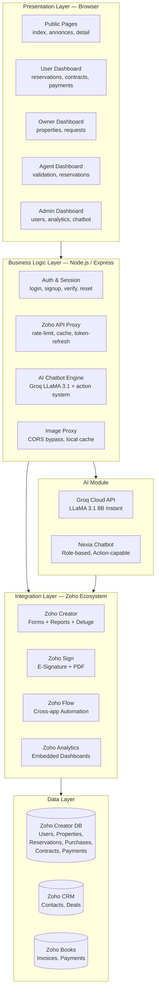

### 5.1. Components of the Layered Architecture

**Presentation Layer**
The user interface layer comprises 17+ dedicated HTML/CSS/JavaScript pages, each tailored to a specific user role. Public pages provide unauthenticated property browsing; authenticated dashboards provide role-specific data views and management interfaces.

**Business Logic Layer**
The Node.js/Express server (`api-proxy.js`, ~3,700 lines) acts as an intelligent proxy. It manages: session authentication, OAuth token lifecycle management, in-memory caching, rate limiting, image proxying, and Groq AI chatbot routing. It deliberately contains minimal business logic — all business rules are delegated to Zoho Creator Deluge workflows.

**Integration Layer**
This layer orchestrates communication between Node.js and the Zoho ecosystem via RESTful APIs:
- Zoho Creator (CRUD on Forms/Reports via 3-URL fallback)
- Zoho Sign (contract generation and e-signature routing)
- Zoho Flow (webhook-based cross-app automation)
- Zoho Analytics (KPI dashboard embedding)

**Data Layer**
Zoho Creator serves as the single source of truth for all operational data. Zoho CRM stores synchronized contacts and deal pipelines. Zoho Books manages invoices and financial records.

**AI Module**
The Groq Cloud API processes natural language queries via LLaMA 3.1 8B Instant. Node.js injects role-specific system prompts and live property data before each API call, enabling context-aware responses and action execution.

### 5.2. Advantages of the Layered Architecture

| Advantage | Description |
|---|---|
| **Separation of Concerns** | Each layer has a single well-defined responsibility |
| **Maintainability** | Changes in one layer do not cascade to other layers |
| **Scalability** | New Zoho modules or AI features can be added without redesigning the architecture |
| **Security** | Authentication/authorization is centralized in the Node.js layer |
| **Resilience** | 3-URL Zoho fallback, exponential retry, and graceful degradation at every integration point |

---

## Conclusion

This chapter laid the technical foundation for the GI Immobilier project. We identified five system actors and comprehensively specified both functional and non-functional requirements. The global use case diagram illustrates the full scope of system interactions. The 37-item Product Backlog, organized across four Sprints, provides the execution roadmap. The adopted technology stack — Node.js/Express as a Zoho proxy, Deluge for business logic, and multiple Zoho services for data, signing, automation, and analytics — reflects a deliberate Zoho-First architecture designed for integration depth, automation richness, and operational reliability. The following chapters describe the development of each Sprint in detail.

---

---

# Chapter 3: Sprint 1 — User Authentication and Account Management

## Introduction

Sprint 1 focuses on implementing the foundation of the GI Immobilier platform: user authentication and account management. This Sprint establishes the identity management layer upon which all subsequent functionality depends. It covers user registration with email verification, secure login and logout, password reset, profile management, and full administrative user management capabilities. This Sprint lasted four weeks and was completed with all planned user stories delivered and validated.

---

## 1. Sprint 1 Objective

The primary objective of Sprint 1 is to deliver a fully functional and secure user identity management system. This includes:

- A two-step registration flow with email verification via Zoho Creator Custom API
- Secure session-based authentication with rate limiting against brute-force attacks
- Token-based password reset with 30-minute expiry
- Profile management for all authenticated users
- Administrative user management (create, read, update role, delete) accessible from the admin dashboard

---

## 2. Sprint Backlog

*Table 3.1: Sprint 1 Backlog*

| Story # | User Story | Effort | Status |
|---|---|---|---|
| 1 | As a user, I want to register a new account to access the platform. | 3 | ✅ Done |
| 2 | As a user, I want to log in securely using my email and password. | 2 | ✅ Done |
| 3 | As a user, I want to log out from my account securely. | 1 | ✅ Done |
| 4 | As a user, I want to reset my forgotten password via email. | 3 | ✅ Done |
| 5 | As a user, I want to update my personal profile information. | 3 | ✅ Done |
| 6 | As an administrator, I want to view the list of all registered users. | 3 | ✅ Done |
| 7 | As an administrator, I want to manually add a new user to the system. | 3 | ✅ Done |
| 8 | As an administrator, I want to modify user roles and information. | 5 | ✅ Done |
| 9 | As an administrator, I want to delete a user account. | 3 | ✅ Done |

---

## 3. Functional Description of the Stories in Sprint 1

### 3.1. General Use Case Diagram for Sprint 1

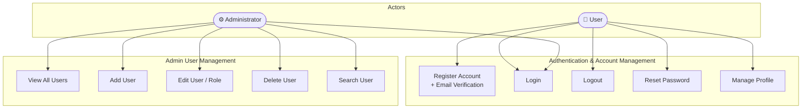

### 3.2. Refined Use Case Diagram « Profile Management »

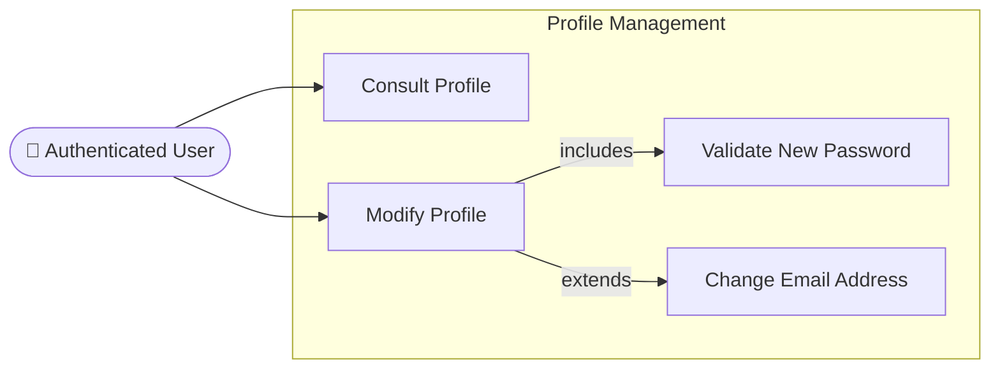

### 3.3. Textual Description of the Use Case « Consult Profile »

| Element | Description |
|---|---|
| **Use Case Name** | Consult Profile |
| **Actor** | Authenticated User (any role) |
| **Precondition** | User is logged in with a valid session |
| **Main Flow** | 1. User navigates to profile page (`profile.html` or `agent_profile.html`) → 2. System calls `GET /api/auth-status` → 3. Session data is displayed (name, email, phone) |
| **Postcondition** | Profile information is displayed to the user |
| **Alternative Flow** | Session expired → user is redirected to login page |

### 3.4. Textual Description of the Use Case « Modify Profile »

| Element | Description |
|---|---|
| **Use Case Name** | Modify Profile |
| **Actor** | Authenticated User (any role) |
| **Precondition** | User is logged in; form fields contain valid input |
| **Main Flow** | 1. User fills profile form → 2. System calls `POST /api/agent/profile/update` → 3. Node.js validates and PATCHes Zoho Creator record → 4. Session is updated → 5. Success message displayed |
| **Postcondition** | User profile is updated in Zoho Creator and session |
| **Business Rule** | Role field cannot be changed via this endpoint (security constraint) |
| **Alternative Flow** | Email already taken → error returned; password update requires valid new password |

### 3.5. Refined Use Case Diagram « User Management »

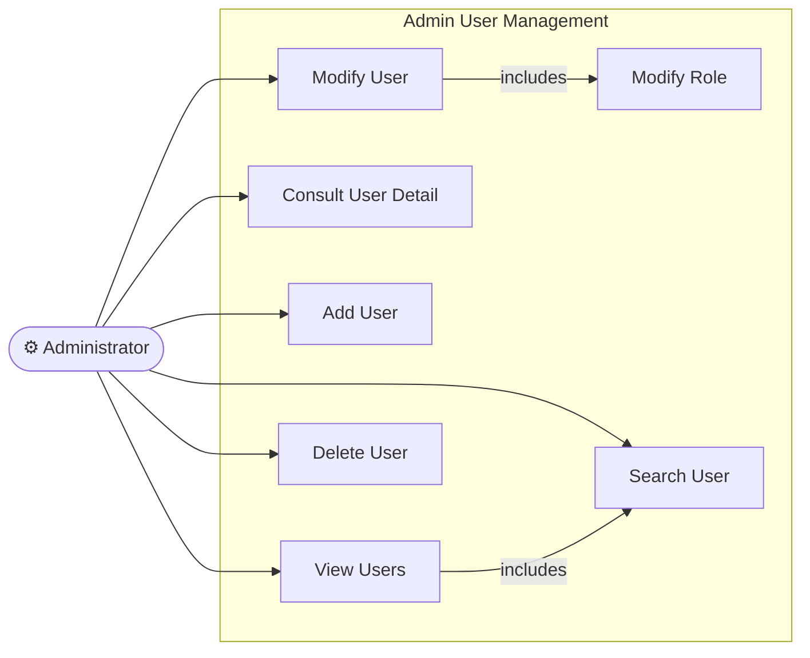

### 3.6. Textual Description of the Use Case « Consult User »

| Element | Description |
|---|---|
| **Use Case Name** | Consult User |
| **Actor** | Administrator |
| **Precondition** | Administrator is logged in; user ID is known |
| **Main Flow** | 1. Admin navigates to user list → 2. Clicks on a user → 3. System calls `GET /api/admin/users/detail/:id` → 4. Full user record is displayed |
| **Postcondition** | User profile is visible to the administrator |

### 3.7. Textual Description of the Use Case « Modify User »

| Element | Description |
|---|---|
| **Use Case Name** | Modify User |
| **Actor** | Administrator |
| **Precondition** | Administrator is logged in; target user exists |
| **Main Flow** | 1. Admin accesses user detail → 2. Edits fields (name, email, role, password) → 3. Submits form → 4. System calls `POST /api/admin/users/update` → 5. `updateUserDirect()` tries 3 base URLs × 2 PATCH strategies → 6. Success confirmed |
| **Postcondition** | User record updated in Zoho Creator |

### 3.8. Textual Description of the Use Case « Delete User »

| Element | Description |
|---|---|
| **Use Case Name** | Delete User |
| **Actor** | Administrator |
| **Precondition** | Administrator is logged in; target user exists |
| **Main Flow** | 1. Admin selects user → 2. Clicks delete → 3. Confirmation dialog → 4. System calls `POST /api/admin/users/delete` → 5. Attempts deletion via workflow form → 6. Falls back to direct `DELETE` on `All_Users` report |
| **Postcondition** | User record permanently removed from Zoho Creator |
| **Alternative Flow** | Workflow form not configured → direct DELETE is used as fallback |

### 3.9. Textual Description of the Use Case « Search User »

| Element | Description |
|---|---|
| **Use Case Name** | Search User |
| **Actor** | Administrator |
| **Precondition** | Administrator is logged in |
| **Main Flow** | 1. Admin enters search query in user list page → 2. Client-side filtering applies on loaded user data → 3. Matching users are displayed |
| **Postcondition** | Filtered user list displayed |

### 3.10. Preliminary Class Diagram for Sprint 1 User Stories

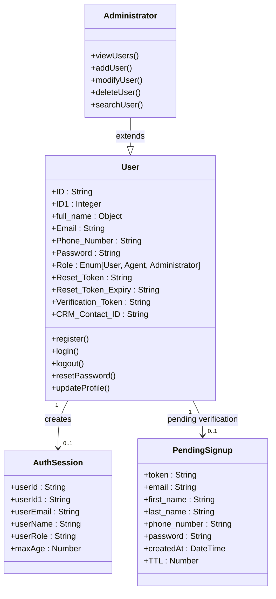

---

## 4. Behavioral Description of the Stories in Sprint 1

### 4.1. Sequence Diagram « Authentication »

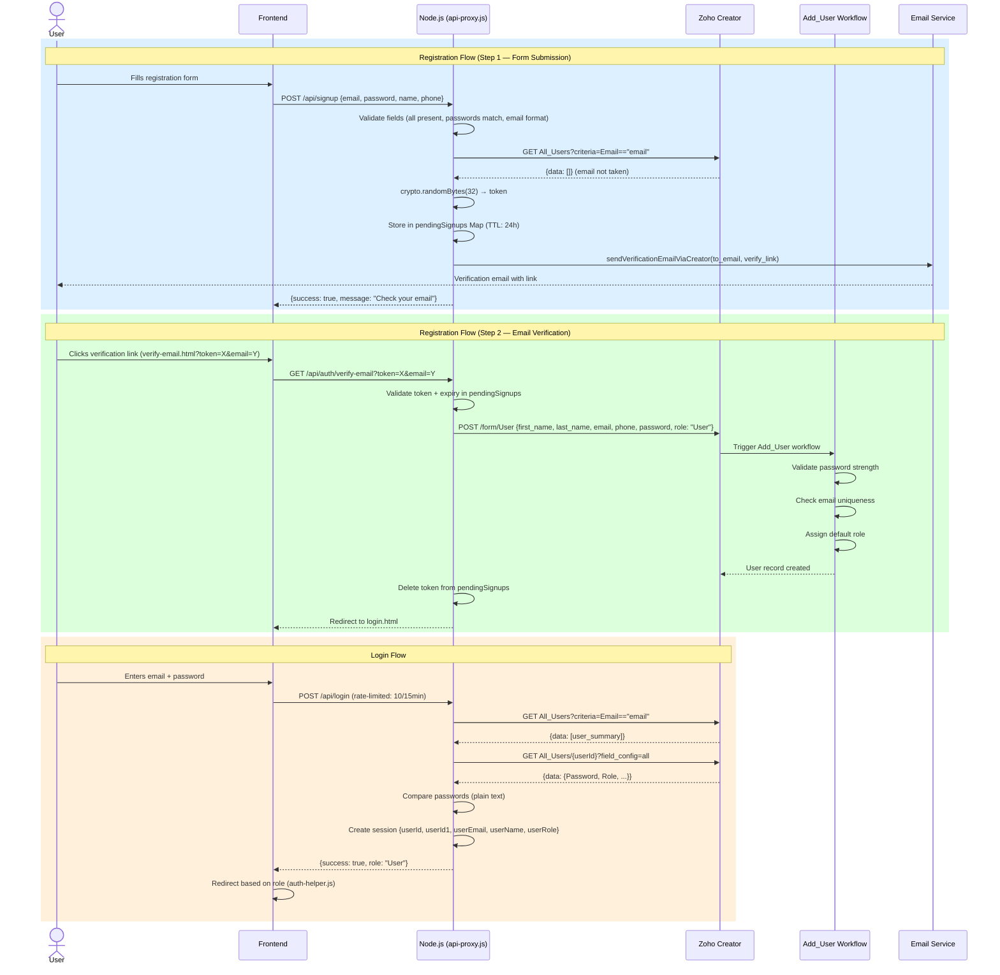

### 4.2. Sequence Diagram « Modify Profile »

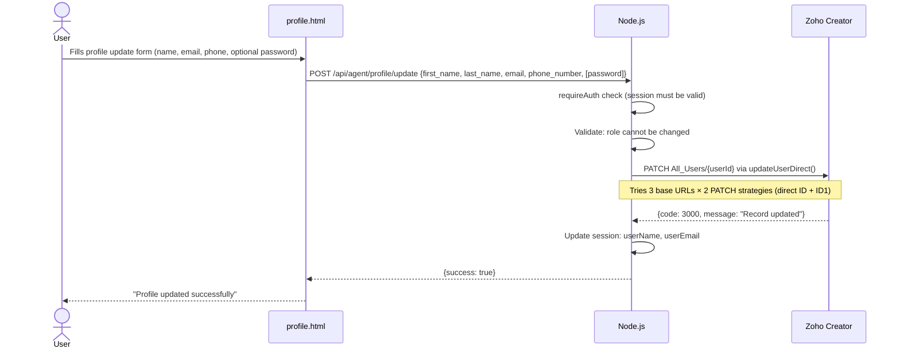

### 4.3. Sequence Diagram « Delete User »

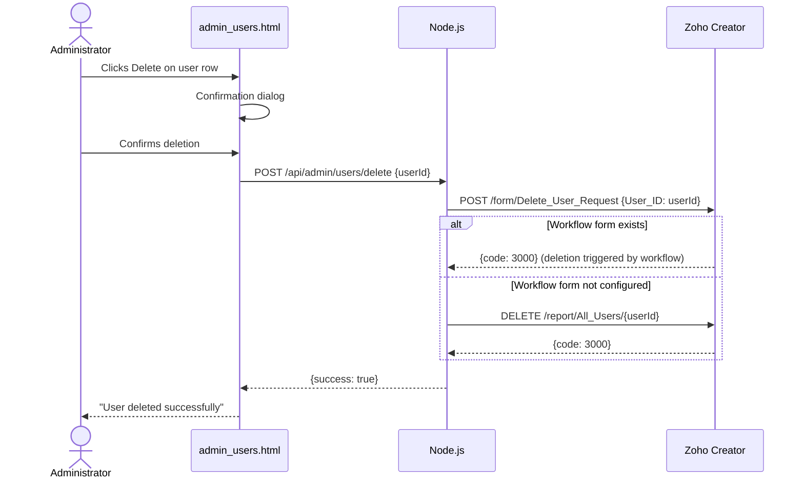

---

## 5. Final Class Diagram for Sprint 1

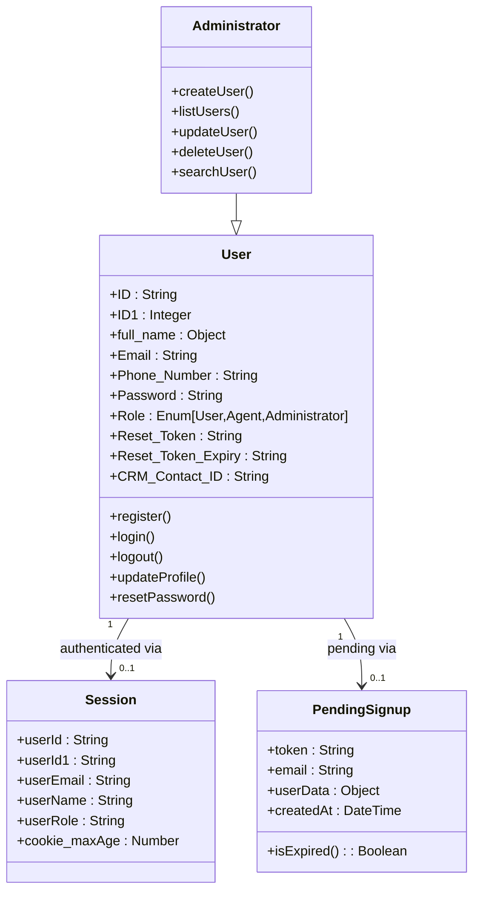

---

## 6. Sprint Review

Sprint 1 concluded with all nine planned user stories delivered and functional. The key deliverables include:

- **Registration page** (`inscription.html`) with two-step email verification flow
- **Login page** (`login.html`) with rate limiting (10 attempts/15 min) and role-based redirect
- **Password reset** (`reset.html`) with token-based flow and 30-minute expiry
- **Profile pages** (`profile.html`, `agent_profile.html`) for all authenticated users
- **Admin user management** (`admin_users.html`, `admin_user_detail.html`) with full CRUD
- **Email verification** (`verify-email.html`) handling both success and error states
- **Auth helper** (`auth-helper.js`) providing session-aware navigation rendering on all pages

---

## 7. Sprint 1 Retrospective

### 7.1. Scrum Board of the First Day

| To Do | In Progress | Done |
|---|---|---|
| Registration Form | — | — |
| Login / Logout | — | — |
| Password Reset | — | — |
| Profile Update | — | — |
| Admin User CRUD | — | — |

### 7.2. Scrum Board of the Last Day

| To Do | In Progress | Done |
|---|---|---|
| — | — | ✅ Registration + Email Verification |
| — | — | ✅ Login with Rate Limiting |
| — | — | ✅ Logout (GET + POST) |
| — | — | ✅ Password Reset (3-step) |
| — | — | ✅ Profile Update (all roles) |
| — | — | ✅ Admin User List + Search |
| — | — | ✅ Admin Add / Edit / Delete User |

### 7.3. Burn Down Chart

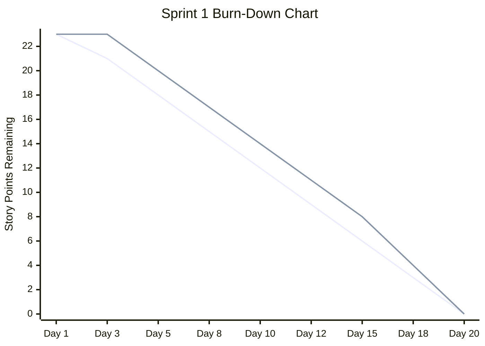

### 7.4. Retrospective Table

| Category | Item |
|---|---|
| ✅ **What went well** | Email verification flow implemented smoothly using Zoho Creator Custom API |
| ✅ **What went well** | Role-based session management integrates cleanly with all subsequent pages |
| ✅ **What went well** | Multi-strategy PATCH for user updates (3 base URLs × 2 criteria) ensured reliability |
| ⚠️ **What to improve** | Password reset email sending via SMTP fallback needs production SMTP configuration |
| ⚠️ **What to improve** | Server-side role enforcement on admin endpoints should be added in hardening phase |
| 🔧 **Action items** | Add `requireAuth` middleware to admin endpoints in Sprint 4 hardening phase |

---

## Conclusion

Sprint 1 successfully established the authentication and account management foundation of the GI Immobilier platform. The two-step email verification, secure session management, rate-limited login, and comprehensive admin user management were all delivered and validated. The Zoho Creator `Add_User` Deluge workflow handles server-side validation (password strength, email uniqueness, default role assignment) while Node.js manages the session lifecycle and token-based verification flows. The platform is now ready for Sprint 2, which will introduce property management and search capabilities.

---

---

# Chapter 4: Sprint 2 — Property Management and Search

## Introduction

Sprint 2 builds upon the authentication foundation established in Sprint 1 to introduce the core commercial functionality of the platform: property management and search. This Sprint enables property owners to list their assets, agents to validate listings, and all users to browse and search the available property catalog. The property system is the central entity of the platform, connecting all subsequent transaction flows (reservations, purchases, contracts).

---

## 1. Sprint 2 Objective

The primary objective of Sprint 2 is to deliver a complete property lifecycle management system, covering:

- Property creation by owners with rich metadata and image upload
- Agent/admin validation workflow (approve / reject)
- Public property browsing with search and filtering
- Property detail pages with owner contact features
- Agent dashboard with validation queue and property supervision tools

---

## 2. Sprint Backlog

*Table 4.1: Sprint 2 Backlog*

| Story # | User Story | Effort | Status |
|---|---|---|---|
| 10 | As a property owner, I want to add a new property listing with full details and images. | 5 | ✅ Done |
| 11 | As a property owner, I want to update my property information and availability. | 5 | ✅ Done |
| 12 | As a property owner, I want to delete a property listing. | 3 | ✅ Done |
| 13 | As a property owner, I want to view all my listed properties and their status. | 3 | ✅ Done |
| 14 | As a user, I want to view all approved properties for rent or sale. | 3 | ✅ Done |
| 15 | As a user, I want to search properties by location and price range. | 5 | ✅ Done |
| 16 | As a user, I want to filter properties by type (rent or sale). | 3 | ✅ Done |
| 17 | As a user, I want to contact the property owner via WhatsApp or email. | 8 | ✅ Done |
| 18 | As an agent, I want to approve or reject pending property listings. | 5 | ✅ Done |
| 19 | As an agent, I want to view all approved and pending properties. | 3 | ✅ Done |
| 20 | As an agent, I want to modify my profile information. | 5 | ✅ Done |

---

## 3. Functional Description of the Stories in Sprint 2

### 3.1. General Use Case Diagram for Sprint 2

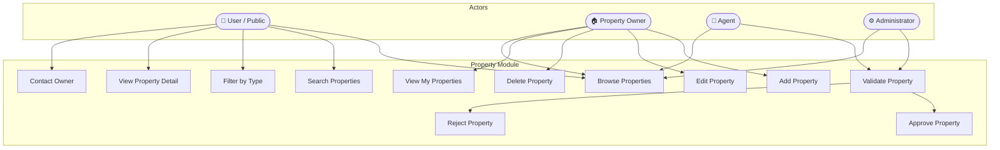

### 3.2. Refined Use Case Diagram « Property Management »

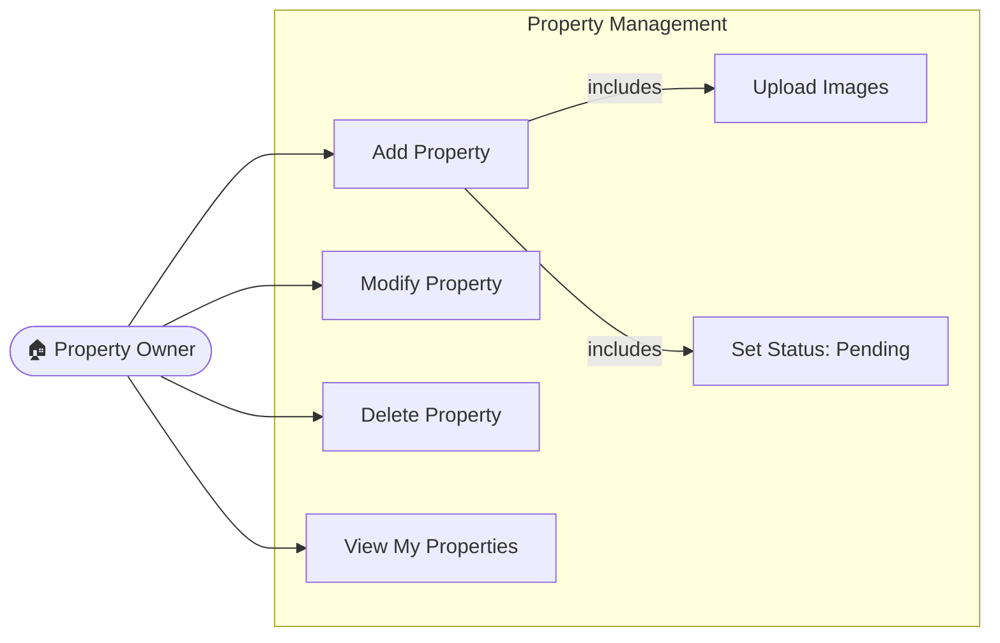

### 3.3. Textual Description of the Use Case « Add Property »

| Element | Description |
|---|---|
| **Use Case Name** | Add Property |
| **Actor** | Property Owner (authenticated User) |
| **Precondition** | User is logged in |
| **Main Flow** | 1. Owner fills property form → 2. Selects type, uploads images → 3. Submits form → 4. `POST /api/properties/create` → 5. Node.js sets `Validation_Status: 'pending'`, `User: session.userId` → 6. Record created in Zoho → 7. Images saved locally and uploaded to Zoho image field → 8. Success redirect |
| **Postcondition** | Property created with `pending` status; awaiting agent review |
| **Business Rule** | New properties are always created with `Validation_Status = 'pending'` — never `approved` |

### 3.4. Textual Description of the Use Case « Modify Property »

| Element | Description |
|---|---|
| **Use Case Name** | Modify Property |
| **Actor** | Property Owner |
| **Precondition** | Property exists and belongs to the logged-in user |
| **Main Flow** | 1. Owner accesses property list → 2. Clicks Edit → 3. Updates allowed fields → 4. `PATCH /api/properties/update/:id` → 5. Zoho record patched |
| **Postcondition** | Property record updated; only allowed fields modified |
| **Business Rule** | Only the following fields may be updated: title, description, location, Price1, prix_nuit, loyer_mensuel, caution_courte, caution_longue, Surface1, Rooms1, Bathrooms1, Floor, Year_Built |

### 3.5. Textual Description of the Use Case « Delete Property »

| Element | Description |
|---|---|
| **Use Case Name** | Delete Property |
| **Actor** | Property Owner / Administrator |
| **Precondition** | Property exists |
| **Main Flow** | 1. User selects property → 2. Clicks Delete → 3. Confirmation → 4. `POST /api/admin/properties/delete` → 5. Zoho record deleted |
| **Postcondition** | Property permanently removed from Zoho Creator |

### 3.6. Textual Description of the Use Case « Search Property »

| Element | Description |
|---|---|
| **Use Case Name** | Search Property |
| **Actor** | Any user (authenticated or public) |
| **Precondition** | At least one approved property exists |
| **Main Flow** | 1. User enters search criteria (location, price range, type) → 2. `GET /api/properties` returns cached approved list → 3. Client-side filtering applied in `annonces.js` → 4. Matching properties displayed |
| **Postcondition** | Filtered property list displayed |

### 3.7. Refined Use Case Diagram « Property Consultation »

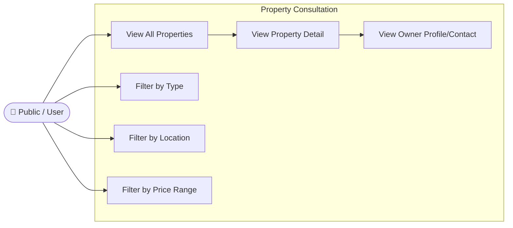

### 3.8. Textual Description of the Use Case « View All Properties »

| Element | Description |
|---|---|
| **Use Case Name** | View All Properties |
| **Actor** | Any user (unauthenticated or authenticated) |
| **Main Flow** | 1. User visits `annonces.html` → 2. `GET /api/properties` fetched → 3. Only `approved` properties returned → 4. Properties displayed with image, title, price, type, location |
| **Postcondition** | Approved properties listed |
| **Performance Note** | Results cached for 15 seconds to avoid repeated Zoho API calls |

### 3.9. Textual Description of the Use Case « Filter by Type »

| Element | Description |
|---|---|
| **Use Case Name** | Filter by Type |
| **Actor** | Any user |
| **Main Flow** | 1. User selects "For Sale" or "To Rent" filter → 2. Client-side `annonces.js` filters the loaded property array by `type_field` value → 3. Matching properties rendered |
| **Postcondition** | Property list filtered by selected type |

### 3.10. Textual Description of the Use Case « Contact Property Owner »

| Element | Description |
|---|---|
| **Use Case Name** | Contact Property Owner |
| **Actor** | Authenticated User |
| **Precondition** | User is logged in; property detail page is open |
| **Main Flow** | 1. User clicks "Contact Owner" → 2. `GET /api/properties/:id/contact` → 3. Node.js returns owner phone, name, and WhatsApp link (prefix `216` for Tunisia) → 4. Modal displays contact options |
| **Postcondition** | Owner contact information displayed |
| **Security Note** | Authentication required — contact info not visible to unauthenticated visitors |

### 3.11. Preliminary Class Diagram for Sprint 2 User Stories

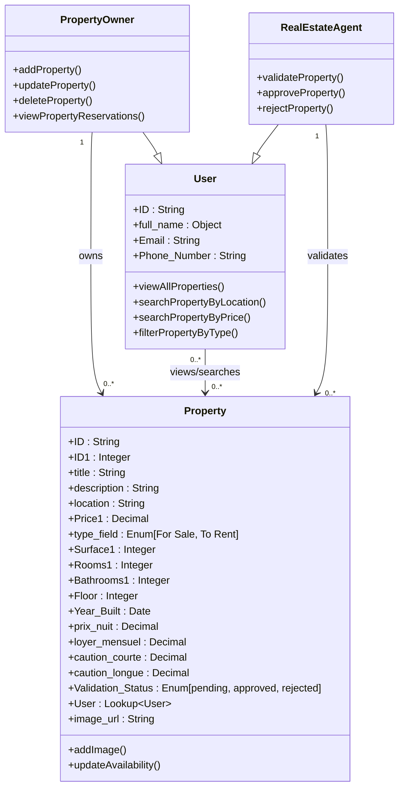

---

## 4. Behavioral Description of the Stories in Sprint 2

### 4.1. Sequence Diagram « Add Property »

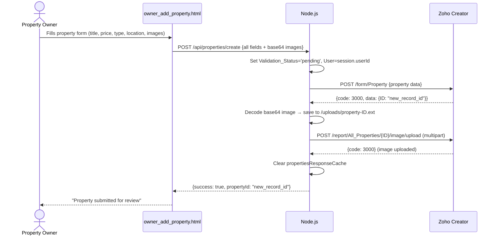

### 4.2. Sequence Diagram « Validate Property »

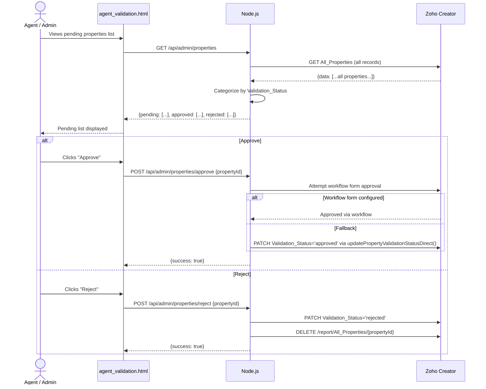

### 4.3. Sequence Diagram « Search Property »

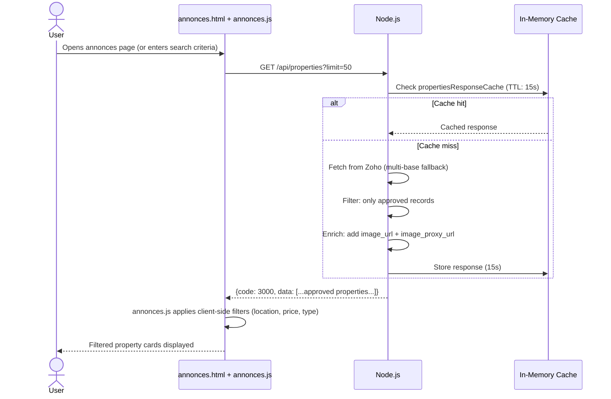

---

## 5. Final Class Diagram for Sprint 2

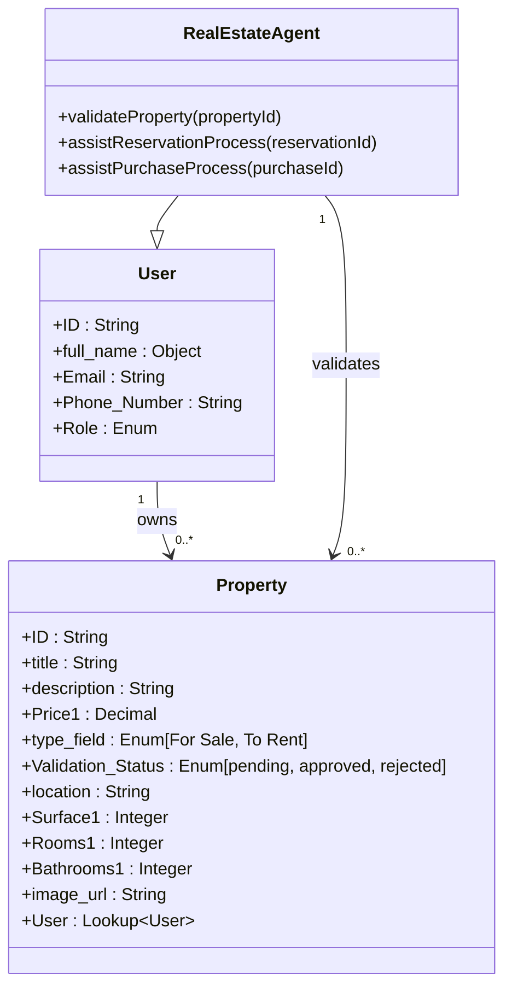

---

## 6. Sprint Review

Sprint 2 delivered all eleven planned user stories. Key achievements:

- **Property creation** (`owner_add_property.html`) with dual image storage (local disk + Zoho upload)
- **Property listing** (`annonces.html` + `annonces.js`) with client-side search, type filter, and price filter
- **Property detail** (`detail.html`) with full specifications, image gallery, and contact modal
- **Agent validation queue** (`agent_validation.html`) with approve/reject actions
- **Admin property management** (`admin_properties.html`) with categorized views by status
- **Owner property dashboard** (`user_properties.html`) with edit capability
- **15-second in-memory cache** for property list ensuring performance under load

---

## 7. Sprint 2 Retrospective

### 7.1. Scrum Board of the First Day

| To Do | In Progress | Done |
|---|---|---|
| Property CRUD | — | — |
| Search & Filter | — | — |
| Image Upload | — | — |
| Agent Validation | — | — |

### 7.2. Scrum Board of the Last Day

| To Do | In Progress | Done |
|---|---|---|
| — | — | ✅ Property Creation with Image |
| — | — | ✅ Property Update (partial) |
| — | — | ✅ Property Listing (approved only) |
| — | — | ✅ Search & Filter (client-side) |
| — | — | ✅ Property Detail Page |
| — | — | ✅ Owner Contact via WhatsApp |
| — | — | ✅ Agent Validation (approve/reject) |

### 7.3. Burn Down Chart

```mermaid
xychart-beta
    title "Sprint 2 Burn-Down Chart"
    x-axis ["Day 1","Day 3","Day 5","Day 8","Day 10","Day 12","Day 15","Day 18","Day 20"]
    y-axis "Story Points Remaining" 0 --> 44
    line [44, 40, 35, 30, 24, 18, 13, 7, 0]
    line [44, 42, 37, 31, 25, 19, 13, 6, 0]
```

### 7.4. Retrospective Table

| Category | Item |
|---|---|
| ✅ **What went well** | Image dual-storage strategy (local + Zoho) ensures reliable image availability |
| ✅ **What went well** | 15-second cache dramatically reduces Zoho API quota consumption during browsing |
| ✅ **What went well** | Multi-URL fallback for Zoho API calls ensured zero downtime during testing |
| ⚠️ **What to improve** | Pagination not implemented — limited to 200 records maximum from Zoho |
| ⚠️ **What to improve** | Server-side search via Zoho criteria would be more scalable than client-side filtering |
| 🔧 **Action items** | Implement server-side search with Zoho criteria parameters in future iterations |

---

## Conclusion

Sprint 2 successfully delivered the complete property management and search ecosystem. Property owners can list, manage, and track their assets. Public users and authenticated users can browse, search, and filter the property catalog with confidence that only validated listings are visible. The agent validation workflow ensures quality control through a structured approve/reject mechanism. The platform is now ready for Sprint 3, which will introduce the transaction layer — reservations, purchases, and advance payment processing.

---

---

# Chapter 5: Sprint 3 — Reservations, Purchases and Transaction Management

## Introduction

Sprint 3 introduces the most commercially critical features of the GI Immobilier platform: the complete transaction management system covering rental reservations, property purchase requests, advance payment processing, automated contract generation via Zoho Sign, and payment tracking through Zoho Books. This Sprint connects the property catalog (Sprint 2) to the financial and legal lifecycle of real estate transactions. All business logic for status transitions, financial calculations, and contract generation is handled by Zoho Creator Deluge workflows.

---

## 1. Sprint 3 Objective

The primary objectives of Sprint 3 are:

- Implement rental reservation creation with Zoho-side availability checking and amount calculation
- Implement property purchase request submission with automatic seller resolution
- Develop advance payment confirmation with countdown timer and sequential PATCH flow
- Enable automated contract generation (rental + sales) via Zoho Sign integration
- Provide users with comprehensive views of their reservations, purchases, contracts, and payments
- Give owners and agents visibility into incoming transactions

---

## 2. Sprint Backlog

*Table 5.1: Sprint 3 Backlog*

| Story # | User Story | Effort | Status |
|---|---|---|---|
| 21 | As a tenant, I want to create a reservation request for a property and date range. | 5 | ✅ Done |
| 22 | As a tenant, I want to confirm a reservation by paying the advance amount. | 4 | ✅ Done |
| 23 | As a tenant, I want to view my current and past reservations. | 3 | ✅ Done |
| 24 | As a tenant, I want to cancel an active reservation. | 3 | ✅ Done |
| 25 | As a buyer, I want to submit a purchase request for a property. | 5 | ✅ Done |
| 26 | As a buyer, I want to confirm a purchase by paying the advance amount. | 4 | ✅ Done |
| 27 | As a buyer, I want to track the status of my purchase request. | 3 | ✅ Done |
| 28 | As a property owner, I want to view incoming reservations on my properties. | 3 | ✅ Done |
| 29 | As a property owner, I want to view incoming purchase requests on my properties. | 5 | ✅ Done |
| 30 | As an admin, I want rental contracts to be generated automatically after payment. | 8 | ✅ Done |
| 31 | As an admin, I want to view analytical charts of the platform. | 6 | ✅ Done |

---

## 3. Functional Description of the Stories in Sprint 3

### 3.1. General Use Case Diagram for Sprint 3

```mermaid
graph TB
    subgraph ACTORS3["Actors"]
        T([🏠 Tenant])
        B([💰 Buyer])
        O4([👤 Owner])
        A3([🔑 Agent / Admin])
    end

    subgraph RES_MOD["Reservation Module"]
        CR[Create Reservation]
        VR[View Reservations]
        CANR[Cancel Reservation]
        PAY_R[Pay Advance — Reservation]
    end

    subgraph PUR_MOD["Purchase Module"]
        CP2[Submit Purchase Request]
        VP[View Purchases]
        CANP[Cancel Purchase]
        PAY_P[Pay Advance — Purchase]
    end

    subgraph CON_MOD["Contract Module"]
        VC[View Contracts]
        DC[Download Contract PDF]
    end

    subgraph PAY_MOD["Payment Module"]
        VPAY[View Payments]
        TRACK[Track Payment Status]
    end

    T --> CR & VR & CANR & PAY_R & VC & DC & VPAY
    B --> CP2 & VP & CANP & PAY_P & VC & DC & VPAY
    O4 --> VR & VP
    A3 --> VR & VP & VC
```

### 3.2. Refined Use Case Diagram « Reservation Management »

```mermaid
graph LR
    T2([🏠 Tenant])
    subgraph RM["Reservation Management"]
        CR2[Create Reservation]
        CR2 --> |includes| CHECK_AVAIL[Zoho: Check Availability]
        CR2 --> |includes| CALC_AMT[Zoho: Calculate Amount]
        VR2[View Reservations]
        CANCEL[Cancel Reservation]
        PAY2[Pay Advance — 10%]
        PAY2 --> |triggers| CONFIRM[Status = Confirmed]
        CONFIRM --> |triggers| GEN_CONTRACT[Generate Contract via Zoho Sign]
    end
    T2 --> CR2 & VR2 & CANCEL & PAY2
```

### 3.3. Textual Description of the Use Case « Create Reservation »

| Element | Description |
|---|---|
| **Use Case Name** | Create Reservation |
| **Actor** | Tenant (authenticated User) |
| **Precondition** | User is logged in; property is `To Rent` and `approved`; dates are selected |
| **Main Flow** | 1. User selects dates on `detail.html` → 2. `POST /api/reservations/create` → 3. Zoho Creator receives submission → 4. `Check_Property_Availability` workflow checks date conflicts → 5. `status&calcul` workflow computes duration, amount, advance (10%), deadline → 6. Record created with `Status='En attente'` → 7. User redirected to `advance-payment.html` |
| **Postcondition** | Reservation created; user must pay advance within deadline (1 hour) |
| **Alternative Flow** | Date conflict detected → workflow cancels submission → 400 error returned to user |

### 3.4. Textual Description of the Use Case « Cancel Reservation »

| Element | Description |
|---|---|
| **Use Case Name** | Cancel Reservation |
| **Actor** | Authenticated Tenant |
| **Precondition** | Reservation exists and belongs to the logged-in user |
| **Main Flow** | 1. User views reservation list → 2. Clicks Cancel → 3. `PATCH /api/reservations/:id/cancel` → 4. Zoho record patched: `Status='Annulé'` |
| **Postcondition** | Reservation status set to `Annulé`; property becomes available again |

### 3.5. Refined Use Case Diagram « Purchase Management »

```mermaid
graph LR
    B2([💰 Buyer])
    subgraph PM2["Purchase Management"]
        SP[Submit Purchase Request]
        SP --> |includes| RESOLVE_SELLER[Resolve Seller ID]
        SP --> |includes| NOTIFY[Notify Seller by Email]
        VP2[View Purchase Status]
        CANC[Cancel Purchase]
        PAY3[Pay Advance — 5%]
        PAY3 --> |triggers| ACCEPT[Status = Accepted]
        ACCEPT --> |triggers| GEN_SALE_CONTRACT[Generate Sale Contract via Zoho Sign]
    end
    B2 --> SP & VP2 & CANC & PAY3
```

### 3.6. Textual Description of the Use Case « Submit Purchase Request »

| Element | Description |
|---|---|
| **Use Case Name** | Submit Purchase Request |
| **Actor** | Buyer (authenticated User) |
| **Precondition** | User is logged in; property is `For Sale` and `approved` |
| **Main Flow** | 1. User clicks "Buy" on `detail.html` → 2. Fills contact preference and message → 3. `POST /api/purchases/create` → 4. Node.js resolves seller ID from property record → 5. Record created in Zoho → 6. `auto_set_purchase_fields` workflow sets `Statut='En attente'`, advance (5%), deadline → 7. `notify_seller_on_purchase` sends email to seller |
| **Postcondition** | Purchase request created; seller notified; buyer redirected to payment page |

### 3.7. Textual Description of the Use Case « Track Purchase Status »

| Element | Description |
|---|---|
| **Use Case Name** | Track Purchase Status |
| **Actor** | Buyer |
| **Precondition** | Purchase request exists for the logged-in user |
| **Main Flow** | 1. User visits `user_reservations.html` (purchases tab) → 2. `GET /api/purchases/user` → 3. Purchases filtered by buyer ID → 4. Status displayed for each purchase |
| **Postcondition** | Current status of all purchase requests displayed |

### 3.8. Refined Use Case Diagram « Contract and Payment Management »

```mermaid
graph LR
    U5([👤 User / Buyer / Tenant])
    subgraph CPM["Contract & Payment Management"]
        CC[Consult Contracts]
        DL[Download Contract PDF]
        DL --> |via| PROXY[Node.js PDF Proxy]
        TP[Track Payments]
        TP --> |includes| INVOICE[View Zoho Books Invoice]
    end
    U5 --> CC & DL & TP
```

### 3.9. Textual Description of the Use Case « Consult Contracts »

| Element | Description |
|---|---|
| **Use Case Name** | Consult Contracts |
| **Actor** | Authenticated User (any role) |
| **Precondition** | At least one contract linked to the user exists |
| **Main Flow** | 1. User visits `user_contracts.html` → 2. `GET /api/contracts/user` → 3. Complex 4-priority matching: Buyer lookup → Reservation IDs → Purchase IDs → Shared property → 4. Matched contracts enriched with single-record fetch for `Contrat_PDF_URL` |
| **Postcondition** | All user-related contracts listed with signing status and download links |

### 3.10. Textual Description of the Use Case « Track Payments »

| Element | Description |
|---|---|
| **Use Case Name** | Track Payments |
| **Actor** | Authenticated User |
| **Precondition** | Contract exists with linked payment records |
| **Main Flow** | 1. User visits `user_payments.html` → 2. `GET /api/payments/user` → 3. Payments matched by contract ownership or buyer reference → 4. Payment schedule displayed with amounts, due dates, and statuses |
| **Postcondition** | Complete payment schedule visible; Zoho Books invoice links available |

### 3.11. Preliminary Class Diagram for Sprint 3 User Stories

```mermaid
classDiagram
    class Reservation {
        +ID : String
        +Start_Date : Date
        +End_Date : Date
        +Status : Enum[En attente, Confirmé, Annulé]
        +Duration_days : Integer
        +Duration_Text : String
        +Advance_Amount : Decimal
        +Advance_Payment_Status : Enum[En attente, Payé]
        +Payment_Deadline : DateTime
        +User : Lookup~User~
        +Property1 : Lookup~Property~
        +calculateTotalPrice()
        +changeStatus(newStatus)
    }

    class Purchase {
        +ID : String
        +Request_Date : Date
        +Statut : Enum[En attente, Accepté, Annulée]
        +Advance_Amount : Decimal
        +Payment_Deadline : DateTime
        +Preference_de_contact : String
        +Message : String
        +Buyer : Lookup~User~
        +Seller : Lookup~User~
        +Property : Lookup~Property~
        +updateStatus(newStatus)
    }

    class Contract {
        +ID : String
        +type_field : Enum
        +Contrat_PDF_URL : String
        +Signing_Status : Enum[En attente de signature, Signé]
        +Buyer : Lookup~User~
        +Reservation : Lookup~Reservation~
        +Purchase : Lookup~Purchase~
        +generatePDF()
        +activateContract()
    }

    class Payment {
        +ID : String
        +Amount : Decimal
        +Status : Enum
        +Date_limite : Date
        +Zoho_Books_Invoice_ID : String
        +Contract : Lookup~Contract~
        +validatePayment()
    }

    Reservation "1" --> "0..1" Contract : generates
    Purchase "1" --> "0..1" Contract : generates
    Contract "1" --> "1" Payment : triggers
```

---

## 4. Behavioral Description of the Stories in Sprint 3

### 4.1. Sequence Diagram « Create Reservation »

```mermaid
sequenceDiagram
    actor T as Tenant
    participant FE as detail.html
    participant API as Node.js
    participant C as Zoho Creator
    participant WF1 as Check_Property_Availability
    participant WF2 as status&calcul

    T->>FE: Selects start_date and end_date<br/>clicks "Reserve"

    FE->>API: POST /api/reservations/create {property_id, start_date, end_date}

    API->>API: Convert dates to Zoho format (dd-MMM-yyyy)

    API->>C: POST /form/Reservation {Start_Date, End_Date, User, Property1}

    C->>WF1: Trigger submit validation

    WF1->>C: Query reservations where Property1 == X AND Status == Confirmed

    alt Date overlap detected
        WF1-->>C: alert("Property already booked") + cancel submit
        C-->>API: error response with alert_message
        API->>API: extractWorkflowAlertMessage()
        API-->>FE: 400 Property already booked for these dates
        FE-->>T: Error displayed

    else No conflict
        WF1-->>C: Validation OK
    end

    C->>WF2: Trigger submit validation

    alt Property type = For Sale
        WF2-->>C: alert + cancel

    else Short-term rental (< 30 days)
        WF2->>WF2: amount = prix_nuit × nbDays
        WF2->>WF2: Advance_Amount = amount × 10%
        WF2->>WF2: Commission_rate = 15%

    else Long-term rental (>= 30 days)
        WF2->>WF2: amount = loyer_mensuel
        WF2->>WF2: Advance_Amount = amount × 10%
        WF2->>WF2: Commission_rate = 50%
    end

    WF2->>C: Set Status = En attente<br/>Payment_Deadline = now + 1h

    C-->>API: code 3000 + reservation ID

    API-->>FE: success response with reservationId and advanceAmount

    FE->>FE: Redirect to advance-payment.html
```

### 4.2. Sequence Diagram « Submit Purchase Request »

```mermaid
sequenceDiagram
    actor B as Buyer
    participant FE as detail.html
    participant API as Node.js
    participant C as Zoho Creator
    participant WF3 as auto_set_purchase_fields
    participant WF4 as notify_seller_on_purchase

    B->>FE: Clicks "Buy"<br/>fills contact preference and message

    FE->>API: POST /api/purchases/create

    API->>API: Resolve seller ID from property record<br/>5-step lookup chain

    API->>C: POST Purchase form data

    C->>WF3: Trigger on create

    WF3->>WF3: Set Statut = En attente
    WF3->>WF3: Compute Advance_Amount = 5% of price
    WF3->>WF3: Set Payment_Deadline = now + 1h

    WF3-->>C: Fields updated

    C->>WF4: Trigger on create

    WF4->>WF4: Fetch seller email
    WF4-->>WF4: sendmail purchase notification

    C-->>API: code 3000 + purchase ID

    API-->>FE: success response with purchaseId and advanceAmount

    FE->>FE: Redirect to advance-payment.html
```

---

## 5. Final Class Diagram for Sprint 3

```mermaid
classDiagram
    class User {
        +ID : String
        +full_name : Object
        +Email : String
        +Role : Enum
    }

    class Property {
        +ID : String
        +title : String
        +Price1 : Decimal
        +type_field : Enum
        +Validation_Status : Enum
    }

    class Reservation {
        +ID : String
        +Start_Date : Date
        +End_Date : Date
        +Status : Enum
        +Advance_Amount : Decimal
        +Payment_Deadline : DateTime
        +User : Lookup~User~
        +Property1 : Lookup~Property~
    }

    class Purchase {
        +ID : String
        +Statut : Enum
        +Advance_Amount : Decimal
        +Payment_Deadline : DateTime
        +Buyer : Lookup~User~
        +Seller : Lookup~User~
        +Property : Lookup~Property~
    }

    class Contract {
        +ID : String
        +Contrat_PDF_URL : String
        +Signing_Status : Enum
        +Buyer : Lookup~User~
        +Reservation : Lookup~Reservation~
        +Purchase : Lookup~Purchase~
    }

    class Payment {
        +ID : String
        +Amount : Decimal
        +Status : Enum
        +Zoho_Books_Invoice_ID : String
        +Contract : Lookup~Contract~
    }

    User "1" --> "0..*" Reservation : makes
    User "1" --> "0..*" Purchase : submits as Buyer
    User "1" --> "0..*" Purchase : receives as Seller
    Property "1" --> "0..*" Reservation : receives
    Property "1" --> "0..*" Purchase : subject of
    Reservation "1" --> "0..1" Contract : generates
    Purchase "1" --> "0..1" Contract : generates
    Contract "1" --> "0..1" Payment : triggers
```

---

## 6. Sprint Review

Sprint 3 delivered the complete transaction management ecosystem:

- **Reservation creation** (`detail.html`) with Zoho-side date conflict checking and automatic amount calculation
- **Purchase request submission** with intelligent seller ID resolution (5-step lookup chain)
- **Advance payment page** (`advance-payment.html`) with live countdown timer (red alert < 10 minutes), payment confirmation, and sequential PATCH flow (1-second delay between PATCHes for Zoho workflow compatibility)
- **Contract viewing** (`user_contracts.html`) with 4-priority user matching logic and PDF proxy download
- **Payment tracking** (`user_payments.html`) with Zoho Books invoice links
- **Owner request views** (`owner_requests.html`) for incoming reservations and purchases
- **State transition system** for Reservation: `En attente → Confirmé → [Contract Generated]` and Purchase: `En attente → Accepté → [Contract Generated]`

---

## 7. Sprint 3 Retrospective

### 7.1. Scrum Board of the First Day

| To Do | In Progress | Done |
|---|---|---|
| Reservation System | — | — |
| Purchase System | — | — |
| Advance Payment | — | — |
| Contract Generation | — | — |
| Payment Tracking | — | — |

### 7.2. Scrum Board of the Last Day

| To Do | In Progress | Done |
|---|---|---|
| — | — | ✅ Reservation Creation + Availability Check |
| — | — | ✅ Purchase Request + Seller Resolution |
| — | — | ✅ Advance Payment Page + Countdown |
| — | — | ✅ Contract Generation (via Zoho Sign) |
| — | — | ✅ Contract Download (PDF Proxy) |
| — | — | ✅ Payment Tracking + Zoho Books |
| — | — | ✅ Owner Request Views |

### 7.3. Burn Down Chart

```mermaid
xychart-beta
    title "Sprint 3 Burn-Down Chart"
    x-axis ["Day 1","Day 3","Day 5","Day 8","Day 10","Day 12","Day 15","Day 18","Day 20"]
    y-axis "Story Points Remaining" 0 --> 46
    line [46, 42, 37, 31, 25, 18, 12, 6, 0]
    line [46, 44, 39, 32, 25, 18, 12, 5, 0]
```

### 7.4. Retrospective Table

| Category | Item |
|---|---|
| ✅ **What went well** | Sequential double-PATCH with 1-second delay reliably triggers Zoho workflows |
| ✅ **What went well** | 4-priority contract matching logic handles all real-world edge cases |
| ✅ **What went well** | Zoho Sign integration fully automated contract generation and e-signature routing |
| ⚠️ **What to improve** | Advance payment is simulated (card UI) — real payment gateway integration needed for production |
| ⚠️ **What to improve** | Expired pending reservations/purchases are cleaned by Zoho scheduled workflow — Node.js has no cleanup |
| 🔧 **Action items** | Integrate a real payment gateway (Flouci, D17, or Stripe) in a future Sprint |

---

## Conclusion

Sprint 3 successfully delivered the complete transaction lifecycle management system. The platform can now handle the full journey from property discovery to confirmed reservation or purchase, advance payment, automated contract generation via Zoho Sign, electronic signature by both parties, and final payment tracking through Zoho Books. The Deluge workflow engine handles all financial calculations, status transitions, and contract generation autonomously, ensuring the Node.js layer remains a clean, minimal proxy. Sprint 4 will complete the platform with AI chatbot integration and advanced admin supervision tools.

---

---

# Chapter 6: Sprint 4 — AI Chatbot Integration and Platform Supervision

## Introduction

Sprint 4 represents the most innovative component of the GI Immobilier platform: the integration of **Nexia**, an AI-powered intelligent chatbot built on the Groq API using the LLaMA 3.1 8B Instant language model. This Sprint also completes the administrative supervision layer with Zoho Analytics dashboard embedding, cache management, and a dedicated admin chatbot interface. Nexia goes beyond simple FAQ functionality — it is a role-aware, action-capable assistant that can query live platform data, execute operational commands (approve/reject properties, delete users), and display business intelligence charts, all through natural language conversation.

---

## 1. Sprint 4 Objective

The primary objectives of Sprint 4 are:

- Deploy the Nexia AI chatbot on all platform pages via an embedded widget
- Implement role-based chatbot behavior (Public/User → Agent → Admin) with graduated action capabilities
- Integrate the Groq API (LLaMA 3.1 8B Instant) with dynamic context injection (live property data + session role)
- Build the action execution system parsing `[ACTION:TYPE:PARAM]` tags from AI responses
- Integrate Zoho Analytics dashboard embedding in the admin panel
- Develop the dedicated admin chatbot supervision interface
- Implement Zoho SalesIQ for human live chat support escalation

---

## 2. Sprint Backlog

*Table 6.1: Sprint 4 Backlog*

| Story # | User Story | Effort | Status |
|---|---|---|---|
| 32 | As a user, I want to query the AI chatbot about available properties. | 5 | ✅ Done |
| 33 | As a user, I want the chatbot to retrieve my reservation status. | 6 | ✅ Done |
| 34 | As a user, I want the chatbot to retrieve my purchase request status. | 6 | ✅ Done |
| 35 | As a user, I want to contact a human agent via live chat for immediate assistance. | 8 | ✅ Done |
| 36 | As an agent, I want to use the chatbot to validate or reject pending properties. | 6 | ✅ Done |
| 37 | As an admin, I want to supervise and control the chatbot behavior and scope. | 5 | ✅ Done |

---

## 3. Functional Description of the Stories in Sprint 4

### 3.1. General Use Case Diagram for Sprint 4

```mermaid
graph TB
    subgraph ACTORS4["Actors"]
        U6([👤 User / Public])
        A4([🔑 Agent])
        ADM4([⚙️ Administrator])
    end

    subgraph CHATBOT_MOD["AI Chatbot Module — Nexia"]
        QC[Query Chatbot]
        RP[Receive Property Info]
        RR[Retrieve Reservation Status]
        RPU[Retrieve Purchase Status]
        CH[Contact Human Agent]
    end

    subgraph AGENT_CHAT["Agent Chatbot Capabilities"]
        LP[List Pending Properties]
        APP[Approve Property via Chat]
        REJ[Reject Property via Chat]
    end

    subgraph ADMIN_CHAT["Admin Chatbot Capabilities"]
        LU[List All Users]
        DEL_P[Delete Property via Chat]
        DEL_U[Delete User via Chat]
        SHOW_C[Show Analytics Chart]
        SUPER[Supervise Chatbot]
    end

    U6 --> QC
    QC --> RP & RR & RPU & CH

    A4 --> QC
    QC --> LP & APP & REJ

    ADM4 --> QC & SUPER
    QC --> LU & DEL_P & DEL_U & SHOW_C
```

### 3.2. Refined Use Case Diagram « AI Chatbot Interaction »

```mermaid
graph LR
    U7([👤 Any Authenticated User])
    subgraph CI["Chatbot Interaction"]
        SEND[Send Message to Nexia]
        SEND --> |triggers| CTX[Context Injection<br/>live properties + role]
        CTX --> GROQ[Groq API Request<br/>LLaMA 3.1 8B]
        GROQ --> |returns| REPLY[Natural Language Reply]
        GROQ --> |may include| ACTION2[Action Tag<br/>ACTION:TYPE:PARAM]
        ACTION2 --> EXEC[Execute Action<br/>on Zoho Creator]
        EXEC --> |result appended to| REPLY
    end
    U7 --> SEND
    REPLY --> U7
```

### 3.3. Textual Description of the Use Case « Query Chatbot »

| Element | Description |
|---|---|
| **Use Case Name** | Query Chatbot |
| **Actor** | Any user (public or authenticated) |
| **Precondition** | Chatbot widget loaded on current page |
| **Main Flow** | 1. User types a message (max 1000 chars) → 2. `POST /chat` → 3. Node.js fetches live property data (up to 20 properties) → 4. Determines session role → 5. Constructs role-specific system prompt → 6. Sends to Groq API → 7. Parses action tags from response → 8. Executes any detected actions → 9. Returns clean reply to browser |
| **Postcondition** | User receives contextual AI-generated response |
| **Rate Limit** | No explicit rate limit on `/chat` endpoint |
| **Error Handling** | Groq API unavailable → graceful error message returned |

### 3.4. Textual Description of the Use Case « Contact Human Agent »

| Element | Description |
|---|---|
| **Use Case Name** | Contact Human Agent |
| **Actor** | Any user |
| **Precondition** | Zoho SalesIQ widget loaded on page |
| **Main Flow** | 1. User clicks "Talk to an Agent" button in chatbot widget → 2. Zoho SalesIQ live chat window opens → 3. User connects to available human agent |
| **Postcondition** | User is in live chat session with a human agent |
| **Fallback** | If no agent available, ticket is created for follow-up |

### 3.5. Refined Use Case Diagram « Admin Supervision »

```mermaid
graph LR
    ADM5([⚙️ Administrator])
    subgraph AS["Admin Supervision"]
        NEXIA_IF[Access Admin Nexia Interface]
        VIEW_CONV[View Chatbot Interactions]
        TRIGGER_ACT[Trigger Admin Actions via Chat]
        TRIGGER_ACT --> |includes| APPROVE2[Approve/Reject Properties]
        TRIGGER_ACT --> |includes| DELETE2[Delete Users/Properties]
        TRIGGER_ACT --> |includes| ANALYTICS3[Request Analytics Charts]
    end
    ADM5 --> NEXIA_IF & VIEW_CONV & TRIGGER_ACT
```

### 3.6. Textual Description of the Use Case « Supervise Chatbot »

| Element | Description |
|---|---|
| **Use Case Name** | Supervise Chatbot |
| **Actor** | Administrator |
| **Precondition** | Admin is logged in |
| **Main Flow** | 1. Admin navigates to `admin_chatbot.html` → 2. Full-page Nexia interface accessible → 3. Admin queries chatbot with administrative prompts → 4. Admin-only actions available (DELETE_PROP, DELETE_USER, LIST_USERS, SHOW_CHART) |
| **Postcondition** | Admin can control platform data via conversational AI |

### 3.7. Textual Description of the Use Case « View Analytical Charts »

| Element | Description |
|---|---|
| **Use Case Name** | View Analytical Charts |
| **Actor** | Administrator |
| **Precondition** | Admin is logged in; Zoho Analytics dashboard URL configured |
| **Main Flow** | 1. Admin opens `admin_dashboard.html` → Zoho Analytics dashboard embedded directly via iframe 2. OR Admin types "show properties chart" to Nexia → `[ACTION:SHOW_CHART:proprietes]` detected → Chart URL returned → Frontend renders iframe |
| **Postcondition** | Analytics dashboard or specific chart displayed |
| **Available Charts** | proprietes, utilisateurs, reservations, contrats, dashboard (full view) |

### 3.8. Preliminary Class Diagram for Sprint 4 User Stories

```mermaid
classDiagram
    class AIChatbot {
        +answerPropertyQuery()
        +retrieveReservationStatus(userId)
        +retrievePurchaseStatus(userId)
        +providePropertyInsights(ownerId)
    }

    class NexiaEngine {
        +endpoint: POST /chat
        +model: llama-3.1-8b-instant
        +maxTokens: 1000 input chars
        +contextProperties: Array
        +sessionRole: String
        +processMessage(message)
        +injectContext()
        +parseActionTags(response)
        +executeAction(type, param)
    }

    class ActionSystem {
        +LIST_USERS()
        +LIST_PENDING()
        +APPROVE_PROP(id)
        +REJECT_PROP(id)
        +DELETE_PROP(id)
        +DELETE_USER(id)
        +SHOW_CHART(type)
    }

    class ZohoAnalytics {
        +dashboardUrl: String
        +charts: Map
        +getChartUrl(type) : String
    }

    AIChatbot --> NexiaEngine : powered by
    NexiaEngine --> ActionSystem : parses and executes
    NexiaEngine --> ZohoAnalytics : requests charts
```

---

## 4. Behavioral Description of the Stories in Sprint 4

### 4.1. Sequence Diagram « AI Chatbot Interaction »

```mermaid
sequenceDiagram
    actor U as User
    participant WIDGET as chatbot-widget.js
    participant API as Node.js /chat
    participant PROPS as Property Cache
    participant GROQ as Groq API (LLaMA 3.1)
    participant C as Zoho Creator

    U->>WIDGET: Types message (e.g., "What properties are available in Tunis?")
    WIDGET->>API: POST /chat {message: "..."}
    API->>PROPS: GET /api/properties (up to 20 approved properties)
    PROPS-->>API: [{title, location, price, type}, ...]
    API->>API: Determine session role (Public/User/Agent/Admin)
    API->>API: Build role-specific system prompt
    Note over API: Prompt includes: role, live properties, authorized actions
    API->>GROQ: POST /chat/completions {model, messages, temperature: 0.7}
    GROQ-->>API: {choices: [{message: {content: "reply text [ACTION:...]*"}}]}
    API->>API: Parse action tags from response
    alt No action tags
        API-->>WIDGET: {reply: "clean text response"}
    else Action tag detected (e.g., [ACTION:APPROVE_PROP:12345])
        API->>C: Execute action (approve property 12345)
        C-->>API: {code: 3000} (success)
        API->>API: Append action result to reply
        API-->>WIDGET: {reply: "Property approved. ✓ [result]"}
    else SHOW_CHART action
        API-->>WIDGET: {reply: "Here is the chart...", chart: {url: "...", title: "..."}}
        WIDGET->>WIDGET: Render iframe with chart URL
    end
    WIDGET-->>U: Display formatted reply (+ chart if applicable)
```

### 4.2. Sequence Diagram « Admin Action via Chatbot »

```mermaid
sequenceDiagram
    actor ADM as Administrator
    participant WIDGET2 as admin_chatbot.html
    participant API2 as Node.js /chat
    participant C2 as Zoho Creator

    ADM->>WIDGET2: "Show me all pending properties"
    WIDGET2->>API2: POST /chat {message: "..."}
    API2->>API2: Role = Admin → full action scope
    API2->>C2: GET All_Properties (pending filter)
    C2-->>API2: [{pending properties list}]
    API2->>API2: Inject pending list into prompt
    API2-->>WIDGET2: {reply: "3 pending properties found: [list]"}

    ADM->>WIDGET2: "Approve property ID 3456789012"
    WIDGET2->>API2: POST /chat {message: "..."}
    API2->>API2: Groq generates: "[ACTION:APPROVE_PROP:3456789012] Property approved."
    API2->>C2: PATCH All_Properties/3456789012 {Validation_Status: 'approved'}
    C2-->>API2: {code: 3000}
    API2->>API2: Strip action tag, append success
    API2-->>WIDGET2: {reply: "✓ Property 3456789012 has been approved and is now visible to the public."}
    WIDGET2-->>ADM: Response displayed
```

### 4.3. Sequence Diagram « View Analytical Dashboard »

```mermaid
sequenceDiagram
    actor ADM6 as Administrator
    participant FE6 as admin_dashboard.html
    participant API6 as Node.js
    participant ZOHO_A as Zoho Analytics

    ADM6->>FE6: Navigates to Admin Dashboard
    FE6->>API6: GET /api/auth-status
    API6-->>FE6: {loggedIn: true, role: "Administrator"}
    FE6->>FE6: Embed Zoho Analytics iframe
    Note over FE6: ZOHO_ANALYTICS_DASHBOARD_URL from env

    alt Via Chatbot
        ADM6->>FE6: Types "Show reservations chart" to Nexia
        FE6->>API6: POST /chat {message: "..."}
        API6->>API6: LLaMA generates [ACTION:SHOW_CHART:reservations]
        API6->>API6: Map "reservations" → dashboard URL
        API6-->>FE6: {reply: "Here is the chart", chart: {url: "...", title: "Reservations"}}
        FE6->>FE6: Render chart iframe in chat panel
        FE6-->>ADM6: Chart displayed
    end
```

---

## 5. Final Class Diagram for Sprint 4

```mermaid
classDiagram
    class User {
        +ID : String
        +Role : Enum[User, Agent, Administrator]
    }

    class AIChatbot {
        +answerPropertyQuery()
        +retrieveReservationStatus(userId)
        +retrievePurchaseStatus(userId)
        +providePropertyInsights(ownerId)
    }

    class NexiaEngine {
        +model: llama-3.1-8b-instant
        +processMessage(message, role, properties)
        +parseActionTags(response)
        +executeAction(type, param)
        +getChartUrl(type)
    }

    class ZohoAnalyticsDashboard {
        +dashboardUrl: String
        +availableCharts: List
        +embedChart(type) : iframeUrl
    }

    class ZohoSalesIQ {
        +widgetCode: String
        +openLiveChat()
        +createTicket()
    }

    AIChatbot --> NexiaEngine
    NexiaEngine --> ZohoAnalyticsDashboard
    User "1" --> "0..*" AIChatbot : interacts with
    AIChatbot --> ZohoSalesIQ : escalates to
```

---

## 6. Sprint Review

Sprint 4 successfully delivered the AI chatbot integration and admin supervision features:

- **Nexia chatbot widget** (`chatbot-widget.js`) embedded on all 17+ pages via script injection
- **Role-based chatbot behavior** with three distinct system prompts and action scope tiers
- **Action system** parsing and executing 7 types of administrative commands
- **Chart integration** with Zoho Analytics via `SHOW_CHART` action rendering iframes in the chat panel
- **Admin chatbot interface** (`admin_chatbot.html`) providing full-page conversational admin access
- **Zoho Analytics dashboard** embedded in `admin_dashboard.html` with KPI visualizations
- **Zoho SalesIQ** integration for human live chat escalation
- **Context injection** with live property data (up to 20 properties) on every Groq request

---

## 7. Sprint 4 Retrospective

### 7.1. Scrum Board of the First Day

| To Do | In Progress | Done |
|---|---|---|
| Chatbot Widget | — | — |
| Groq API Integration | — | — |
| Action System | — | — |
| Analytics Integration | — | — |

### 7.2. Scrum Board of the Last Day

| To Do | In Progress | Done |
|---|---|---|
| — | — | ✅ Chatbot Widget (all pages) |
| — | — | ✅ Groq API Integration |
| — | — | ✅ Role-based System Prompts |
| — | — | ✅ 7-Action Execution System |
| — | — | ✅ Analytics Chart Integration |
| — | — | ✅ Admin Chatbot Interface |
| — | — | ✅ Zoho SalesIQ Live Chat |

### 7.3. Burn Down Chart

```mermaid
xychart-beta
    title "Sprint 4 Burn-Down Chart"
    x-axis ["Day 1","Day 3","Day 5","Day 8","Day 10","Day 12","Day 15","Day 18","Day 20"]
    y-axis "Story Points Remaining" 0 --> 36
    line [36, 33, 28, 23, 18, 13, 9, 5, 0]
    line [36, 34, 29, 23, 17, 12, 8, 4, 0]
```

### 7.4. Retrospective Table

| Category | Item |
|---|---|
| ✅ **What went well** | Role-aware system prompts produce highly relevant chatbot responses |
| ✅ **What went well** | Action tag parsing is robust — strips tags cleanly before returning text to user |
| ✅ **What went well** | Context injection with live properties makes Nexia genuinely useful for property queries |
| ⚠️ **What to improve** | Chatbot response time depends on Groq API latency (~1-3 seconds) |
| ⚠️ **What to improve** | No conversation history maintained between messages (stateless per request) |
| 🔧 **Action items** | Implement conversation history (rolling context window) in a future iteration |

---

## 8. AI Integration

### 8.1. AI Models Used

#### 8.1.1. LLaMA 3.1 (AI Chatbot)

**LLaMA 3.1 8B Instant** is Meta's open-source large language model, accessed in GI Immobilier through the **Groq Cloud API** for ultra-fast inference. Key characteristics:

| Attribute | Value |
|---|---|
| **Model Name** | `llama-3.1-8b-instant` |
| **Provider** | Groq Cloud API |
| **Parameters** | 8 Billion |
| **Inference Speed** | ~500+ tokens/second (Groq optimized) |
| **Context Window** | 128K tokens |
| **Temperature** | 0.7 (balanced creativity/precision) |
| **Max Input** | 1000 characters (user message limit) |

**Role in the Platform:**
Nexia uses LLaMA 3.1 to process natural language queries from platform users. On each request, Node.js constructs a dynamic system prompt that includes:
1. The user's current role and authorized actions
2. Up to 20 live approved property listings (title, location, price, type)
3. Platform-specific instructions (language: French, tone: professional, action tag syntax)

The model parses the context and generates responses containing both natural language text and structured `[ACTION:TYPE:PARAM]` tags that Node.js detects and executes against Zoho Creator.

**Role-Based Capability Matrix:**

| Capability | Public/User | Agent | Admin |
|---|---|---|---|
| Answer property queries | ✓ | ✓ | ✓ |
| List pending properties | ✗ | ✓ | ✓ |
| Approve property | ✗ | ✓ | ✓ |
| Reject property | ✗ | ✓ | ✓ |
| List all users | ✗ | ✗ | ✓ |
| Delete property | ✗ | ✗ | ✓ |
| Delete user | ✗ | ✗ | ✓ |
| Show analytics charts | ✗ | ✗ | ✓ |

#### 8.1.2. Zoho SalesIQ (Human Support Chat)

**Zoho SalesIQ** provides the live human chat escalation capability embedded in the platform. When users need immediate human assistance beyond Nexia's AI capabilities, a dedicated "Talk to an Agent" button opens the SalesIQ live chat widget, connecting the user with an available human real estate agent.

| Attribute | Value |
|---|---|
| **Provider** | Zoho SalesIQ |
| **Integration Method** | JavaScript widget embed |
| **Trigger** | User request in chatbot or dedicated button |
| **Features** | Live chat, ticket creation, agent routing, visitor tracking |

### 8.2. Why These Models?

**Rationale for LLaMA 3.1 via Groq:**

| Factor | Justification |
|---|---|
| **Speed** | Groq's Language Processing Unit (LPU) delivers inference speeds orders of magnitude faster than GPU-based alternatives, ensuring a responsive chatbot experience |
| **Open Source** | LLaMA 3.1 is available under a permissive license, enabling full control over system prompt design and customization |
| **Cost-Effective** | Groq API pricing is competitive, making it suitable for a startup-scale Tunisian real estate platform |
| **Context Length** | 128K token context window comfortably accommodates system prompts, property lists, and user messages |
| **Quality** | 8B parameter model provides high-quality French-language responses suitable for professional real estate interactions |

**Rationale for Zoho SalesIQ:**

| Factor | Justification |
|---|---|
| **Zoho Ecosystem** | Native integration with Zoho CRM ensures visitor data synchronization without additional API work |
| **Hybrid Support** | Complements the AI chatbot by providing human escalation for complex or sensitive inquiries |
| **Cost** | Available within the Zoho One subscription already used for other platform services |

---

## Conclusion

Sprint 4 completed the GI Immobilier platform with the integration of Nexia, an intelligent, role-aware AI chatbot powered by the Groq API and LLaMA 3.1 8B Instant. The chatbot goes far beyond simple FAQ responses — it queries live property data, executes administrative actions on Zoho Creator, and renders Zoho Analytics charts through natural language conversation. The addition of Zoho SalesIQ ensures that users can seamlessly escalate to human support when needed. With this Sprint, the platform delivers on all four pillars of its original promise: centralized real estate management, automated business processes, intelligent AI assistance, and comprehensive analytics supervision.

---

---

# General Conclusion and Perspectives

## Summary of Achievements

This final year project successfully designed, developed, and validated **GI Immobilier**, a comprehensive web-based real estate management platform built on the Zoho ecosystem and enhanced with artificial intelligence. Over four Sprints spanning sixteen weeks, the project team implemented all 37 planned user stories, delivering a fully functional platform serving four distinct user roles: tenants/buyers, property owners, real estate agents, and administrators.

The key technical achievements of the project include:

**Architecture and Backend**
A Zoho-First layered architecture was implemented, with Node.js/Express serving as a minimal, intelligent proxy (~3,700 lines in `api-proxy.js`) while all business logic — status transitions, financial calculations, availability checking, contract generation, and payment scheduling — was implemented in Zoho Creator Deluge workflows. This separation of concerns ensures that the platform is maintainable, extensible, and cloud-native.

**Transaction Management**
The platform supports complete rental and purchase transaction lifecycles: from property discovery and reservation/purchase request through advance payment confirmation (10% for rentals, 5% for sales), automated contract generation via Zoho Sign, electronic signature by all parties, and payment schedule tracking through Zoho Books. The Zoho Creator database schema — six interconnected forms (User, Property, Reservation, Purchase, Contract, Payment) — provides the relational foundation for all transaction flows.

**AI Integration**
The Nexia chatbot, powered by Groq API (LLaMA 3.1 8B Instant), provides genuine operational value beyond informational assistance. Through a structured action tag system (`[ACTION:TYPE:PARAM]`), administrators and agents can approve/reject properties, delete records, and view analytical dashboards entirely through natural language conversation. Context injection with live property data ensures responses are grounded in real platform state.

**Zoho Ecosystem Integration**
The platform leverages six Zoho services in a coherent integration chain: Zoho Creator (database + workflows), Zoho Sign (e-signatures), Zoho Flow (cross-app automation), Zoho Analytics (KPI dashboards), Zoho CRM (contact synchronization), and Zoho Books (invoicing). This ecosystem approach eliminated the need for custom database administration, third-party email systems, and separate analytics tools.

**Security and Reliability**
The platform implements multiple security layers: rate limiting on login (10/15min) and password reset (5/15min), Helmet security headers, image proxy host whitelisting, session-based authentication with 24-hour TTL, and OAuth 2.0 token rotation. A 3-URL Zoho API fallback with exponential retry backoff provides resilience against API endpoint changes or temporary outages.

## Limitations and Known Gaps

Despite its comprehensive feature set, the project has several known limitations that should be addressed before full production deployment:

| Limitation | Risk Level | Recommended Resolution |
|---|---|---|
| **Plain text password storage** | High | Implement bcrypt hashing via Deluge `Add_User` workflow |
| **No CSRF protection** | Medium | Add CSRF token validation for state-changing endpoints |
| **Admin endpoints lack server-side role check** | Medium | Add `requireAuth` + role assertion middleware to all `/api/admin/` routes |
| **Simulated payment** (no real gateway) | High | Integrate Flouci, D17, or Stripe for production payment processing |
| **In-memory session/cache** | Medium | Migrate to Redis for multi-instance deployment readiness |
| **Max 200 records per Zoho fetch** | Low | Implement pagination for large deployments |
| **Stateless chatbot** (no conversation history) | Low | Add rolling context window for coherent multi-turn conversations |

## Future Perspectives

The GI Immobilier platform provides a solid foundation for several promising extensions:

**AI Enhancement**
- Multi-turn conversation history with rolling context window
- Predictive property price estimation using historical transaction data
- AI-powered property recommendation engine based on user behavior patterns
- Automated property valuation via integration with Tunisian real estate market APIs

**Mobile Application**
- Native iOS and Android apps built with React Native or Flutter
- Push notifications for reservation confirmations, payment reminders, and contract updates
- Offline property browsing with cached listings

**Payment and Financial Integration**
- Integration with Tunisian payment gateways (Flouci, D17, MonétBam)
- Automated rental payment scheduling with bank transfer instructions
- Full Zoho Books invoicing cycle management from the Node.js layer

**Advanced Analytics**
- Predictive occupancy forecasting for property owners
- Demand heatmaps for location-based pricing optimization
- Agent performance dashboards with KPI tracking

**Security Hardening**
- Two-factor authentication (2FA) for admin and agent accounts
- Full CSRF protection via synchronizer token pattern
- End-to-end encryption for contract PDFs in transit
- Production HTTPS deployment with valid SSL certificates

**Scalability**
- Redis session store for horizontal scaling
- Zoho Creator pagination implementation for large datasets
- CDN integration for property image delivery
- Docker containerization for reproducible deployments

## Final Remarks

This project demonstrated the viability of a Zoho-First architecture for building sophisticated, integrated business applications. By delegating business logic to Zoho Creator Deluge workflows and leveraging the broader Zoho ecosystem, the development team was able to deliver a feature-rich platform with electronic contract signing, integrated CRM, invoicing, analytics, and AI chatbot capabilities — capabilities that would typically require months of custom backend development — within a four-Sprint academic timeline.

The integration of the Groq API (LLaMA 3.1) represents a forward-looking AI integration that transforms the chatbot from a static FAQ system into a live, action-capable operational assistant — a design pattern that has broad applicability beyond real estate to any domain where role-based access and operational actions are critical.

GI Immobilier stands as a complete, validated, and extensible foundation for a production-grade Tunisian real estate management platform, ready for the next phase of development and commercial deployment.

---

---

# Bibliography

## Books and Academic References

1. Schwaber, K., & Sutherland, J. (2020). *The Scrum Guide — The Definitive Guide to Scrum: The Rules of the Game*. Scrum.org.

2. Fowler, M. (2002). *Patterns of Enterprise Application Architecture*. Addison-Wesley Professional.

3. Newman, S. (2021). *Building Microservices: Designing Fine-Grained Systems* (2nd ed.). O'Reilly Media.

4. Brown, E. (2019). *Web Development with Node and Express* (2nd ed.). O'Reilly Media.

## Technical Documentation

5. Zoho Corporation. (2025). *Zoho Creator Developer Documentation — Deluge Script Reference*. Retrieved from https://www.zoho.com/creator/help/script/

6. Zoho Corporation. (2025). *Zoho Creator REST API v2.1 Documentation*. Retrieved from https://www.zoho.com/creator/help/api/

7. Zoho Corporation. (2025). *Zoho Sign API Documentation*. Retrieved from https://www.zoho.com/sign/api/

8. Zoho Corporation. (2025). *Zoho Flow — Workflow Automation Documentation*. Retrieved from https://www.zoho.com/flow/

9. Groq Inc. (2025). *Groq API Documentation — LLaMA 3.1 Integration Guide*. Retrieved from https://console.groq.com/docs/

10. Meta AI. (2024). *LLaMA 3.1 Technical Report — Model Architecture and Capabilities*. Retrieved from https://ai.meta.com/research/publications/

## Web Platforms Analyzed

11. Airbnb Inc. (2025). *Airbnb Platform — Online Short-Term Rental Marketplace*. Retrieved from https://www.airbnb.com

12. Booking Holdings Inc. (2025). *Booking.com — Accommodation Reservation Platform*. Retrieved from https://www.booking.com

13. Zillow Group. (2025). *Zillow — Real Estate Listings and Market Data*. Retrieved from https://www.zillow.com

## Node.js Dependencies

14. Express.js. (2025). *Express — Fast, Unopinionated, Minimalist Web Framework for Node.js*. Retrieved from https://expressjs.com

15. Helmet.js. (2025). *Helmet — Help Secure Express Apps with Various HTTP Headers*. Retrieved from https://helmetjs.github.io

16. node-fetch. (2025). *node-fetch — A Light-Weight Module that Brings Fetch API to Node.js*. Retrieved from https://github.com/node-fetch/node-fetch

17. express-rate-limit. (2025). *express-rate-limit — Basic IP Rate-Limiting Middleware for Express*. Retrieved from https://github.com/express-rate-limit/express-rate-limit

18. nodemailer. (2025). *Nodemailer — Send Emails from Node.js*. Retrieved from https://nodemailer.com

---

*Report completed: May 2026*
*Platform: GI Immobilier — Tunisian Real Estate Management Platform*
*Host Organization: NEXFLOW — Certified Zoho Partner*
*Academic Institution: [University Name], Faculty of Science and Technology*
*Bachelor of Science in Information Technology — Information Systems Development*
